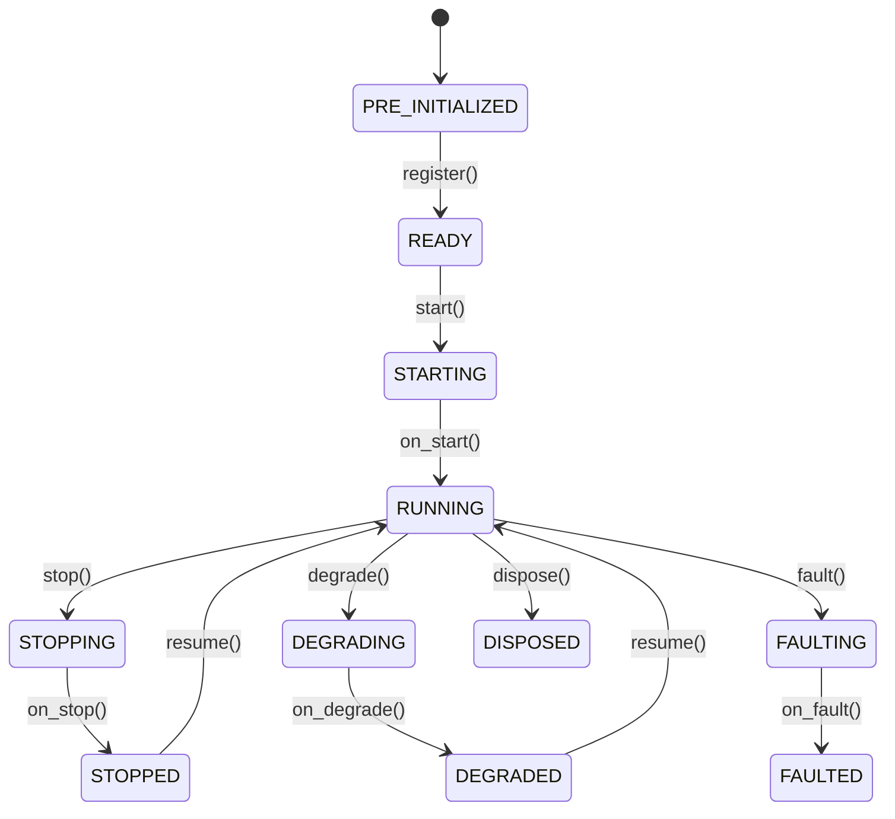

# 执行器 (Actors)

`执行器 (Actor)` 接收数据、处理事件并管理状态。`策略 (Strategy)` 类扩展了执行器，并增加了订单管理功能。

**核心能力**：

- 数据订阅和请求（市场数据、自定义数据）。
- 事件处理和发布。
- 定时器 (Timers) 和警报 (Alerts)。
- 缓存 (Cache) 和投资组合 (Portfolio) 访问。
- 日志 (Logging)。

## 基础示例

执行器支持通过类似于策略的模式进行配置。

```python
from nautilus_trader.config import ActorConfig
from nautilus_trader.model import InstrumentId
from nautilus_trader.model import Bar, BarType
from nautilus_trader.common.actor import Actor


class MyActorConfig(ActorConfig):
    instrument_id: InstrumentId   # 示例值: "ETHUSDT-PERP.BINANCE"
    bar_type: BarType             # 示例值: "ETHUSDT-PERP.BINANCE-15-MINUTE[LAST]-INTERNAL"
    lookback_period: int = 10


class MyActor(Actor):
    def __init__(self, config: MyActorConfig) -> None:
        super().__init__(config)

        # 自定义状态变量
        self.count_of_processed_bars: int = 0

    def on_start(self) -> None:
        # 订阅与配置的 K线 (Bar) 类型匹配的 K线
        self.subscribe_bars(self.config.bar_type)

    def on_bar(self, bar: Bar) -> None:
        self.count_of_processed_bars += 1
```

## 执行器配置和 ID

执行器可以接收 `ActorConfig` 子类。基础配置可能包含 `actor_id`；如果提供，执行器将使用该 ID 注册。如果省略，系统将派生一个运行时执行器 ID。

将配置视为执行器的构造数据。通过 `self.config` 读取用户提供的设置，并将运行时状态保留在执行器本身上。

:::info Rust 实现
对于 Rust 执行器，生成或分配的运行时 ID 存在于执行器核心上，而不是写回 `DataActorConfig` 中。这与 Python 桥接路径不同，后者在从可导入配置创建 Python 对象时，可能会将继承的配置字段复制到运行时状态中。
:::

## 生命周期 (Lifecycle)

执行器在其生命周期中遵循定义的有限状态机：



重写这些方法以挂钩生命周期事件：

| 方法             | 何时调用                                                            |
|-----------------|-------------------------------------------------------------------|
| `on_start()`    | 执行器正在启动（在此订阅数据）。                                          |
| `on_stop()`     | 执行器正在停止（取消定时器，清理资源）。                                    |
| `on_resume()`   | 执行器正从停止状态恢复。                                               |
| `on_reset()`    | 重置指标和内部状态（在回测 (Backtesting) 运行之间调用）。                     |
| `on_degrade()`  | 执行器正在进入降级状态（部分功能可用）。                                    |
| `on_fault()`    | 执行器遇到了故障。                                                    |
| `on_dispose()`  | 执行器正在被销毁（最终清理）。                                          |

## 定时器 (Timers) 和警报 (Alerts)

执行器可以访问用于调度的时钟：

```python
def on_start(self) -> None:
    # 设置一个带有回调的循环定时器（每 5 秒触发一次）
    self.clock.set_timer(
        "my_timer",
        timedelta(seconds=5),
        callback=self._on_timer,
    )

    # 设置一个带有回调的一次性时间警报
    self.clock.set_time_alert(
        "my_alert",
        self.clock.utc_now() + timedelta(minutes=1),
        callback=self._on_alert,
    )

def on_stop(self) -> None:
    # 取消定时器以防止在停止/恢复循环中发生资源泄漏
    self.clock.cancel_timer("my_timer")

def _on_timer(self, event: TimeEvent) -> None:
    self.log.info("Timer fired!")

def _on_alert(self, event: TimeEvent) -> None:
    self.log.info("Alert triggered!")
```

传递 `callback` 以将 `TimeEvent` 对象定向到您自己的方法。如果您省略回调，事件将传递给 `on_event`。

## 系统访问

执行器可以访问核心系统组件：

| 属性               | 描述                                                   |
|-------------------|-------------------------------------------------------|
| `self.cache`      | 合约 (Instruments)、订单、持仓等的共享状态。                    |
| `self.portfolio`  | 投资组合 (Portfolio) 状态和计算。                          |
| `self.clock`      | 当前时间和定时器/警报调度。                                  |
| `self.log`        | 结构化日志。                                              |
| `self.msgbus`     | 发布/订阅自定义消息。                                       |

有关组件之间的自定义消息传递，请参阅 [消息总线 (Message Bus)](message_bus.md) 指南。

## 数据处理和回调 (Callbacks)

系统根据数据是历史数据还是实时数据使用不同的回调处理程序。理解数据 *请求/订阅* 及其处理程序之间的关系是关键。

### 历史数据 vs 实时数据

系统区分两种数据流：

1. **历史数据 (Historical data)**（来自 *请求 (Requests)*）：
   - 通过 `request_bars()`、`request_quote_ticks()` 等方法获取。
   - 通过 `on_historical_data()` 处理程序进行处理。
   - 用于初始数据加载和历史分析。

2. **实时数据 (Real-time data)**（来自 *订阅 (Subscriptions)*）：
   - 通过 `subscribe_bars()`、`subscribe_quote_ticks()` 等方法获取。
   - 通过特定的处理程序处理，如 `on_bar()`、`on_quote_tick()` 等。
   - 用于实时数据处理。

### 回调处理程序 (Callback handlers)

不同的数据操作映射到这些处理程序：

| 操作                                   | 类别       | 处理程序 (Handler)         | 用途                                               |
|--------------------------------------|------------|--------------------------|---------------------------------------------------|
| `subscribe_data()`                   | 实时 (Real‑time)  | `on_data()`              | 实时数据更新。                                      |
| `subscribe_instrument()`             | 实时 (Real‑time)  | `on_instrument()`        | 实时合约定义更新。                                   |
| `subscribe_instruments()`            | 实时 (Real‑time)  | `on_instrument()`        | 实时合约定义更新（针对场馆）。                         |
| `subscribe_order_book_deltas()`      | 实时 (Real‑time)  | `on_order_book_deltas()` | 实时订单簿 (Order book) 增量。                      |
| `subscribe_order_book_depth()`       | 实时 (Real‑time)  | `on_order_book_depth()`  | 实时订单簿深度快照。                                 |
| `subscribe_order_book_at_interval()` | 实时 (Real‑time)  | `on_order_book()`        | 定期间隔的实时订单簿快照。                            |
| `subscribe_quote_ticks()`            | 实时 (Real‑time)  | `on_quote_tick()`        | 实时报价 (Quote) 更新。                             |
| `subscribe_trade_ticks()`            | 实时 (Real‑time)  | `on_trade_tick()`        | 实时成交 (Trade) 更新。                             |
| `subscribe_mark_prices()`            | 实时 (Real‑time)  | `on_mark_price()`        | 实时标记价格 (Mark price) 更新。                    |
| `subscribe_index_prices()`           | 实时 (Real‑time)  | `on_index_price()`       | 实时指数价格 (Index price) 更新。                    |
| `subscribe_bars()`                   | 实时 (Real‑time)  | `on_bar()`               | 实时 K线 (Bar) 更新。                               |
| `subscribe_funding_rates()`          | 实时 (Real‑time)  | `on_funding_rate()`      | 实时资金费率 (Funding rate) 更新。                  |
| `subscribe_instrument_status()`      | 实时 (Real‑time)  | `on_instrument_status()` | 实时合约状态更新。                                   |
| `subscribe_instrument_close()`       | 实时 (Real‑time)  | `on_instrument_close()`  | 实时合约收盘更新。                                   |
| `subscribe_option_greeks()`          | 实时 (Real‑time)  | `on_option_greeks()`     | 实时期权希腊字母 (Option greeks) 更新。              |
| `subscribe_option_chain()`           | 实时 (Real‑time)  | `on_option_chain()`      | 实时期权链 (Option chain) 切片快照。                 |
| `subscribe_order_fills()`            | 实时 (Real‑time)  | `on_order_filled()`      | 合约的实时订单成交事件。                               |
| `subscribe_order_cancels()`          | 实时 (Real‑time)  | `on_order_canceled()`    | 合约的实时订单撤销事件。                               |
| `request_data()`                     | 历史 (Historical) | `on_historical_data()`   | 历史数据处理。                                      |
| `request_order_book_deltas()`        | 历史 (Historical) | `on_historical_data()`   | 历史订单簿增量。                                     |
| `request_order_book_depth()`         | 历史 (Historical) | `on_historical_data()`   | 历史订单簿深度。                                     |
| `request_order_book_snapshot()`      | 历史 (Historical) | `on_historical_data()`   | 历史订单簿快照。                                     |
| `request_instrument()`               | 历史 (Historical) | `on_instrument()`        | 合约定义。                                         |
| `request_instruments()`              | 历史 (Historical) | `on_instrument()`        | 合约定义。                                         |
| `request_quote_ticks()`              | 历史 (Historical) | `on_historical_data()`   | 历史报价处理。                                      |
| `request_trade_ticks()`              | 历史 (Historical) | `on_historical_data()`   | 历史成交处理。                                      |
| `request_bars()`                     | 历史 (Historical) | `on_historical_data()`   | 历史 K线处理。                                      |
| `request_aggregated_bars()`          | 历史 (Historical) | `on_historical_data()`   | 历史聚合 K线（动态）。                                |
| `request_funding_rates()`            | 历史 (Historical) | `on_historical_data()`   | 历史资金费率处理。                                   |

### 示例

此示例显示了历史和实时数据处理：

```python
from nautilus_trader.common.actor import Actor
from nautilus_trader.config import ActorConfig
from nautilus_trader.core.data import Data
from nautilus_trader.model import Bar, BarType
from nautilus_trader.model import ClientId, InstrumentId


class MyActorConfig(ActorConfig):
    instrument_id: InstrumentId  # 示例值: "AAPL.XNAS"
    bar_type: BarType            # 示例值: "AAPL.XNAS-1-MINUTE-LAST-EXTERNAL"


class MyActor(Actor):
    def __init__(self, config: MyActorConfig) -> None:
        super().__init__(config)
        self.bar_type = config.bar_type

    def on_start(self) -> None:
        # 请求历史数据 - 将由 on_historical_data() 处理程序处理
        self.request_bars(
            bar_type=self.bar_type,
            # 许多可选参数
            start=None,                # pd.Timestamp | None
            end=None,                  # pd.Timestamp | None
            callback=None,             # Callable[[UUID4], None] | None
            update_catalog_mode=None,  # UpdateCatalogMode | None
            params=None,               # dict[str, Any] | None
        )

        # 订阅实时数据 - 将由 on_bar() 处理程序处理
        self.subscribe_bars(
            bar_type=self.bar_type,
            # 许多可选参数
            client_id=None,  # ClientId, 可选
            params=None,     # dict[str, Any], 可选
        )

    def on_historical_data(self, data: Data) -> None:
        # 处理历史数据（来自请求）
        if isinstance(data, Bar):
            self.log.info(f"Received historical bar: {data}")

    def on_bar(self, bar: Bar) -> None:
        # 处理实时 K线更新（来自订阅）
        self.log.info(f"Received real-time bar: {bar}")
```

分离历史和实时处理程序允许您根据上下文应用不同的处理逻辑。例如：

- 使用历史数据初始化指标或建立基准指标。
- 针对实时交易决策以不同方式处理实时数据。
- 针对历史与实时数据应用不同的验证或日志记录。

:::tip 提示
在调试数据流问题时，请检查您是否查看了正确的数据源处理程序。如果您在 `on_bar()` 中没有看到数据，但看到了有关接收 K线的日志消息，请检查 `on_historical_data()`，因为数据可能来自请求而不是订阅。
:::

## 订单成交订阅

执行器可以使用 `subscribe_order_fills()` 订阅特定合约的订单成交 (Order fill) 事件。这对于监控交易活动、成交分析或跟踪执行质量非常有用。

订阅后，`on_order_filled()` 处理程序将接收指定合约的所有成交，无论哪个策略或组件生成了原始订单。

### 示例

```python
from nautilus_trader.common.actor import Actor
from nautilus_trader.config import ActorConfig
from nautilus_trader.model import InstrumentId
from nautilus_trader.model.events import OrderFilled


class MyActorConfig(ActorConfig):
    instrument_id: InstrumentId  # 示例值: "ETHUSDT-PERP.BINANCE"


class FillMonitorActor(Actor):
    def __init__(self, config: MyActorConfig) -> None:
        super().__init__(config)
        self.fill_count = 0
        self.total_volume = 0.0

    def on_start(self) -> None:
        # 订阅该合约的所有成交
        self.subscribe_order_fills(self.config.instrument_id)

    def on_order_filled(self, event: OrderFilled) -> None:
        # 处理订单成交事件
        self.fill_count += 1
        self.total_volume += float(event.last_qty)

        self.log.info(
            f"Fill received: {event.order_side} {event.last_qty} @ {event.last_px}, "
            f"Total fills: {self.fill_count}, Volume: {self.total_volume}"
        )

    def on_stop(self) -> None:
        # 取消订阅成交
        self.unsubscribe_order_fills(self.config.instrument_id)
```

:::note 注意
订单成交订阅仅使用消息总线，不涉及数据引擎。`on_order_filled()` 处理程序仅在执行器运行时接收事件。
:::

## 订单撤销订阅

执行器可以使用 `subscribe_order_cancels()` 订阅特定合约的订单撤销 (Order cancel) 事件。这对于监控撤单或跟踪订单生命周期事件非常有用。

订阅后，`on_order_canceled()` 处理程序将接收指定合约的所有撤单，无论哪个策略或组件生成了原始订单。

### 示例

```python
from nautilus_trader.common.actor import Actor
from nautilus_trader.config import ActorConfig
from nautilus_trader.model import InstrumentId
from nautilus_trader.model.events import OrderCanceled


class MyActorConfig(ActorConfig):
    instrument_id: InstrumentId  # 示例值: "ETHUSDT-PERP.BINANCE"


class CancelMonitorActor(Actor):
    def __init__(self, config: MyActorConfig) -> None:
        super().__init__(config)
        self.cancel_count = 0

    def on_start(self) -> None:
        # 订阅该合约的所有撤单
        self.subscribe_order_cancels(self.config.instrument_id)

    def on_order_canceled(self, event: OrderCanceled) -> None:
        # 处理订单撤销事件
        self.cancel_count += 1

        self.log.info(
            f"Cancel received: {event.client_order_id}, "
            f"Total cancels: {self.cancel_count}"
        )

    def on_stop(self) -> None:
        # 取消订阅撤单
        self.unsubscribe_order_cancels(self.config.instrument_id)
```

:::note 注意
订单撤销订阅仅使用消息总线，不涉及数据引擎。`on_order_canceled()` 处理程序仅在执行器运行时接收事件。
:::

## 相关指南

- [策略 (Strategies)](strategies.md) - 策略扩展了具有订单管理能力的执行器。
- [数据 (Data)](data.md) - 执行器可用的数据类型和订阅。
- [消息总线 (Message Bus)](message_bus.md) - 执行器用于通信的消息系统。
