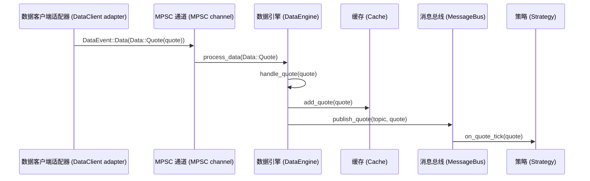
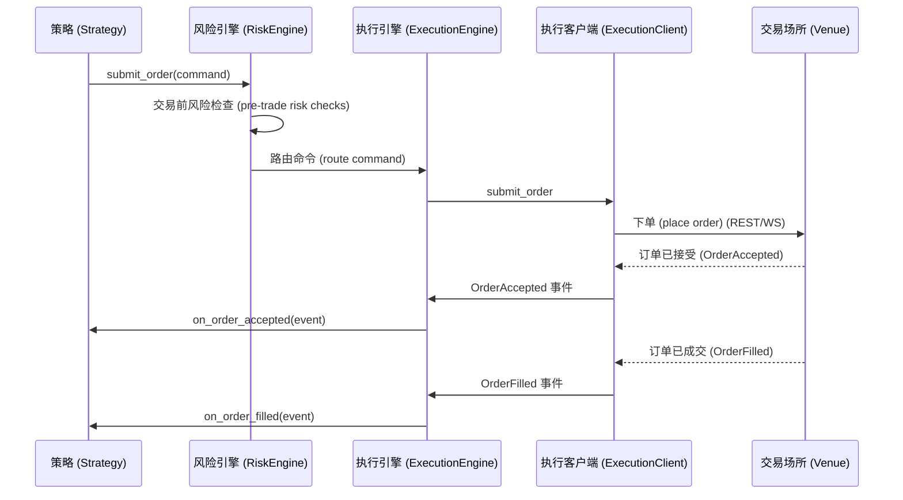
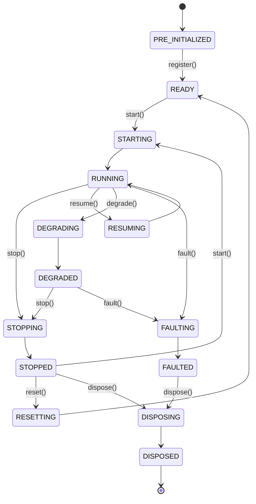
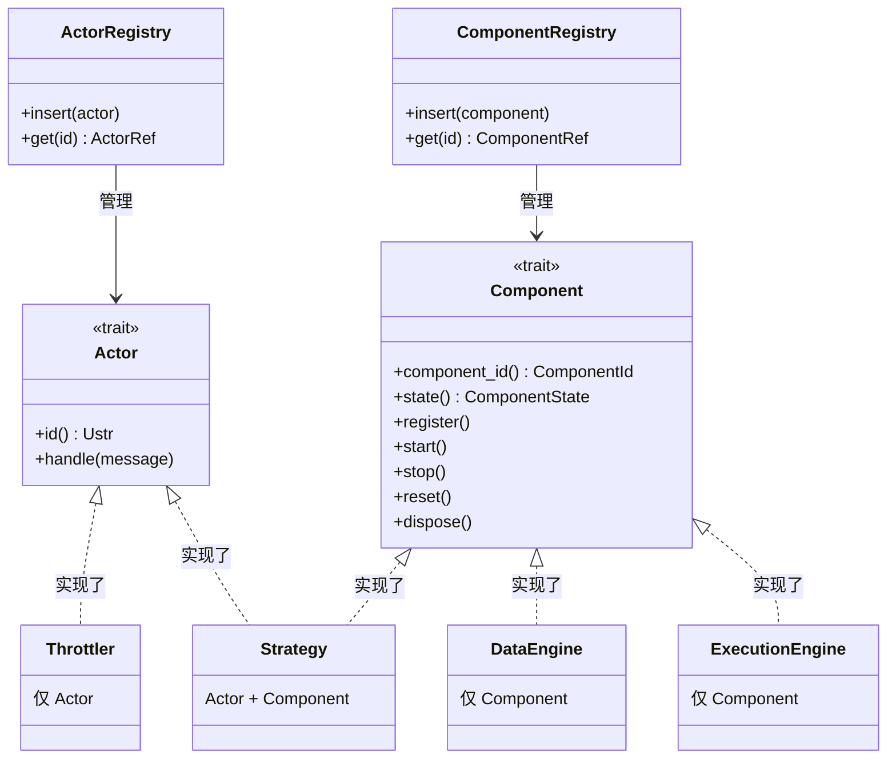
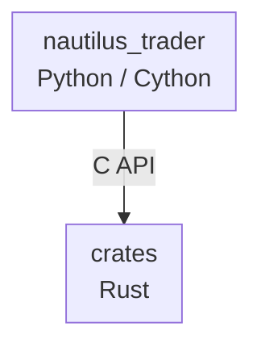

# 架构 (Architecture)

本指南涵盖了 NautilusTrader 的架构原则和结构：

- 设计哲学和质量属性。
- 核心组件及其交互方式。
- 环境上下文 (Environment contexts)（回测、沙盒、实盘）。
- 框架组织和代码结构。

:::note
在整个文档中，“Nautilus 系统边界 (Nautilus system boundary)”是指在单个 Nautilus 节点（也称为“交易者实例 (Trader instance)”）运行时内部的操作。
:::

## 设计哲学 (Design philosophy)

NautilusTrader 采用的主要架构技术和设计模式包括：

- [领域驱动设计 (DDD)](https://en.wikipedia.org/wiki/Domain-driven_design)
- [事件驱动架构 (Event-driven architecture)](https://en.wikipedia.org/wiki/Event-driven_programming)
- [消息模式 (Messaging patterns)](https://en.wikipedia.org/wiki/Messaging_pattern)（发布/订阅、请求/响应、点对点）
- [端口与适配器 (Ports and adapters)](https://en.wikipedia.org/wiki/Hexagonal_architecture_(software))
- [崩溃即停设计 (Crash-only design)](#crash-only-design)

这些技术有助于实现特定的架构质量属性。

### 质量属性 (Quality attributes)

架构决策通常是在相互竞争的优先级之间进行的权衡。以下质量属性指导着设计和架构决策，大致按权重排序：

- 可靠性 (Reliability)
- 性能 (Performance)
- 模块化 (Modularity)
- 可测试性 (Testability)
- 可维护性 (Maintainability)
- 可部署性 (Deployability)

### 保障驱动工程 (Assurance-driven engineering)

NautilusTrader 正在逐步采用高保障 (High-assurance) 心态：关键代码路径应带有可执行不变量 (Executable invariants)，以验证行为是否符合业务需求。实际上，这意味着我们：

- 识别那些失效后故障影响范围 (Blast radius) 最大的组件（核心领域类型、风险和执行流程），并用平实的语言写下它们的不变量。
- 将这些不变量编码为可执行检查（单元测试、属性测试、模糊测试、静态断言），并在 CI 中运行，保持轻量的反馈循环。
- 优先使用 Rust 内置的零成本安全技术（所有权、`Result` 表面、`panic = abort`），仅在收益超过成本时添加针对性的形式化工具。
- 在进行功能开发的同时追踪“保障债务”，确保新的集成能扩展安全网，而不是绕过它。

这种方法在保持平台交付节奏的同时，给予高风险流程所需的额外审查。

延伸阅读：[High Assurance Rust](https://highassurance.rs/)。

### 崩溃即停设计 (Crash-only design)

NautilusTrader 从[崩溃即停设计 (Crash-only design)](https://en.wikipedia.org/wiki/Crash-only_software)原则中汲取灵感，特别是在处理不可恢复的错误方面。其核心见解是：能够从崩溃中干净利落地恢复的系统，比那些拥有单独且极少测试的优雅停机路径的系统更健壮。

关键原则：

- **统一的恢复路径** - 启动和崩溃恢复共享相同的代码路径，确保其经过充分测试。
- **外部化状态** - 关键状态在配置后应持久化到外部，以减少数据丢失风险；持久性取决于后端存储。
- **快速重启** - 系统设计为在崩溃后能快速重启，最大限度地减少停机时间。
- **幂等操作** - 操作设计为在重启后可以安全地重试。
- **对不可恢复的错误快速失败** - 数据损坏或违反不变量会触发立即终止，而不是尝试在受损状态下继续运行。

:::note
系统确实为正常运行提供了优雅停机流程 (`stop`, `dispose`)。这些流程会关闭客户端、持久化状态并刷新写入器。崩溃即停哲学专门适用于那些尝试优雅清理可能会造成进一步损害的*不可恢复的故障*。
:::

这种设计补充了[快速失败策略](#data-integrity-and-fail-fast-policy)，即不可恢复的错误会导致进程立即终止。

**参考资料：**

- [Crash-Only Software](https://www.usenix.org/conference/hotos-ix/crash-only-software) - Candea & Fox, HotOS 2003 (原始研究论文)
- [Microreboot: A technique for cheap recovery](https://www.usenix.org/events/osdi04/tech/candea.html) - Candea et al., OSDI 2004
- [The properties of crash-only software](https://brooker.co.za/blog/2012/01/22/crash-only.html) - Marc Brooker 的博客
- [Crash-only software: More than meets the eye](https://lwn.net/Articles/191059/) - LWN.net 文章
- [Recovery-Oriented Computing (ROC) Project](http://roc.cs.berkeley.edu/) - 加州大学伯克利分校/斯坦福大学研究项目

### 数据完整性和快速失败策略 (Data integrity and fail-fast policy)

NautilusTrader 在交易操作中将数据完整性置于可用性之上。系统对算术运算和数据处理采用了严格的快速失败 (Fail-fast) 策略，以防止可能导致错误交易决策的静默数据损坏。

#### 快速失败原则 (Fail-fast principles)

系统在遇到以下情况时将快速失败（Panic 或返回错误）：

- 在对超出有效范围的时间戳、价格或数量进行运算时发生算术溢出 (Overflow) 或欠流 (Underflow)。
- 反序列化过程中遇到无效数据，包括市场数据或配置中的 NaN、无穷大 (Infinity) 或超出范围的值。
- 类型转换失败，例如在仅正值有效的地方（时间戳、数量）出现负值。
- 对价格、时间戳或精度值进行错误的输入解析。

理由：

在交易系统中，损坏的数据比没有数据更糟糕。一个错误的报价、时间戳或数量可能会在系统中产生连锁反应，导致：

- 错误的头寸规模或风险计算。
- 以错误的价格下单。
- 回测产生误导性的结果。
- 静默的经济损失。

通过在遇到无效数据时立即崩溃，NautilusTrader 旨在提供：

1. **无静默损坏** - 快速失败策略旨在防止无效数据传播；这取决于涵盖输入的各项检查。
2. **即时反馈** - 问题在开发和测试阶段就能被发现，而不是在生产环境中。
3. **审计追踪** - 崩溃日志清楚地标识了无效数据的来源。
4. **确定性行为** - 凭借确定性的排序和配置，相同的无效输入应触发相同的失败；非确定性来源可能会改变结果。

#### 快速失败何时适用

Panic 用于：

- 程序员错误（逻辑 Bug、错误的 API 使用）。
- 违反基本不变量的数据（负数时间戳、NaN 价格）。
- 会静默产生错误结果的算术运算。

Result 或 Option 用于：

- 预期的运行时失败（网络错误、文件 I/O）。
- 业务逻辑验证（订单约束、风险限制）。
- 用户输入验证。
- 暴露给下游 Crate 的库 API，调用者需要显式的错误处理，而不依赖 Panic 进行控制流。

#### 示例场景

```rust
// 正确：溢出时 Panic - 防止数据损坏
let total_ns = timestamp1 + timestamp2; // 如果结果 > u64::MAX 则 Panic

// 正确：反序列化期间拒绝 NaN
let price = serde_json::from_str("NaN"); // 错误："必须是有限的 (must be finite)"

// 正确：需要时进行显式的溢出处理
let total_ns = timestamp1.checked_add(timestamp2)?; // 返回 Option<UnixNanos>
```

该策略已在核心类型（`UnixNanos`, `Price`, `Quantity` 等）中全面实施，有助于 NautilusTrader 在生产交易中保持强大的数据正确性。

在生产部署中，系统通常在发布版本 (Release builds) 中配置为 `panic = abort`，确保任何 Panic 都会导致干净的进程终止，从而由进程守护程序 (Process supervisors) 或编排系统处理。这符合[崩溃即停设计 (Crash-only design)](#crash-only-design)原则，即不可恢复的错误导致立即重启，而不是尝试在潜在的损坏状态下继续运行。

## 系统架构 (System architecture)

NautilusTrader 代码库既是一个用于组合交易系统的框架，也是一套可以在各种[环境上下文 (Environment contexts)](#environment-contexts)中运行的默认系统实现。


### 核心组件 (Core components)

多个核心组件协同工作形成交易系统：

#### `NautilusKernel` (Nautilus 内核)

负责以下工作的中央编排组件：

- 初始化和管理所有系统组件。
- 配置消息基础设施。
- 维护特定环境的行为。
- 协调共享资源和生命周期管理。
- 为系统操作提供统一的入口点。

#### `MessageBus` (消息总线)

组件间通信的骨干，实现：

- **发布/订阅模式 (Publish/Subscribe patterns)**：用于向多个消费者广播事件和数据。
- **请求/响应通信 (Request/Response communication)**：用于需要确认的操作。
- **命令/事件消息传递 (Command/Event messaging)**：用于触发动作和通知状态更改。
- **可选的状态持久化**：使用 Redis 实现持久性和重启能力。

#### `Cache` (缓存)

高性能内存存储系统，用于：

- 存储合约 (Instruments)、账户、订单、仓位等。
- 为交易组件提供高性能的获取功能。
- 在整个系统中保持一致的状态。
- 支持具有优化访问模式的读写操作。

#### `DataEngine` (数据引擎)

在整个系统中处理和路由市场数据：

- 处理多种数据类型（报价、成交、K 线、订单簿、自定义数据等）。
- 根据订阅将数据路由到合适的消费者。
- 管理从外部源到内部组件的数据流。

#### `ExecutionEngine` (执行引擎)

管理订单生命周期和执行：

- 将交易命令路由到相应的适配器客户端。
- 追踪订单和仓位状态。
- 与风险管理系统协调。
- 处理来自交易场所的执行报告和成交 (Fills)。
- 处理外部执行状态的对账。

#### `RiskEngine` (风险引擎)

提供风险管理：

- 交易前风险检查和验证。
- 仓位和风险敞口监控。
- 实时风险计算。
- 可配置的风险规则和限制。

### 环境上下文 (Environment contexts)

NautilusTrader 中的环境上下文定义了您所使用的数据和交易场所类型。理解这些上下文对于回测、开发和实盘交易至关重要。

以下是您可以使用的环境：

- `Backtest` (回测)：具有模拟交易场所的历史数据。
- `Sandbox` (沙盒)：具有模拟交易场所的实时数据。
- `Live` (实盘)：具有真实交易场所（模拟交易或真实账户）的实时数据。

### 通用核心 (Common core)

平台设计为在回测、沙盒和实盘交易系统之间尽可能多地共享通用代码。这在 `system` 子包中得到了形式化，您可以在那里找到 `NautilusKernel` 类，它提供了一个通用的核心系统“内核 (Kernel)”。

*端口与适配器 (Ports and adapters)* 架构风格使得模块化组件可以集成到核心系统中，为用户定义或自定义组件实现提供各种钩子 (Hooks)。

### 数据和执行流模式 (Data and execution flow patterns)

了解数据和执行如何流经系统有助于使用该平台。

#### 数据流：报价 Tick 的生命周期 (Data flow: life of a quote tick)

以下追踪显示了 `QuoteTick` 从网络到您的策略所经历的每一个步骤。成交 (Trades) 和 K 线 (Bars) 遵循相同的“先缓存后发布 (cache-then-publish)”路径，只是处理程序名称不同。订单簿增量 (Order book deltas) 和深度快照 (Depth snapshots) 采用不同的路线（请参见步骤下方的提示）。



**逐步说明：**

1. **适配器接收原始数据**。交易场所特定的 `DataClient`（例如 Binance, Bybit）接收一条 WebSocket 消息，对其进行解析，并构建一个 `QuoteTick`。
2. **适配器发送数据事件**。适配器通过一个 MPSC 通道发送 `DataEvent::Data(Data::Quote(quote))`。在实盘模式下，这是一个异步无界通道；在回测中，引擎直接提供数据。
3. **数据引擎 (DataEngine) 处理事件**。通道接收者将事件路由到 `DataEngine::process_data`，然后再分发给 `handle_quote`。
4. **缓存存储报价**。`handle_quote` 通过 `cache.add_quote(quote)` 将报价写入 `Cache`，使其可以通过 `self.cache.quote_tick(instrument_id)` 提供给任何组件。
5. **消息总线 (MessageBus) 发布**。引擎在源自合约 ID（例如 `data.quotes.BINANCE.BTCUSDT-PERP`）的话题 (Topic) 上发布报价。`MessageBus` 找到订阅了该话题的所有处理程序。
6. **策略处理程序触发**。每个订阅了该策略的 `on_quote_tick(quote)` 都在单线程内核上运行。在处理程序执行之前，报价已经存在于缓存中，因此 `self.cache.quote_tick(instrument_id)` 会返回相同的报价。

:::tip
对于报价、成交和 K 线，“先缓存后发布”的顺序意味着您的策略处理程序始终可以从缓存中读取最新值。订单簿增量和深度快照是直接发布的；订单簿状态是单独维护的。
:::

#### 执行流程：订单的生命周期 (Execution flow: life of an order)

当策略提交订单时，它会流经验证、路由，并作为执行事件返回：



1. **策略创建命令**。策略调用 `self.submit_order(order)`。
2. **风险引擎验证**。运行交易前检查（持仓限制、名义价值限制、订单频率）。如果检查失败，策略会收到 `OrderDenied`（订单被拒绝），且订单永远不会到达交易场所。
3. **执行引擎路由**。命令被路由到目标交易场所的执行客户端 (`ExecutionClient`)。
4. **执行客户端提交**。适配器通过 REST 或 WebSocket 将订单发送到交易场所。
5. **事件返回**。交易场所返回确认和成交信息。每个事件（已接受 Accepted、已成交 Filled、已取消 Canceled、已拒绝 Rejected、已过期 Expired）都流回执行引擎 (`ExecutionEngine`)，后者更新缓存 (`Cache`) 中的订单状态，并将事件传递给策略的处理程序。成交事件还会触发仓位和投资组合的更新。

#### 组件状态管理 (Component state management)

所有组件都遵循有限状态机模式。`ComponentState` 枚举定义了稳定状态和过渡状态：



**稳定状态 (Stable states)：**

- **PRE_INITIALIZED** (预初始化)：组件已实例化，但尚未准备好履行其规范。
- **READY** (就绪)：组件已配置并可以启动。
- **RUNNING** (运行中)：组件运行正常，可以履行其规范。
- **STOPPED** (已停止)：组件已成功停止。
- **DEGRADED** (已降级)：组件已降级，可能无法完全满足其规范。
- **FAULTED** (故障)：由于检测到故障，组件已关闭。
- **DISPOSED** (已弃置)：组件已关闭并释放了所有资源。

**过渡状态 (Transitional states)：**

- **STARTING** (启动中)：组件正在执行其 `start` 动作。
- **STOPPING** (停止中)：组件正在执行其 `stop` 动作。
- **RESUMING** (恢复中)：组件在初次启动后再次启动。
- **RESETTING** (重置中)：组件正在执行其 `reset` 动作。
- **DISPOSING** (弃置中)：组件正在执行其 `dispose` 动作。
- **DEGRADING** (降级中)：组件正在执行其 `degrade` 动作。
- **FAULTING** (故障中)：组件正在执行其 `fault` 动作。

过渡状态是发生在状态转换期间的短暂中间状态。组件不应长时间保持在过渡状态。

#### Actor 与 Component 特征 (Actor vs Component traits)

在 Rust 实现层面上，系统区分了两个互补的特征 (Traits)：



**`Actor` 特征** - 消息分发：

- 提供用于接收通过 Actor 注册表分发的消息的 `handle` 方法。
- 通过 Actor ID 实现类型安全的查找和消息分发。
- 由需要接收目标消息的组件使用（策略、节流器 Throttler）。

**`Component` 特征** - 生命周期管理：

- 管理状态转换 (`start`, `stop`, `reset`, `dispose`)。
- 提供向系统内核的注册功能 (`register`)。
- 通过上述有限状态机追踪组件状态。
- 由所有需要生命周期管理的系统组件使用。

:::note
所有组件都可以直接通过消息总线 (`MessageBus`) 发布和订阅消息——这与 `Actor` 特征无关。`Actor` 特征专门实现了基于注册表的消息分发模式，在这种模式下，消息按 ID 路由到特定的 Actor。
:::

这种分离允许：

- **仅限 Actor**：没有生命周期的轻量级消息处理程序（例如 `Throttler`）。
- **仅限 Component**：具有生命周期的系统基础设施，但使用直接的消息总线 (MessageBus) 发布/订阅（例如 `DataEngine`, `ExecutionEngine`）。
- **兼备两种特征**：既需要生命周期管理，又需要目标消息分发的交易策略。

这些特征由单独的注册表管理，以支持它们不同的访问模式——生命周期方法是按顺序调用的，而消息处理程序在回调期间可能会被重入调用。

### 消息传递 (Messaging)

为了实现模块化和松耦合，高效的消息总线 (`MessageBus`) 在组件之间传递消息（数据、命令和事件）。

#### 线程模型 (Threading model)

在一个节点内，*内核 (Kernel)* 在单个线程上消费和分发消息。内核包括：

- 消息总线 (`MessageBus`) 和 Actor 回调分发。
- 策略逻辑和订单管理。
- 风险引擎检查和执行协调。
- 缓存的读写。

这个单线程核心提供了确定性的事件排序，有助于维持回测与实盘的一致性，尽管实盘输入和延迟仍可能导致行为差异。组件以*类似于*[执行者模型 (Actor model)](https://en.wikipedia.org/wiki/Actor_model)的模式同步消费消息。

:::note
值得关注的是 LMAX 交易所架构，它在单线程上运行时实现了屡获殊荣的性能。您可以从 Martin Fowler 的[这篇有趣文章](https://martinfowler.com/articles/lmax.html)中了解他们基于 *Disruptor* 模式的架构。
:::

后台服务使用单独的线程或异步运行时：

- **网络 I/O** - WebSocket 连接、REST 客户端和异步数据源。
- **持久化** - 通过多线程 Tokio 运行时进行 DataFusion 查询和数据库操作。
- **适配器** - 通过线程池执行器进行异步适配器操作。

这些服务通过消息总线 (`MessageBus`) 将结果传回内核。总线本身是线程局部的 (Thread-local)，因此每个线程都有自己的实例，跨线程通信通过通道发生，最终将事件传递给单线程核心。

## 框架组织 (Framework organization)

代码库被组织成抽象层，并分组为内聚概念的逻辑子包。您可以从左侧导航菜单导航到每个子包的文档。

### 核心 / 低层 (Core / low-level)

- `core`：整个框架中使用的常量、函数和低层组件。
- `common`：用于组装框架各个组件的公共部分。
- `network`：网络客户端的低层基础组件。
- `serialization`：序列化基础组件和序列化器实现。
- `model`：定义了丰富的交易领域模型。

### 组件 (Components)

- `accounting`：不同的账户类型和账户管理机制。
- `adapters`：平台的集成适配器，包括经纪商和交易所。
- `analysis`：与交易绩效统计和分析相关的组件。
- `cache`：提供公共缓存基础设施。
- `data`：平台的数据栈和数据工具。
- `execution`：平台的执行栈。
- `indicators`：一套高效的指标和分析器。
- `persistence`：数据存储、编目和检索，主要用于支持回测。
- `portfolio`：投资组合管理功能。
- `risk`：风险特定的组件和工具。
- `trading`：交易领域特定的组件和工具。

### 系统实现 (System implementations)

- `backtest`：回测组件以及回测引擎和节点实现。
- `live`：实盘引擎和客户端实现，以及用于实盘交易的节点。
- `system`：`backtest`、`sandbox`、`live` [环境上下文](#environment-contexts)之间共有的核心系统内核。

## 代码结构 (Code structure)

代码库的基础是 `crates` 目录，包含一系列 Rust Crate，包括由 `cbindgen` 生成的 C 外部函数接口 (FFI)。

生产代码的大部分位于 `nautilus_trader` 目录，其中包含一系列 Python/Cython 子包和模块。

Rust 核心的 Python 绑定是通过在编译时将 Rust 库静态链接到 Cython 生成的 C 扩展模块来实现的（有效地扩展了 CPython API）。

### 依赖流 (Dependency flow)



### Rust Crate

`crates/` 目录包含 Rust 实现，组织成具有清晰依赖边界的专项 Crate。功能标志 (Feature flags) 控制可选功能——例如，`streaming` 启用基于目录的数据流持久化，`cloud` 启用云存储后端（S3, Azure, GCP）。

依赖流（箭头指向依赖项）：

```mermaid
flowchart BT
    subgraph Foundation (基础层)
        core
        model
        common
        system
        trading
    end

    subgraph Infrastructure (基础设施层)
        serialization
        network
        cryptography
        persistence
    end

    subgraph Engines (引擎层)
        data
        execution
        portfolio
        risk
    end

    subgraph Runtime (运行时层)
        live
        backtest
    end

    adapters
    pyo3

    model --> core
    common --> core
    common --> model
    system --> common
    trading --> common
    serialization --> model
    network --> common
    network --> cryptography
    persistence --> serialization
    data --> common
    execution --> common
    portfolio --> common
    risk --> portfolio
    live --> system
    live --> trading
    backtest --> system
    backtest --> persistence
    adapters --> live
    adapters --> network
    pyo3 --> adapters
```

**Crate 类别：**

| 类别 | Crate | 用途 |
|----------------|-----------------------------------------------------------|----------------------------------------------------------|
| 基础层 (Foundation) | `core`, `model`, `common`, `system`, `trading` | 基元、领域模型、内核、Actor 和策略基类。 |
| 引擎层 (Engines) | `data`, `execution`, `portfolio`, `risk` | 核心交易引擎组件。 |
| 基础设施层 (Infrastructure) | `serialization`, `network`, `cryptography`, `persistence` | 编码、组网、签名、存储。 |
| 运行时层 (Runtime) | `live`, `backtest` | 环境特定的节点实现。 |
| 外部 (External) | `adapters/*` | 交易场所和数据集成。 |
| 绑定 (Bindings) | `pyo3` | Python 绑定。 |

**功能标志 (Feature flags)：**

| 功能 | Crate | 作用 |
|-------------|----------------------------|------------------------------------------------------------|
| `streaming` | `data`, `system`, `live` | 为目录流启用 `persistence` 依赖。 |
| `cloud` | `persistence` | 启用云存储后端 (S3, Azure, GCP, HTTP)。 |
| `python` | 大多数 Crate | 启用 PyO3 绑定（自动启用 `streaming`, `cloud`）。 |
| `defi` | `common`, `model`, `data` | 启用 DeFi/区块链数据类型。 |

:::note
Rust 和 Cython 都是构建依赖项。从构建生成的二级制轮子 (Binary wheels) 在运行时不需要安装 Rust 或 Cython。
:::

### 类型安全 (Type safety)

平台设计优先考虑软件的正确性和安全性。

`crates/` 下的 Rust 代码依赖 `rustc` 编译器对安全代码的保证。任何 `unsafe` 块都是显式的选择性退出，我们必须亲自维护所需的不变量（参见 [开发者指南](../developer_guide/rust.md) 的 Rust 部分）；总体的内存和类型安全取决于这些不变量是否成立。

Cython 在编译时和运行时都提供 C 级别的类型安全：

:::info
如果您向具有类型参数的 Cython 实现模块传递了无效类型的参数，那么您将在运行时收到 `TypeError`。
:::

如果函数或方法的参数未显式设置类型以接受 `None`，则将 `None` 作为参数传递会导致运行时出现 `ValueError`。

:::warning
为了防止文档字符串过于冗长，上述异常并未在文档中逐一列出。
:::

### 错误与异常 (Errors and exceptions)

文档旨在涵盖 NautilusTrader 代码可能引发的所有异常及其触发条件。

:::warning
可能还存在其他未记录的异常，这些异常可能由 Python 标准库或第三方库依赖项引发。
:::

### 进程与线程 (Processes and threads)

:::warning[每个进程仅限一个节点 (One node per process)]
由于存在全局单例状态，不支持在同一个进程中**并发**运行多个 `TradingNode` 或 `BacktestNode` 实例：

- **回测强制停止标志** - `_FORCE_STOP` 全局标志在进程中的所有引擎之间共享。
- **日志模式和时间戳** - 日志子系统使用全局状态；回测会在静态模式和实时模式之间切换。
- **运行时单例** - 全局 Tokio 运行时、回调注册表和其他 `OnceLock` 实例是进程级的。

**顺序执行**多个节点（一个接一个运行，且在运行之间进行适当弃置）是完全支持的，并已在测试套件中使用。

对于生产部署，请在进程内的**单个 TradingNode** 中添加多个策略。
如需并行执行或工作负载隔离，请在各自独立的进程中运行每个节点。
:::

## 相关指南 (Related guides)

- [概览 (Overview)](overview.md) - NautilusTrader 的高层介绍。
- [消息总线 (Message Bus)](message_bus.md) - 核心消息基础设施。
