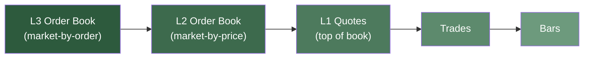
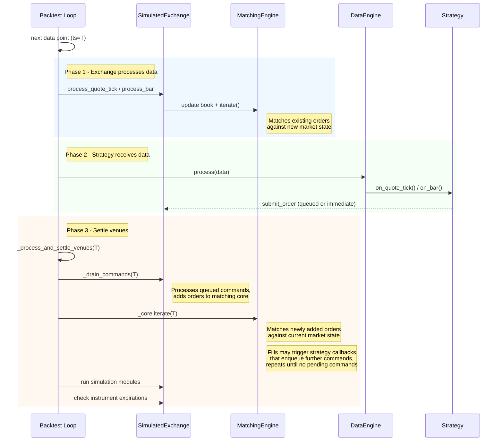

# 回测 (Backtesting)

回测 (Backtesting) 使用特定的系统实现来模拟交易。该系统包括内置引擎、`Cache`、[消息总线 (MessageBus)](message_bus.md)、`Portfolio`、[执行单元 (Actors)](actors.md)、[策略 (Strategies)](strategies.md)、[执行算法 (Execution Algorithms)](execution.md) 以及用户定义的模块。`BacktestEngine` 处理历史数据流。当数据流结束时，引擎会生成用于分析的结果和绩效指标 (Metrics)。

NautilusTrader 为回测 (Backtesting) 提供了两个层级的 API：

- **高级 API (High-level API)**：使用 `BacktestNode` 和配置对象（内部使用 `BacktestEngine`）。
- **低级 API (Low-level API)**：直接使用 `BacktestEngine`，需要更多“手动”设置。

## 选择 API 层级

在以下情况下考虑使用**低级 (low-level)** API：

- 您的整个数据流可以在可用机器资源（例如 RAM）内处理。
- 您不希望以 Nautilus 特有的 Parquet 格式存储数据。
- 您有特定需求或偏好，希望以原始格式（例如 CSV、二进制等）保留原始数据。
- 您需要对 `BacktestEngine` 进行精细控制，例如能够在交换组件（例如执行单元 actors 或策略 strategies）或调整参数配置的同时，在相同的数据集上重新运行回测 (Backtesting)。

在以下情况下考虑使用**高级 (high-level)** API：

- 您的数据流超过了可用内存，需要分批流式传输数据。
- 您希望使用 `ParquetDataCatalog` 的性能和便利性，以 Nautilus 特有的 Parquet 格式存储数据。
- 您看重通过配置对象定义和管理多个引擎上同时运行的多个回测 (Backtesting) 的灵活性和功能。

## 低级 API (Low-level API)

低级 API 以 `BacktestEngine` 为核心，通过 Python 脚本手动初始化和添加输入。实例化的 `BacktestEngine` 可以接受以下内容：

- `Data` 对象列表，这些对象会根据 `ts_init` 自动按单调顺序排序。
- 手动初始化的多个场内 (Venues)。
- 手动初始化并添加的多个执行单元 (Actors)。
- 手动初始化并添加的多个执行算法 (Execution Algorithms)。

这种方法提供了对回测 (Backtesting) 过程的详细控制，允许您手动配置每个组件。

### 高效加载大型数据集

当处理涉及多个合约 (Instruments) 的大量数据时，加载数据的方式会显著影响性能。

#### 性能考量 (Performance consideration)

默认情况下，当 `sort=True`（默认值）时，`BacktestEngine.add_data()` 在每次调用时都会对整个数据流（现有数据 + 新添加的数据）进行排序。这意味着：

- 第一次调用加载 100 万根 K 线 (Bars)：排序 100 万根。
- 第二次调用加载 100 万根 K 线 (Bars)：排序 200 万根。
- 第三次调用加载 100 万根 K 线 (Bars)：排序 300 万根。
- 依此类推...

在为多个合约 (Instruments) 加载数据时，这种对越来越大的数据集进行的重复排序可能会成为瓶颈。

#### 优化策略 (Optimization strategies)

**策略 1：延迟排序直到最后（推荐用于多个合约）**

```python
from nautilus_trader.backtest.engine import BacktestEngine

engine = BacktestEngine()

# Setup venue and instruments
engine.add_venue(...)
engine.add_instrument(instrument1)
engine.add_instrument(instrument2)
engine.add_instrument(instrument3)

# Load all data WITHOUT sorting on each call
engine.add_data(instrument1_bars, sort=False)
engine.add_data(instrument2_bars, sort=False)
engine.add_data(instrument3_bars, sort=False)

# Sort once at the end - much more efficient!
engine.sort_data()

# Now run your backtest
engine.add_strategy(strategy)
engine.run()
```

**策略 2：收集并单次批量添加**

```python
# Collect all data first
all_bars = []
all_bars.extend(instrument1_bars)
all_bars.extend(instrument2_bars)
all_bars.extend(instrument3_bars)

# Add once with sorting
engine.add_data(all_bars, sort=True)
```

**策略 3：为超大型数据集使用流式 API**

对于内存不足以容纳的数据集，有两种流式处理方法：

**自动分块 (Automatic chunking)** - 提供一个产出批次的生成器。引擎在单次 `run()` 调用期间延迟提取分块：

```python
def data_generator():
    # Yield chunks of data (each chunk is a list of Data objects)
    yield load_chunk_1()
    yield load_chunk_2()
    yield load_chunk_3()

engine.add_data_iterator(
    data_name="my_data_stream",
    generator=data_generator(),
)

engine.run()  # Chunks are consumed on-demand
```

**手动分块 (Manual chunking)** - 自己加载并运行每个批次。这是 `BacktestNode` 内部使用的模式，可以完全控制批次边界：

```python
engine.add_strategy(strategy)

for batch in data_batches:
    engine.add_data(batch)
    engine.run(streaming=True)
    engine.clear_data()

engine.end()  # Finalize: flushes remaining timers, stops engines, produces results
```

:::note
在流式模式下，当每个批次的数据耗尽时，计时器推进会停止。调度在最后一个数据点之后（例如 K 线聚合间隔）的计时器将被推迟，直到更多数据到达或调用 `end()`，后者将刷新直到最后一次 `run()` 调用后的 `end` 边界。
:::

:::tip[性能影响]
对于包含 10 个合约 (Instruments)、每个合约有 100 万根 K 线 (Bars) 的回测 (Backtesting)：

- 每次调用排序：约 10 次大小递增的排序（1M, 2M, 3M, ... 10M 根）。
- 最后排序一次：1 次 10M 根的排序。

延迟排序方法对于大型数据集可以**显著加快速度**。
:::

### 数据加载规范 (Data loading contract)

`BacktestEngine` 执行重要的不变性检查以确保数据完整性：

**要求：**

- 在调用 `run()` 之前，所有数据必须已排序。
- 当使用 `sort=False` 时，您**必须**在运行前调用 `sort_data()`。
- 引擎会对此进行验证，如果检测到未排序的数据，将引发 `RuntimeError`。
- 多次调用 `sort_data()` 是安全的（幂等性）。

**安全保证：**

- 数据列表在内部始终会被复制，以防止外部修改影响引擎状态。
- 在将数据列表传递给 `add_data()` 后，您可以安全地清除或修改它们。
- 使用 `sort=True` 添加数据会使其立即用于回测 (Backtesting)。

这种设计在确保数据完整性的同时，也为大型数据集提供了性能优化。

## 高级 API (High-level API)

高级 API 以 `BacktestNode` 为核心，它编排多个 `BacktestEngine` 实例的管理，每个实例由 `BacktestRunConfig` 定义。可以将多个配置捆绑到一个列表中，并由节点在一次运行中处理。

每个 `BacktestRunConfig` 对象包含以下内容：

- `BacktestDataConfig` 对象列表。
- `BacktestVenueConfig` 对象列表。
- `ImportableActorConfig` 对象列表。
- `ImportableStrategyConfig` 对象列表。
- `ImportableExecAlgorithmConfig` 对象列表。
- 可选的 `ImportableControllerConfig` 对象。
- 可选的 `BacktestEngineConfig` 对象，如果未指定则使用默认配置。

## 重复运行

在进行多次回测 (Backtesting) 运行时，了解组件如何重置以避免意外行为非常重要。

### BacktestEngine.reset()

`.reset()` 方法将所有有状态字段恢复到其**初始值**，但数据和合约 (Instruments) 除外，它们会持久存在。

**会被重置的内容：**

- 所有交易状态（订单、持仓、账户余额）。
- 策略 (Strategy) 实例会被移除（您必须在下次运行前重新添加策略）。
- 引擎计数器和时间戳。

**会持久存在的内容：**

- 通过 `.add_data()` 添加的数据（使用 `.clear_data()` 移除）。
- 合约 (Instruments)（必须与持久存在的数据匹配）。
- 场内 (Venue) 配置。

**合约 (Instrument) 处理：**

对于 `BacktestEngine`，合约 (Instruments) 默认在重置后持久存在（因为数据持久存在，且合约必须与数据匹配）。这是通过默认 `BacktestEngineConfig` 中的 `CacheConfig.drop_instruments_on_reset=False` 配置的。

### 多次回测运行的方法

运行多次回测 (Backtesting) 主要有两种方法：

#### 1. 使用 BacktestNode（推荐用于生产）

高级 API 专为具有不同配置的多次回测 (Backtesting) 运行而设计：

```python
from nautilus_trader.backtest.node import BacktestNode
from nautilus_trader.config import BacktestRunConfig

# Define multiple run configurations
configs = [
    BacktestRunConfig(...),  # Run 1
    BacktestRunConfig(...),  # Run 2
    BacktestRunConfig(...),  # Run 3
]

# Execute all runs
node = BacktestNode(configs=configs)
results = node.run()
```

每次运行都会获得一个具有干净状态的新引擎 - 不需要调用 reset()。

#### 2. 使用 BacktestEngine.reset()

对于低级 API 的精细控制：

```python
from nautilus_trader.backtest.engine import BacktestEngine

engine = BacktestEngine()

# Setup once
engine.add_venue(...)
engine.add_instrument(ETHUSDT)
engine.add_data(data)

# Run 1
engine.add_strategy(strategy1)
engine.run()

# Reset and run 2 - instruments and data persist
engine.reset()
engine.add_strategy(strategy2)
engine.run()

# Reset and run 3
engine.reset()
engine.add_strategy(strategy3)
engine.run()
```

:::note
对于 `BacktestEngine`，合约 (Instruments) 和数据默认在重置后持久存在，这使得参数优化变得简单直接。
:::

:::tip[最佳实践]

- **对于生产回测 (Backtesting)：** 使用带有配置对象的 `BacktestNode`。
- **对于参数优化：** 使用 `BacktestEngine.reset()` 针对相同数据运行多个策略 (Strategies)。
- **对于快速实验：** 两种方法均可 - 根据个人使用场景选择。

:::

## 数据

为回测 (Backtesting) 提供的数据驱动执行流。由于可以使用多种数据类型，因此您的场内 (Venue) 配置必须与为回测 (Backtesting) 提供的数据保持一致。数据与配置之间的不匹配可能会导致执行期间的意外行为。

NautilusTrader 主要针对订单簿 (Order book) 数据进行设计和优化，订单簿数据提供了市场中每个价格层级或订单的完整表示，反映了交易场内的实时行为。这提供了最大的执行粒度和真实性。然而，如果无法获得或不需要粒度较高的订单簿 (Order book) 数据，平台能够按照以下详细程度递减的顺序处理市场数据：



1. **订单簿数据/增量 (L3 market-by-order)**：
   - 完整的市场深度，可见所有单个订单。

2. **订单簿数据/增量 (L2 market-by-price)**：
   - 所有价格层级的市场深度可见性。

3. **报价 Tick (L1 market-by-price)**：
   - 仅限盘口 (Top of book) - 最佳买价 (Bid) 和卖价 (Ask) 的价格与大小。

4. **成交 Tick (Trade Ticks)**：
   - 实际执行的成交。

5. **K 线 (Bars)**：
   - 在固定时间间隔（例如 1 分钟、1 小时、1 天）内聚合的交易活动。

### 选择数据：成本与准确性

对于许多交易策略 (Strategies)，K 线 (Bar) 数据（例如 1 分钟）对于回测 (Backtesting) 和策略开发可能已经足够。这特别重要，因为 K 线 (Bar) 数据通常比 Tick 或订单簿 (Order book) 数据更容易获得且更具成本效益。

鉴于这一实际现实，Nautilus 旨在支持基于 K 线 (Bar) 的回测 (Backtesting)，并具有旨在最大限度提高模拟 (Simulation) 准确性的高级功能，即使在使用较低粒度的数据时也是如此。

:::tip
对于某些交易策略 (Strategies)，先使用 K 线 (Bar) 数据进行开发以验证核心交易思路是切合实际的。如果策略看起来很有前景，但对精确的执行时机更为敏感（例如，需要在 OHLC 层级之间的特定价格成交，或者使用紧凑的止盈/止损层级），那么您可以投资于更高粒度的数据以进行更准确的验证。
:::

## 场内 (Venues)

在为回测 (Backtesting) 初始化场内 (Venue) 时，您必须从以下选项中指定其内部订单簿类型 `book_type` 以进行执行处理：

- `L1_MBP`：Level 1 价格档位 (market-by-price)（默认）。仅维护订单簿的最高档位。
- `L2_MBP`：Level 2 价格档位 (market-by-price)。维护订单簿深度，每个价格层级聚合为单个订单。
- `L3_MBO`：Level 3 订单档位 (market-by-order)。维护订单簿深度，按照数据提供的方式跟踪所有单个订单。

`book_type` 决定了撮合引擎使用哪些数据类型来更新订单簿状态并驱动执行。不适用于给定 `book_type` 的数据类型在订单簿和价格更新中会被忽略，尽管精度验证仍然适用，且引擎时钟仍会推进。策略 (Strategies) 始终通过数据引擎接收所有订阅的数据，无论 `book_type` 如何。

| 数据类型           | L1_MBP            | L2_MBP            | L3_MBO            |
| ------------------ | ----------------- | ----------------- | ----------------- |
| `QuoteTick`        | 更新订单簿        | *忽略*            | *忽略*            |
| `TradeTick`        | 触发撮合          | 触发撮合          | 触发撮合          |
| `Bar`              | 更新订单簿        | *忽略*            | *忽略*            |
| `OrderBookDelta`   | *忽略*            | 更新订单簿        | 更新订单簿        |
| `OrderBookDeltas`  | *忽略*            | 更新订单簿        | 更新订单簿        |
| `OrderBookDepth10` | 更新订单簿        | 更新订单簿        | 更新订单簿        |

:::note
数据的粒度必须与指定的订单簿类型 `book_type` 相匹配。Nautilus 无法从较低层级的数据（如报价、成交或 K 线）生成更高粒度的数据（L2 或 L3）。
:::

:::warning
如果您将场内 (Venue) 的 `book_type` 指定为 `L2_MBP` 或 `L3_MBO`，报价 (Quotes) 和 K 线 (Bars) 将不会更新订单簿。请确保您提供了订单簿增量 (Order book delta) 数据，否则订单可能看起来永远无法成交。
:::

:::warning
当使用 `L1_MBP`（默认值）时，撮合引擎会忽略订单簿增量。如果您订阅了订单簿增量，请将场内 (Venue) 的 `book_type` 设置为 `L2_MBP` 或 `L3_MBO`。这也适用于沙盒 (Sandbox) 执行，其中撮合引擎使用相同的 `book_type` 配置。
:::

## 执行 (Execution)

### 数据和消息排序

在主回测循环中，新的市场数据在通过数据引擎分发给执行单元 (Actors)/策略 (Strategies) 之前先进行订单执行处理。

#### 主循环流程

对于每个数据点，引擎运行三个阶段：

- **交易所处理数据。** 模拟 (Simulation) 的交易所根据传入的市场数据更新其订单簿，并迭代撮合引擎。这将成交任何现在与新市场状态匹配的现有订单。
- **策略接收数据。** 数据引擎通过执行单元 (Actors) 和策略 (Strategies) 的回调（例如 `on_quote_tick`、`on_bar`）将数据点分发给它们。策略可能会在这些回调期间提交、取消或修改订单。
- **结算场内。** 引擎清空所有排队的场内命令，然后迭代撮合引擎以成交新提交的订单。此循环重复直到没有待处理命令，因此级联订单（例如从 `on_order_filled` 提交的对冲订单）在同一时间戳内结算。



计时器事件使用相同的结算机制，但按时间戳批量处理：时间戳 T 的所有回调先执行，然后在推进到 T+1 之前为 T 结算场内。

#### 命令结算 (Command settling)

当订单成交触发策略 (Strategy) 回调并提交额外订单（例如在 `on_order_filled` 中提交止损单）时，这些级联命令会在同一时间戳/事件周期内结算。引擎会重复清空场内命令队列和任何新生成的命令，直到当前时间戳没有待处理命令。模拟 (Simulation) 模块在所有命令结算后每个周期仅运行一次。

配置 `LatencyModel` 时，命令会被放置在场内 (Venue) 的在途 (Inflight) 队列中，并具有源自模拟延迟的未来时间戳。结算循环将当前时间戳到期的在途命令视为待处理，因此零延迟或同 Tick 延迟配置仍能正确结算。具有未来时间戳的命令将被推迟，并在引擎到达该时间时处理。

### 成交建模哲学

NautilusTrader 在回测 (Backtesting) 期间将历史订单簿和成交数据视为**不可变**。市场上发生的情况会完全按照记录保留。成交永远不会修改底层的订单簿状态。

这解决了学术文献中的一个空白：大多数研究关注真实的场内动态，即订单簿确实在演变。带冻结快照的历史回测是一个独特的工程问题：我们如何针对不会根据我们的订单而改变的数据来模拟 (Simulation) 真实的成交？

**设计选择：**

- **不可变的历史数据**：订单簿和成交数据永远不会被修改。
- **可选的消耗跟踪**：当 `liquidity_consumption=True` 时，引擎跟踪每个价格层级消耗的流动性，以防止重复成交。有关配置，请参见[订单簿不可变性](#订单簿不可变性)。
- **可重复的结果**：固定的随机种子 `random_seed` 固定了概率成交模型的 PRNG（伪随机数生成器）。相同进程的重新运行预计会匹配；由于成交模型之外的哈希排序效应，跨进程的重新运行在极少数情况下可能会有所不同。

### 成交价格确定

撮合引擎根据订单类型、订单簿类型和市场状态确定成交价格。

#### L2/L3 订单簿数据 (L2/L3 order book data)

有了完整的订单簿深度，成交由实际的订单簿模拟 (Simulation) 确定：

| 订单类型               | 成交价格                                                    |
| ---------------------- | ----------------------------------------------------------- |
| `MARKET`               | 遍历订单簿，在每个价格层级成交（吃单 Taker）。              |
| `MARKET_TO_LIMIT`      | 遍历订单簿，在每个价格层级成交（吃单 Taker）。              |
| `LIMIT`                | 匹配时订单的限价（挂单 Maker）。                           |
| `STOP_MARKET`          | 触发时遍历订单簿。                                          |
| `STOP_LIMIT`           | 触发并匹配时订单的限价。                                    |
| `MARKET_IF_TOUCHED`    | 触发时遍历订单簿。                                          |
| `LIMIT_IF_TOUCHED`     | 触发时订单的限价。                                          |
| `TRAILING_STOP_MARKET` | 激活并触发时遍历订单簿。                                    |
| `TRAILING_STOP_LIMIT`  | 激活、触发并匹配时订单的限价。                              |

使用 L2/L3 数据时，如果盘口 (Top of book) 流动性不足，市价类订单可能会在多个价格层级部分成交。限价类订单在触发后充当挂单，如果市场未达到限价，则可能保持未成交状态。`MARKET_TO_LIMIT` 首先作为吃单 (Taker) 成交，然后将任何剩余数量作为限价单以其第一个成交价格挂单。

#### L1 订单簿数据 (L1 order book data)

仅有盘口数据时，使用单层订单簿进行相同的订单簿模拟 (Simulation)：

| 订单类型               | 买入 (BUY) 成交价格 | 卖出 (SELL) 成交价格 |
| ---------------------- | ------------------- | -------------------- |
| `MARKET`               | 最佳卖价 (Best ask) | 最佳买价 (Best bid)  |
| `MARKET_TO_LIMIT`      | 最佳卖价            | 最佳买价             |
| `LIMIT`                | 限价                | 限价                 |
| `STOP_MARKET`          | 最佳卖价            | 最佳买价             |
| `STOP_LIMIT`           | 限价                | 限价                 |
| `MARKET_IF_TOUCHED`    | 最佳卖价            | 最佳买价             |
| `LIMIT_IF_TOUCHED`     | 限价                | 限价                 |
| `TRAILING_STOP_MARKET` | 最佳卖价            | 最佳买价             |
| `TRAILING_STOP_LIMIT`  | 限价                | 限价                 |

使用 L1 数据时，模拟 (Simulation) 的订单簿只有一个价格层级。订单针对该层级的可用大小进行成交。如果订单在耗尽盘口流动性后仍有剩余数量，市价和可成交限价风格的订单将滑点一个 Tick 以成交剩余部分。

特别对于 K 线 (Bar) 数据，当 K 线在其高/低处理期间穿过触发价时，`STOP_MARKET` 和 `TRAILING_STOP_MARKET` 订单可能会以触发价成交，而不是最佳卖/买价。详情请参见[K 线数据下止损单成交行为](#k-线数据下止损单成交行为)。

:::note
成交模型可以更改这些成交价格。有关配置执行模拟 (Simulation) 的详细信息，请参见[成交模型 (Fill models)](#成交模型-fill-models)部分。
:::

#### 订单类型语义 (Order type semantics)

- **市价执行 (Market execution)**：以当前市场价格（买价/卖价）成交。这模拟了真实的交易所行为，即这些订单在触发后以最佳可用价格执行。例外：使用 K 线 (Bar) 数据时，在高/低处理期间触发的 `STOP_MARKET` 和 `TRAILING_STOP_MARKET` 订单以触发价成交（见下文）。
- **限价执行 (Limit execution)**：匹配时以订单的限价成交。提供价格保证，但如果市场未达到限价，则可能无法成交。

#### K 线数据下止损单成交行为 (Stop order fill behavior with bar data)

当仅使用 K 线数据（无 Tick 数据）进行回测 (Backtesting) 时，撮合引擎会区分 `STOP_MARKET` 和 `TRAILING_STOP_MARKET` 订单的两种情况：

**跳空场景 (Gap scenario)**（K 线开盘价超过触发价）：
当 K 线的开盘价跳空超过触发价时，止损单立即触发并以市场价格（开盘价）成交。这模拟了真实的交易所行为，即在跳空期间止损市价单不提供价格保证。

示例 - 卖出 (SELL) `STOP_MARKET`，触发价为 100：

- 前一根 K 线收于 105。
- 下一根 K 线开于 90（隔夜跳空低开）。
- 止损单在开盘时触发并以 90 成交。

**穿过场景 (Move-through scenario)**（K 线价格移过触发价）：
当 K 线正常开盘，然后其最高价或最低价移过触发价时，止损单以触发价成交。由于我们只有 OHLC 数据，我们假设市场平滑地穿过了触发价，订单本应在那里成交。

示例 - 卖出 (SELL) `STOP_MARKET`，触发价为 100：

- K 线开于 102（无跳空）。
- K 线最低价达到 98，移过 100 的触发价。
- 止损单以 100（触发价）成交。

这种行为在模拟有序市场波动期间的潜在滑点的同时，仍能准确模拟跳空滑点。如需 Tick 级别的精度，请使用报价 (Quote) 或成交 (Trade) Tick 数据，而非 K 线。

### 价格保护 (Price protection)

价格保护定义了交易所计算的价格边界，以防止可成交订单以过于激进的价格执行。这模拟了像 Binance 和 CME 这样对市价单和止损市价单实施保护机制的交易所。

**配置：**

```python
from nautilus_trader.backtest.config import BacktestVenueConfig

venue_config = BacktestVenueConfig(
    name="BINANCE",
    oms_type="NETTING",
    account_type="MARGIN",
    starting_balances=["100_000 USDT"],
    price_protection_points=100,  # 100 points = 1.00 offset for 2-decimal instruments
)
```

**工作原理：**

撮合引擎在成交时根据当前的最佳买/卖价计算保护边界：

- **买入 (BUY) 订单**：`protection_price = ask + (points × price_increment)`
- **卖出 (SELL) 订单**：`protection_price = bid - (points × price_increment)`

引擎会过滤掉超出保护边界的成交。例如，在 `price_increment=0.01` 的合约 (Instrument) 上设置 `price_protection_points=100`：

- 最佳卖价为 1001.00。
- 保护价 = 1001.00 + (100 × 0.01) = 1002.00。
- 买入市价单仅在价格 ≤ 1002.00 时成交。
- 1003.00 或更高价格的流动性将被过滤，订单部分成交。

**触发时间语义：**

引擎在成交时计算保护，而不是在订单提交时：

- **市价单**：订单处理时立即计算保护。
- **止损市价单**：止损触发时，使用那一刻的买/卖价计算保护。

这种设计允许止损单在对手方订单簿为空时提交，因为引擎会在止损触发后的稍后时间计算保护。

**受影响的订单类型：**

- `MARKET`
- `STOP_MARKET`

限价单不受影响，因为它们已经定义了价格边界。

:::note
将 `price_protection_points=0` 设置为禁用价格保护（默认行为）。
:::

### 滑点和价差处理

在进行不同类型数据的回测 (Backtesting) 时，Nautilus 实施了特定的滑点和价差模拟 (Simulation) 处理：

对于 L2（价格档位）或 L3（订单档位）数据，滑点通过以下方式实现高精度模拟 (Simulation)：

- 针对实际订单簿层级成交订单。
- 按顺序匹配每个价格层级的可用大小。
- 维护真实的订单簿深度影响（每次订单成交）。

对于 L1 数据类型（例如 L1 订单簿、成交、报价、K 线），滑点通过 `FillModel` 处理：

**每次成交滑点 (Per-fill slippage)** (`prob_slippage`)：

- 在使用带配置 `FillModel` 的 L1 订单簿时，应用于每次成交。
- 影响所有订单类型（市价、限价、止损等）。
- 触发时，成交价格向订单相反方向移动一个 Tick。
- 示例：在 `prob_slippage=0.5` 时，买入 (BUY) 订单有 50% 的几率在最佳卖价上方一个 Tick 成交。

:::note
使用 K 线数据回测时，请注意价格信息粒度的降低会影响滑点机制。为了获得最真实的回测结果，请考虑在可行时使用更高粒度的数据源，如 L2 或 L3 订单簿数据。
:::

#### 模拟如何随数据类型而变化 (How simulation varies by data type)

`FillModel` 的行为根据所使用的订单簿类型而调整：

**L2/L3 订单簿数据**

有了完整的订单簿深度，`FillModel` 纯粹专注于通过 `prob_fill_on_limit` 模拟限价单的队列位置。订单簿本身根据每个价格层级的可用流动性自然处理滑点。

- `prob_fill_on_limit` 处于激活状态 - 模拟队列位置。
- `prob_slippage` 不被使用 - 真实的订单簿深度决定价格影响。

:::warning
历史订单簿在回测 (Backtesting) 期间是不可变的。成交后订单簿深度**不会**减少。默认情况下 (`liquidity_consumption=False`)，在一次迭代中可以重复消耗相同的流动性。启用 `liquidity_consumption=True` 以跟踪每个价格层级消耗的流动性。当该层级有新数据到达时，消耗量重置。详情请参见[订单簿不可变性](#订单簿不可变性)。
:::

**L1 订单簿数据**

仅有最佳买/卖价可用时，`FillModel` 提供额外的模拟：

- `prob_fill_on_limit` 处于激活状态 - 模拟队列位置。
- `prob_slippage` 处于激活状态 - 模拟基础价格影响，因为我们缺乏真实的深度信息。

**K 线/报价/成交数据**

使用粒度较低的数据时，适用与 L1 相同的行为：

- `prob_fill_on_limit` 处于激活状态 - 模拟队列位置快照。
- `prob_slippage` 处于激活状态 - 模拟基础价格影响。

#### 重要考虑因素

- **部分成交 (Partial fills)**：使用 L2/L3 数据时，成交限于每个价格层级的可用流动性。使用 L1 数据时，整个订单数量在单个可用层级成交。
- **消耗跟踪 (Consumption tracking)**：有关防止重复成交的详情，请参见[订单簿不可变性](#订单簿不可变性)。

### 订单簿不可变性

历史订单簿数据在回测 (Backtesting) 期间是不可变的。当您的订单针对订单簿流动性成交时，订单簿状态保持不变。这保留了历史数据的完整性。

撮合引擎可以可选地使用**每层级消耗跟踪**来防止重复成交，同时允许在新流动性到达时成交。此行为由 `liquidity_consumption` 配置选项控制。

**配置：**

```python
from nautilus_trader.backtest.config import BacktestVenueConfig

venue_config = BacktestVenueConfig(
    name="SIM",
    oms_type="NETTING",
    account_type="CASH",
    starting_balances=["100_000 USD"],
    liquidity_consumption=True,  # Enable consumption tracking (default: False)
)
```

- `liquidity_consumption=False`（默认）：每次迭代都独立地针对完整的订单簿流动性成交。行为较简单，假设您是一个小参与者，您的订单不会对可用流动性产生有意义的影响。
- `liquidity_consumption=True`：跟踪每个价格层级消耗的流动性。防止同一显示的流动性产生多次成交。当该层级有新数据到达时重置。

**消耗跟踪如何工作（启用时）：**

对于每个价格层级，引擎维护：

- `original_size`：跟踪开始时订单簿的数量。
- `consumed`：针对该层级已成交的量。

处理成交时：

1. 检查订单簿该层级当前的大小是否与 `original_size` 匹配。
2. 如果不同（有新数据到达），重置条目：`original_size = current_size`，`consumed = 0`。
3. 计算 `available = original_size - consumed`。
4. 成交后，将 `consumed` 增加成交数量。

**示例：**

1. 订单簿显示在卖价 100.00 处有 100 个单位。引擎跟踪：`(original=100, consumed=0)`。
2. 您的买入 (BUY) 订单成交 30 个单位。引擎更新：`(original=100, consumed=30)`。可用量 = 70。
3. 另一个买入订单尝试成交 50 个单位。可用量 = 70，因此成交 50。`(original=100, consumed=80)`。
4. 增量更新卖价 100.00 为 120 个单位。引擎重置：`(original=120, consumed=0)`。
5. 新订单现在可以针对新的 120 个单位成交。

**L1 数据上的被动限价单成交：**

使用 L1 数据（报价、成交、K 线）时，订单簿每侧只有一个价格层级。当市场移过被动 (MAKER) 限价单的价格时，引擎必须决定在耗尽显示的流动性后如何处理剩余的订单数量。

| `liquidity_consumption` | 市场移过被动限价时的行为                                                                    |
| ----------------------- | ------------------------------------------------------------------------------------------- |
| `False`（默认）         | 以限价成交整个订单。假设市场波动意味着存在足够的流动性。                                    |
| `True`                  | 仅针对显示的流动性成交。订单保持未成交状态以进行后续成交。                                  |

**示例场景** (`liquidity_consumption=True`)：

1. 报价显示卖价 100.10 处有 50 个单位。
2. 您以 100.05 挂单买入限价单 (BUY LIMIT) 1000 个单位（被动，在卖价下方挂单）。
3. 下一个报价显示卖价 100.00 处有 30 个单位（市场移过了您的限价）。
4. 订单针对显示的流动性成交 30 个单位。剩余 970 个单位未成交。
5. 下一个报价显示卖价 99.95 处有 200 个单位。
6. 订单再成交 200 个单位。剩余 770 个单位未成交。
7. 随着新流动性到达被穿过的价格层级，成交将继续。

这种行为提供了保守的成交模拟 (Simulation)：您的订单仅针对数据中实际观察到的流动性成交，而不是根据价格波动推测流动性。

**成交 Tick 流动性 (Trade tick liquidity)**：

成交 Tick 提供了成交价格处存在可执行流动性的证据。当成交发生在一个当前订单簿未反映的价格层级时，引擎可以将成交数量作为可用流动性，并遵循相同的消耗跟踪规则（如果启用）。

**成交消耗预置 (Trade consumption seeding)**：

使用 L2/L3 订单簿数据且成交 Tick 触发订单撮合（例如触发挂起的止损单）时，成交本身消耗了订单簿的流动性。在为触发的订单模拟 (Simulation) 成交之前，引擎会使用成交的消耗量预置消耗图。这防止了触发的订单针对触发成交已经消耗的流动性进行成交。对于 L1 订单簿，这一预置会被跳过，因为成交 Tick 已经直接更新了盘口层级。

例如，如果订单簿在最佳卖价处有 10 个单位，且大小为 8 的买入 (BUY) 成交触发了大小为 5 的买入止损市价单，则止损单在最佳卖价处仅看到剩余 2 个单位 (10 - 8)，必须在下一个价格层级成交剩余 3 个单位。如果没有这种预置，止损单会错误地在最佳卖价处成交全部 5 个单位。

引擎使用时间戳保护以避免重复计算：如果订单簿的最新更新 (`ts_last`) 比成交的事件时间 (`ts_event`) 更晚，则跳过预置。这处理了像 Binance 这样深度增量在相应成交 Tick 之前到达的交易所，此时订单簿已反映了消耗的流动性，额外的预置会过度惩罚成交。

:::note
随着 `FillModel` 的持续演进，未来版本可能会引入更复杂的订单执行动态模拟 (Simulation)，包括：

- 基于订单大小的可变滑点。
- 更复杂的队列位置建模。

:::

#### 已知局限

**层级内无队列位置**：消耗跟踪确定一个层级还剩*多少*流动性，但不模拟您的订单相对于其他参与者在队列中的*位置*。使用 `prob_fill_on_limit` 以概率方式模拟队列位置。

**成交驱动的成交是随机的**：当成交 Tick 表明订单簿中不存在的价格处存在流动性时，引擎将其作为成交依据。然而，这代表了瞬间存在的流动性，可能无法反映持续的可用性。

### 基于成交的执行 (Trade based execution)

默认情况下，成交 Tick 数据会触发订单成交 (`trade_execution=True`)。成交 Tick 表明流动性在成交价格处被触及，允许挂单限价单进行撮合。这反映了 K 线 (Bar) 数据的默认行为 (`bar_execution=True`)。

高级用户如果希望将执行仅隔离为 L1 订单簿数据（报价或订单簿更新），可以禁用基于成交的执行：

```python
venue_config = BacktestVenueConfig(
    name="SIM",
    oms_type="NETTING",
    account_type="CASH",
    starting_balances=["100_000 USD"],
    trade_execution=False,  # Disable trade-based fills
)
```

当 `trade_execution=False` 或 `bar_execution=False` 时，相应的数据类型将跳过订单撮合和维护操作（GTD 订单到期、追踪止损激活、合约到期检查）。报价 Tick 始终触发维护，因此在使用多种数据类型时这通常是可以接受的。

撮合引擎使用“瞬态覆盖”机制：在撮合过程中，它会暂时将撮合核心的最佳买价 (Best Bid)（针对买方成交）或最佳卖价 (Best Ask)（针对卖方成交）向成交价格调整。这允许被动方的挂单穿过价差并成交。注意：底层的订单簿数据永远不会被修改（保持不可变）；仅调整撮合核心的内部价格参考。

**成交确定：**

当成交 Tick 触发订单撮合时，引擎按如下方式确定成交：

1. **订单簿反映成交价格**：如果订单簿在成交价格处有流动性，则成交使用订单簿深度（标准行为）。
2. **订单簿未反映成交价格**：如果订单簿流动性在不同价格，引擎将以订单限价进行“成交驱动的成交”，并限制在 `min(order.leaves_qty, trade.size)`。

这确保了当成交穿过价差但订单簿尚未更新时，成交受限于成交 Tick 实际证明的内容。当 `liquidity_consumption=False`（默认）时，同一成交大小可以在一次迭代中成交多个订单。当 `liquidity_consumption=True` 时，消耗跟踪也适用于成交驱动的成交。在相同成交价格处的重复成交将受限于消耗的流动性，直到新数据到达。

**恢复行为：**

撮合后，仅当成交价格改善了核心的买/卖价（使其远离价差）时，它们才会恢复到原始值：

- **卖方成交**：仅当成交价格低于原始卖价时，卖价才会恢复。
- **买方成交**：仅当成交价格高于原始买价时，买价才会恢复。

如果成交价格未改善报价（例如，在卖价或卖价之上的卖方成交），核心将保留成交价格。这意味着在价差或价差之外的重复成交可以逐步移动核心的买/卖价。

**成交价格：**

- **价格为 P 的卖方成交**：引擎将核心的最佳卖价设置为 P（如果 P < 当前卖价）。在 P 或更高价格的买入限价 (BUY LIMIT) 挂单将以其限价（如果订单簿没有该层级）或以订单簿价格（如果有）成交。
- **价格为 P 的买方成交**：引擎将核心的最佳买价设置为 P（如果 P > 当前买价）。在 P 或更低价格的卖出限价 (SELL LIMIT) 挂单将以其限价（如果订单簿没有该层级）或以订单簿价格（如果有）成交。

这种保守的方法确保成交以订单限价发生，而不是潜在的更优成交价格。例如，由 100.00 的卖方成交触发的 100.05 的买入限价单将以 100.05 成交，而非 100.00。

:::tip
将成交数据与订单簿或报价数据结合使用可获得最佳结果：订单簿/报价数据建立基准价差，而成交 Tick 触发那些可能在价差内部或早于报价更新的订单执行。
:::

#### 理解成交 Tick 的主动成交方 (Understanding trade tick aggressor sides)

一个常见的困惑是成交 Tick 上的 `aggressor_side` 字段：

- **卖方成交 (SELLER trade)**：卖方主动成交，卖入买价。这为成交价格处的**买入 (BUY)** 订单提供了可成交流动性的证据。
- **买方成交 (BUYER trade)**：买方主动成交，从卖价买入。这为成交价格处的**卖出 (SELL)** 订单提供了可成交流动性的证据。

换句话说，成交 Tick 触发**主动方对面**订单的成交。100.00 的卖方成交可以成交您在 100.00 的买入限价挂单，但无法成交您的卖出限价单，因为成交已经代表了其他人在卖。

#### 将 L2 订单簿数据与成交 Tick 结合 (Combining L2 book data with trade ticks)

使用 L2 订单簿数据（例如 100 毫秒节流的深度快照）结合成交 Tick 数据时：

1. **订单簿更新建立价差**：每个订单簿增量/快照都会更新撮合引擎对每个价格层级可用流动性的视图。

2. **成交 Tick 提供执行依据**：成交 Tick 表明流动性在特定价格被触及，可能发生在订单簿快照之间。

3. **成交数量确定**：当成交触发成交时：
   - 如果订单簿已反映了成交价格处的流动性，成交使用订单簿深度。
   - 如果成交价格在价差内部（不在当前订单簿中），成交受限于 `min(order.leaves_qty, trade.size)`。

4. **时间考量**：使用节流订单簿数据（如 100 毫秒）时，订单簿可能滞后于成交。尚未反映在订单簿中的价格成交将使用成交驱动的成交逻辑。

**常见误区**：用户有时期望每个成交 Tick 都能触发成交。请记住：

- 仅有**对面**的成交可以成交您的订单。
- 卖方成交 -> 潜在买入成交。
- 买方成交 -> 潜在卖出成交。
- 订单簿更新 (UPDATE) 事件移动市场，但仅在价格穿过您的订单时才触发成交。

#### 队列位置跟踪 (Queue position tracking)

当在启用 `trade_execution=True` 的同时启用 `queue_position=True` 时，撮合引擎会模拟 (Simulation) 限价单的队列位置。这通过跟踪在给定价格层级有多少订单“在您前面”来提供更真实的成交行为。

**工作原理：**

1. **订单下达**：当限价单 (LIMIT) 被接受时，引擎会对订单价格层级的当前同侧订单簿深度进行快照。这代表了队列中前面的订单。

2. **成交 Tick**：当在订单价格层级发生成交 Tick 时，“前面的数量”将减去成交大小。仅有正确方向的成交会影响队列（买方成交减少卖单队列，卖方成交减少买单队列）。具有 `NO_AGGRESSOR`（在缺乏主动成交方元数据的历史数据集中很常见）的成交影响双方。这是悲观的，但可以防止订单无限期停滞。

3. **成交资格**：仅当队列前面的数量达到零时，订单才有资格成交。在清除队列的那个 Tick，仅有多余的交易量（成交大小减去队列前面量）可供成交，以防止超量成交。

4. **价格层级删除 (DELETE)**：如果订单簿层级被删除 (BookAction.DELETE)，队列立即清除，使订单具备成交资格。忽略更新 (UPDATE) 操作（队列不变）。

5. **订单修改**：如果订单被修改（价格或数量变化），队列位置重置。订单移动到其新价格层级队列的末尾。

**配置：**

```python
from nautilus_trader.backtest.config import BacktestVenueConfig

venue_config = BacktestVenueConfig(
    name="SIM",
    oms_type="NETTING",
    account_type="MARGIN",
    starting_balances=["100_000 USD"],
    trade_execution=True,      # Required for queue_position
    queue_position=True,       # Enable queue position tracking
)
```

**示例场景：**

1. 订单簿显示在买价 100.00 处有 100 个单位。
2. 您下达一个 100.00 的买入限价单，大小为 50。队列前面量 = 100。
3. 100.00 处的 80 个单位卖方成交 -> 队列前面量 = 20。尚未成交。
4. 100.00 处的 30 个单位卖方成交 -> 队列清除，多余 10 个单位。成交 = 10 个单位。
5. 下一个 50 个单位的卖方成交 -> 成交剩余 40 个单位。

**局限：**

- 仅适用于限价 (LIMIT) 订单。此实现中不跟踪止损限价和触及限价订单。
- 队列位置是针对每个订单的，不跨同一价格的多个订单共享。
- 队列快照基于订单接受时的订单簿状态。
- `NO_AGGRESSOR` 的成交减少双侧队列，这可能导致订单比实际情况更早成交（对队列估计是悲观的，但防止了停滞）。

**L1 报价模式 (L1 quote-based mode)：**

使用 `BookType.L1_MBP`（仅限盘口报价）时，队列位置跟踪使用成交 Tick 来减少队列（与 L2/L3 机制相同），而报价 Tick 处理价格移动检测和延迟快照解析。

- **成交 Tick**：在订单价格层级的成交按成交大小减少队列前面量，与 L2/L3 行为相同。仅有正确主动方侧的成交会影响队列（卖方成交减少买单队列，买方成交减少卖单队列）。
- **价格移开**：如果买价跌破买单价格（或卖价升至卖单价格之上），订单的价格层级已被“穿过”，队列清除为零，使订单在下一次撮合成交时具备成交资格。
- **价格移近**：如果买价上升（或卖价下降），订单价格处的层级未被消耗，因此队列位置被保留。
- **价格返回层级**：当价格在移开后返回时，如果之前的队列前面量较大，则上限为新的显示大小。
- **盘口后的订单（待处理）**：当限价单下在最佳买/卖价之后（例如买价低于最佳买价）时，由于 L1 数据在该层级没有可见深度，队列快照会延迟。成交被阻止，直到盘口到达订单价格，此时根据显示大小进行队列快照。当成交穿过其价格层级时，待处理订单也会解析。

L1 模式使用相同的配置：设置 `queue_position=True` 且 `book_type=BookType.L1_MBP`。这在仅有盘口报价时，提供了完整 L2/L3 数据的轻量级替代方案。

:::note
队列位置跟踪提供了一种队列动态的启发式模拟 (Simulation)。真实的交易所队列行为取决于许多因素（订单优先级规则、隐藏单等），无法从历史数据中完美重建。
:::

### 基于 K 线的执行 (Bar based execution)

K 线数据总结了每个时间段的市场活动，包含四个关键价格（假设 K 线按成交聚合）：

- **开盘价 (Open)**：开盘价格（第一笔成交）
- **最高价 (High)**：成交的最高价格
- **最低价 (Low)**：成交的最低价格
- **收盘价 (Close)**：收盘价格（最后一笔成交）

虽然这为我们提供了价格波动的概览，但我们失去了一些在使用更高粒度数据时能获得的重要信息：

- 我们不知道市场触及最高价和最低价的先后顺序。
- 我们无法准确看到时间段内价格变化的具体时刻。
- 我们不知道发生的实际成交序列。

这就是为什么 Nautilus 通过一个系统处理 K 线数据，尽管存在这些限制，该系统仍试图保持最真实且保守的市场行为。其核心是平台始终维护订单簿模拟 (Simulation) - 即使您提供的是粒度较低的数据，如报价、成交或 K 线（尽管模拟只有盘口订单簿）。

:::warning
当使用 K 线进行执行模拟 (Simulation)（场内配置中默认通过 `bar_execution=True` 启用）时，Nautilus 严格要求每根 K 线的初始化时间戳 (`ts_init`) 代表其**收盘时间**。这确保了准确的时间处理，防止前瞻偏差 (look-ahead bias)，并使市场更新（开盘 -> 最高 -> 最低 -> 收盘）与 K 线完成的时刻对齐。

事件时间戳 (`ts_event`) 可以代表 K 线的开盘或收盘时间：

- 如果 `ts_event` 在**收盘**时，请在处理 K 线时确保 `ts_init_delta=0`（默认值）。
- 如果 `ts_event` 在**开盘**时，请将 `ts_init_delta` 设置为 K 线的持续时间，以将 `ts_init` 移至收盘时。

:::

#### K 线时间戳约定 (Bar timestamp convention)

如果您的数据源提供的 K 线带有**开盘时间**的时间戳（某些提供商常见），您需要确保 `ts_init` 设置为收盘时间，以便进行正确的执行模拟 (Simulation)。有两种方法：

**方法 1：调整数据时间戳（推荐）**

- 使用适配器特定的配置，如 `bars_timestamp_on_close=True`（例如，Bybit 或 Databento 适配器），以便在数据摄取期间自动处理此问题。
- 对于自定义数据，在加载前手动将时间戳按 K 线持续时间偏移（例如，为 `1-MINUTE` K 线增加 1 分钟）。
- 这种方法最清晰，因为数据本身反映了收盘时间。

**方法 2：使用 `ts_init_delta` 参数**

- 调用 `BarDataWrangler.process()` 时，将 `ts_init_delta` 设置为 K 线的纳秒持续时间（例如，1 分钟 K 线为 `60_000_000_000`）。
- Wrangler 计算 `ts_init = ts_event + ts_init_delta`，将执行时机移至收盘。
- 当您无法或不想修改源数据时间戳时，请使用此方法。

始终用小样本验证数据的时间戳约定，以避免模拟 (Simulation) 误差。不正确的时间戳处理可能导致前瞻偏差和不真实的回测结果。

#### 处理 K 线数据 (Processing bar data)

即使您提供的是 K 线数据，Nautilus 也会像真实的场内一样，为每个合约 (Instrument) 维护一个内部订单簿。

1. **时间处理**：
   - Nautilus 在处理 K 线数据的*执行*时间方面有特定的方法，这对于准确模拟 (Simulation) 至关重要。
   - 初始化时间戳 (`ts_init`) 用于执行计时，且必须代表 K 线的收盘时间。这种方法最符合逻辑，因为它代表了 K 线完全形成且聚合完成的时刻。
   - 事件时间戳 (`ts_event`) 代表数据事件发生的时刻，根据您的数据源可能与 `ts_init` 不同：
     - 如果您的 K 线在**收盘**时打时间戳（推荐默认值），请在 `BarDataWrangler` 中使用 `ts_init_delta=0`，以便 `ts_init = ts_event`。
     - 如果您的 K 线在**开盘**时打时间戳，请将 `ts_init_delta` 设置为 K 线的纳秒持续时间（例如，1 分钟 K 线为 60_000_000_000），以将 `ts_init` 移至收盘时间。
   - 平台确保所有事件根据 `ts_init` 按正确顺序发生，防止回测 (Backtesting) 中出现任何前瞻偏差的可能性。

:::note[K 线执行的异常情况]
在以下情况下，K 线将**不**被用于执行处理（且不会更新订单簿）：

- **内部聚合的 K 线**：跳过具有 `AggregationSource.INTERNAL` 的 K 线，以避免处理源自已处理 Tick 数据的 K 线。
- **非 L1 订单簿类型**：当场内 (Venue) 的 `book_type` 配置为 `L2_MBP` 或 `L3_MBO` 时，K 线数据在执行处理中会被忽略，因为 K 线仅源自盘口价格。

在这些情况下，策略 (Strategies) 仍将接收 K 线用于分析和决策，但它们不会触发订单撮合或更新模拟 (Simulation) 订单簿。
:::

2. **价格处理**：
   - 平台将每根 K 线的 OHLC 价格转换为一系列市场更新。
   - 默认情况下，更新遵循顺序：开盘 -> 最高 -> 最低 -> 收盘（可通过 `bar_adaptive_high_low_ordering` 配置）。
   - 如果您提供多个周期（例如 1 分钟和 5 分钟 K 线），平台将使用粒度更高的数据以实现最高准确性。

3. **执行**：
   - 当您下达订单时，它们会像在真实场内一样与模拟 (Simulation) 订单簿交互。
   - 对于市价 (MARKET) 订单，执行以当前模拟市场价格加上任何配置的延迟发生。
   - 对于在市场中挂单的限价 (LIMIT) 订单，如果 K 线的任何价格达到或穿过您的限价，它们将执行（见下文）。
   - 撮合引擎随着 OHLC 价格的波动连续处理订单，而不是等待完整的 K 线。

#### OHLC 价格模拟 (OHLC prices simulation)

在回测执行期间，每根 K 线被转换为四个价格点序列：

1. 开盘价
2. 最高价 *(最高/最低之间的顺序是可配置的。见下文 `bar_adaptive_high_low_ordering`。)*
3. 最低价
4. 收盘价

该 K 线的交易量在这四个点之间**平均分配**（每个 25%），任何剩余量都会添加到收盘价成交中以保持总交易量。在极端情况下，如果 K 线的交易量除以 4 小于合约 (Instrument) 的最小数量增量 `size_increment`，我们使用每个价格点的最小 `size_increment` 以确保有效的市场活动（例如，CME 集团交易所为 1 张合约）。

这些价格点的排序方式可以通过配置场内 (Venue) 时的 `bar_adaptive_high_low_ordering` 参数进行控制。

Nautilus 支持两种 K 线处理模式：

1. **固定排序 (Fixed ordering)** (`bar_adaptive_high_low_ordering=False`，默认)
   - 按固定顺序处理每根 K 线：`开盘 -> 最高 -> 最低 -> 收盘`。
   - 简单且确定性的方法。

2. **自适应排序 (Adaptive ordering)** (`bar_adaptive_high_low_ordering=True`)
   - 使用 K 线结构估算可能的路径：
     - 如果开盘价更接近最高价：按 `开盘 -> 最高 -> 最低 -> 收盘` 处理。
     - 如果开盘价更接近最低价：按 `开盘 -> 最低 -> 最高 -> 收盘` 处理。
   - [研究](https://gist.github.com/stefansimik/d387e1d9ff784a8973feca0cde51e363)表明，这种方法在预测正确的最高/最低顺序方面达到了约 75-85% 的准确率（相比之下，固定排序的统计准确率约为 50%）。
   - 当止盈和止损层级同时出现在同一根 K 线内时，这尤为重要 - 因为顺序决定了哪个订单先成交。

以下是如何为场内配置自适应 K 线排序（包括账户设置）：

```python
from nautilus_trader.backtest.engine import BacktestEngine
from nautilus_trader.model.enums import OmsType, AccountType
from nautilus_trader.model import Money, Currency

# Initialize the backtest engine
engine = BacktestEngine()

# Add a venue with adaptive bar ordering and required account settings
engine.add_venue(
    venue=venue,  # Your Venue identifier, e.g., Venue("BINANCE")
    oms_type=OmsType.NETTING,
    account_type=AccountType.CASH,
    starting_balances=[Money(10_000, Currency.from_str("USDT"))],
    bar_adaptive_high_low_ordering=True,  # Enable adaptive ordering of High/Low bar prices
)
```

### 内部 K 线聚合计时

当从 Tick 数据内部聚合时间 K 线时，数据引擎使用计时器在间隔边界关闭 K 线。当数据恰好在 K 线收盘时间戳到达时，会出现一个计时边缘情况：计时器可能在处理边界数据之前触发。

在 `DataEngineConfig` 中配置 `time_bars_build_delay` 以延迟 K 线收盘计时器：

```python
from nautilus_trader.config import BacktestEngineConfig
from nautilus_trader.data.config import DataEngineConfig

config = BacktestEngineConfig(
    data_engine=DataEngineConfig(
        time_bars_build_delay=1,  # Microseconds
    ),
)
```

:::tip
微小的延迟（1 微秒）可确保在 K 线关闭前处理边界数据。这在 Tick 数据聚集在整数间隔时间戳时很有用。
:::

:::note
仅影响内部聚合的 K 线 (`AggregationSource.INTERNAL`)。
:::

### 仅限计时器的回测

回测引擎支持在没有市场数据的情况下运行计时器。这对于计划任务或测试基于计时器的逻辑很有用。计时器按时间顺序触发，计时器回调可以动态添加数据（通过 `add_data_iterator()`），这些数据将按顺序处理。

:::warning
计时器回调在精确开始时间添加的数据应具有**晚于**开始时间的时间戳。引擎在处理开始时间计时器之前读取第一个数据点，因此在开始时间或之前带有时间戳的动态添加数据可能无法按预期顺序处理。
:::

### 成交模型 (Fill models)

成交模型在回测 (Backtesting) 期间模拟 (Simulation) 订单执行动态。它们解决了一个根本性的挑战：*即使拥有完美的历史市场数据，我们也无法完全模拟订单在实时中如何与其他市场参与者互动。*

基础 `FillModel` 为队列位置和滑点模拟提供概率参数。子类可以覆盖 `get_orderbook_for_fill_simulation()` 以生成合成订单簿，从而进行更复杂的流动性建模。

#### 可用的成交模型

| 模型                         | 描述                                                    | 使用场景                                     |
| ---------------------------- | ------------------------------------------------------- | -------------------------------------------- |
| `FillModel`                  | 具有概率成交/滑点参数的基础模型。                       | 简单的队列位置和滑点。                       |
| `BestPriceFillModel`         | 以最佳价格成交，具有无限流动性。                       | 乐观地测试基础策略逻辑。                     |
| `OneTickSlippageFillModel`   | 强制所有订单出现正好一个 Tick 的滑点。                  | 保守的滑点测试。                             |
| `TwoTierFillModel`           | 最佳价格 10 张合约，其余差一个 Tick。                   | 基础市场深度模拟。                           |
| `ThreeTierFillModel`         | 在三个价格层级分配 50/30/20 张合约。                   | 更真实的深度模拟。                           |
| `ProbabilisticFillModel`     | 50% 几率最佳价格，50% 几率一个 Tick 滑点。              | 随机化的执行质量。                           |
| `SizeAwareFillModel`         | 根据订单大小（≤10 vs >10）进行不同的执行。              | 依赖大小的市场影响。                         |
| `LimitOrderPartialFillModel` | 每个价格触碰最高成交 5 张合约。                         | 通过部分成交模拟队列位置。                   |
| `MarketHoursFillModel`       | 在低流动性期间采用更宽的价差。                         | 感知时段的执行。                             |
| `VolumeSensitiveFillModel`   | 基于近期交易量的流动性。                               | 感知交易量的深度。                           |
| `CompetitionAwareFillModel`  | 仅部分可见流动性可用。                                 | 多参与者竞争。                               |

#### 配置成交模型

**使用带概率参数的基础 FillModel：**

```python
from nautilus_trader.backtest.config import BacktestVenueConfig
from nautilus_trader.backtest.config import ImportableFillModelConfig

venue_config = BacktestVenueConfig(
    name="SIM",
    oms_type="NETTING",
    account_type="CASH",
    starting_balances=["100_000 USD"],
    fill_model=ImportableFillModelConfig(
        fill_model_path="nautilus_trader.backtest.models:FillModel",
        config_path="nautilus_trader.backtest.config:FillModelConfig",
        config={
            "prob_fill_on_limit": 0.2,    # Chance a limit order fills when price matches
            "prob_slippage": 0.5,         # Chance of 1-tick slippage (L1 data only)
            "random_seed": 42,            # Optional: Set for reproducible results
        },
    ),
)
```

**使用订单簿模拟模型：**

```python
from nautilus_trader.backtest.config import BacktestVenueConfig
from nautilus_trader.backtest.config import ImportableFillModelConfig

venue_config = BacktestVenueConfig(
    name="SIM",
    oms_type="NETTING",
    account_type="CASH",
    starting_balances=["100_000 USD"],
    fill_model=ImportableFillModelConfig(
        fill_model_path="nautilus_trader.backtest.models:ThreeTierFillModel",
    ),
)
```

#### 概率参数（基础 FillModel）

**prob_fill_on_limit**（默认值：`1.0`）

通过控制限价单在价格触碰（但未穿过）时成交的概率来模拟 (Simulation) 队列位置。

- `0.0`：触碰时永远不成交（在队列末尾）。
- `0.5`：50% 几率成交（在队列中间）。
- `1.0`：触碰时总是成交（在队列前端）。

**prob_slippage**（默认值：`0.0`）

模拟每次成交的价格滑点。仅适用于无法获得真实深度的 L1 数据类型（报价、成交、K 线）。影响作为吃单 (Taker) 执行的所有订单类型。

- `0.0`：无滑点（以最佳价格成交）。
- `0.5`：每次成交有 50% 几率滑点一个 Tick。
- `1.0`：总是滑点一个 Tick。

#### 订单簿模拟模型

这些模型覆盖 `get_orderbook_for_fill_simulation()` 方法，以生成代表预期市场流动性的合成订单簿。撮合引擎根据此模拟订单簿成交订单。

**工作原理：**

1. 在处理成交之前，撮合引擎调用 `get_orderbook_for_fill_simulation()`。
2. 如果模型返回合成订单簿，则针对该订单簿的流动性执行成交。
3. 如果模型返回 `None`，则适用标准成交逻辑。

:::note
当自定义成交模型提供模拟订单簿时，**不**应用 `liquidity_consumption` 跟踪。自定义成交模型应在返回的订单簿内自行管理流动性模拟。流动性消耗跟踪仅影响内置成交逻辑（当 `get_orderbook_for_fill_simulation()` 返回 `None` 时）。
:::

**示例：ThreeTierFillModel**

此模型创建一个流动性分布在三个价格层级的订单簿：

- 最佳价格 50 张合约
- 差一个 Tick 30 张合约
- 差两个 Tick 20 张合约

一个 100 张合约的市价单将在每个层级部分成交，体验真实的价格影响。

**创建自定义成交模型：**

```python
from nautilus_trader.backtest.models import FillModel
from nautilus_trader.model.book import OrderBook, BookOrder
from nautilus_trader.model.enums import OrderSide
from nautilus_trader.core.rust.model import BookType

class MyCustomFillModel(FillModel):
    def get_orderbook_for_fill_simulation(
        self,
        instrument,
        order,
        best_bid,
        best_ask,
    ):
        book = OrderBook(
            instrument_id=instrument.id,
            book_type=BookType.L2_MBP,
        )

        # Add custom liquidity based on your market model
        # ...

        return book
```

### 精度要求和不变性

撮合引擎执行严格的精度不变性检查，以确保整个成交流水线的数据完整性。所有价格和数量必须符合合约 (Instrument) 配置的精度（`price_precision` 和 `size_precision`）。不匹配会立即引发 `RuntimeError`，防止成交数量的隐性损坏。

| 数据/操作      | 字段                           | 要求精度                     | 验证位置                    |
| -------------- | ------------------------------ | ---------------------------- | --------------------------- |
| `QuoteTick`    | `bid_price`, `ask_price`       | `instrument.price_precision` | `process_quote_tick`        |
| `QuoteTick`    | `bid_size`, `ask_size`         | `instrument.size_precision`  | `process_quote_tick`        |
| `TradeTick`    | `price`                        | `instrument.price_precision` | `process_trade_tick`        |
| `TradeTick`    | `size`                         | `instrument.size_precision`  | `process_trade_tick`        |
| `Bar`          | `open`, `high`, `low`, `close` | `instrument.price_precision` | `process_bar`               |
| `Bar`          | `volume` (基础单位)            | `instrument.size_precision`  | `process_bar`               |
| `Order`        | `quantity`                     | `instrument.size_precision`  | `process_order`             |
| `Order`        | `price`                        | `instrument.price_precision` | `process_order`             |
| `Order`        | `trigger_price`                | `instrument.price_precision` | `process_order`             |
| `Order`        | `activation_price`\*           | `instrument.price_precision` | `process_order`             |
| 订单更新       | `quantity`                     | `instrument.size_precision`  | `update_order`              |
| 订单更新       | `price`, `trigger_price`       | `instrument.price_precision` | `update_order`              |
| 成交           | `fill_qty`                     | `instrument.size_precision`  | `apply_fills`, `fill_order` |
| 成交           | `fill_px`                      | `instrument.price_precision` | `apply_fills`               |

\*`activation_price` 在订单提交后不可变。

:::warning
`Bar.volume` 必须以**基础货币单位 (base currency units)** 表示。某些数据提供商报告报价货币交易量；请在加载前转换为基础单位（除以价格或使用提供商特定字段）。
:::

:::tip
如果您遇到精度不匹配错误，请将数据对齐到合约 (Instrument)：

```python
# Align price/quantity to instrument precision
price = instrument.make_price(raw_price)
qty = instrument.make_qty(raw_qty)
```

同时验证：

1. 合约 (Instrument) 定义与数据源精度匹配。
2. 数据在加载期间未被无意中舍入或截断。
3. 自定义数据加载器保留了原始精度元数据。

:::

## 账户 (Accounts)

每个回测场内都附带三种 `account_type` 之一：`CASH`、`MARGIN` 或 `BETTING`。有关完整的数据模型、查询 API 和保证金模型参考，请参见[会计 (Accounting)](accounting.md)。

为回测场内添加 `CASH` 账户的示例：

```python
from nautilus_trader.adapters.binance import BINANCE_VENUE
from nautilus_trader.backtest.engine import BacktestEngine
from nautilus_trader.model.currencies import USDT
from nautilus_trader.model.enums import OmsType, AccountType
from nautilus_trader.model import Money, Currency

# Initialize the backtest engine
engine = BacktestEngine()

# Add a CASH account for the venue
engine.add_venue(
    venue=BINANCE_VENUE,  # Create or reference a Venue identifier
    oms_type=OmsType.NETTING,
    account_type=AccountType.CASH,
    starting_balances=[Money(10_000, USDT)],
)
```

## 保证金模型 (Margin models)

保证金模型决定了模拟 (Simulation) 交易所如何在回测运行中为订单和持仓预留抵押品。模型类型（`StandardMarginModel` vs `LeveragedMarginModel`）、其公式、默认行为以及自定义模型编写在专门的[会计 (Accounting)](accounting.md#margin-models) 指南中介绍。

本节仅涵盖回测特定的配置。

### 回测场内配置

通过 `MarginModelConfig` 在 `BacktestVenueConfig` 上指定保证金模型：

```python
from nautilus_trader.backtest.config import BacktestVenueConfig
from nautilus_trader.backtest.config import MarginModelConfig

venue_config = BacktestVenueConfig(
    name="SIM",
    oms_type="NETTING",
    account_type="MARGIN",
    starting_balances=["1_000_000 USD"],
    margin_model=MarginModelConfig(model_type="standard"),  # Options: 'standard', 'leveraged'
)
```

可用的 `model_type` 值：

- `"leveraged"`：按杠杆降低保证金（默认）。
- `"standard"`：固定百分比（传统经纪商）。
- 自定义模型的完全限定类路径：`"my_package.my_module:MyMarginModel"`。

### 高级回测 API

使用高级 API 时，以相同方式附加保证金模型：

```python
from nautilus_trader.backtest.config import BacktestVenueConfig
from nautilus_trader.backtest.config import MarginModelConfig
from nautilus_trader.config import BacktestRunConfig

venue_config = BacktestVenueConfig(
    name="SIM",
    oms_type="NETTING",
    account_type="MARGIN",
    starting_balances=["1_000_000 USD"],
    margin_model=MarginModelConfig(
        model_type="standard",  # Traditional broker simulation
    ),
)

config = BacktestRunConfig(
    venues=[venue_config],
    # ... other config
)
```

带参数的自定义模型：

```python
margin_model=MarginModelConfig(
    model_type="my_package.my_module:CustomMarginModel",
    config={
        "risk_multiplier": 1.5,
        "use_leverage": False,
        "volatility_threshold": 0.02,
    },
)
```

该模型在回测执行期间应用于模拟 (Simulation) 交易所。

## 成交 ID 派生

模拟 (Simulation) 交易所（用于回测和沙盒执行）为每个生成的成交发出确定性的 `TradeId`。ID 的格式为 `T-{hash:016x}-{count:03d}`，其中 16 位十六进制字符是 `(venue, raw_id, ts_init)` 的 FNV-1a 哈希，尾随计数器区分同一 `ts_init` 下的多次成交（例如 K 线驱动成交的多个分段）。

**属性**：

- 跨运行确定性：相同的回放数据每次都会产生相同的 `TradeId`，因此下游去重和黄金输出比较保持稳定。
- 跨重置碰撞安全：`ts_init` 在回测数据中固定，在实盘/沙盒中单调递增，因此 `BacktestEngine.reset()`（或沙盒中带有持久订单的内存中 `IdsGenerator` 重置）不会生成与缓存中已有的 `TradeId` 碰撞的 ID。
- 长度受限：无论场内名称多长，哈希值都会使标识符保持在 36 个字符的 `TradeId` 上限内。

场内标志 `use_random_ids` 仍控制 `VenueOrderId` 和 `PositionId` 的生成，但 `TradeId` 始终是确定性的，不受该标志影响。

## 相关指南

- [策略 (Strategies)](strategies.md) - 开发用于回测的策略。
- [可视化 (Visualization)](visualization.md) - 从回测结果生成绩效图表 (Tear sheets)。
- [报告 (Reports)](reports.md) - 分析回测绩效数据。
