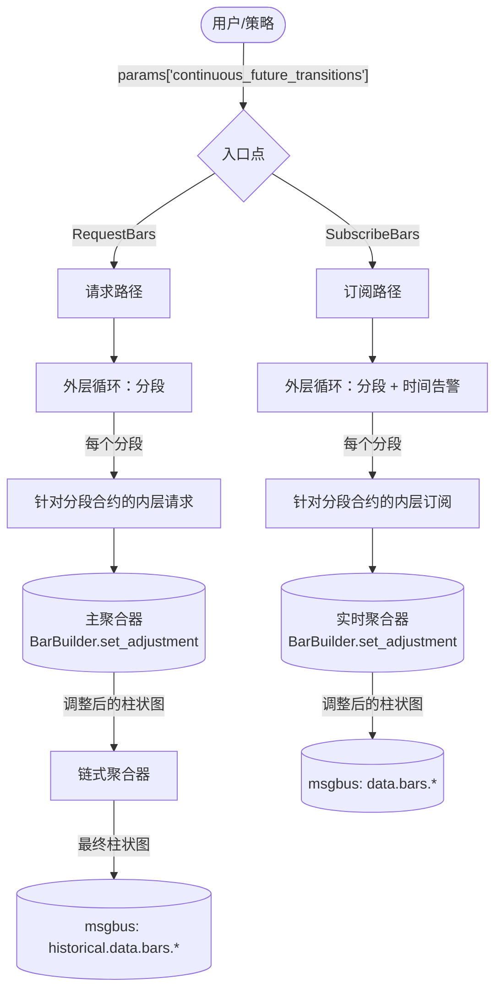
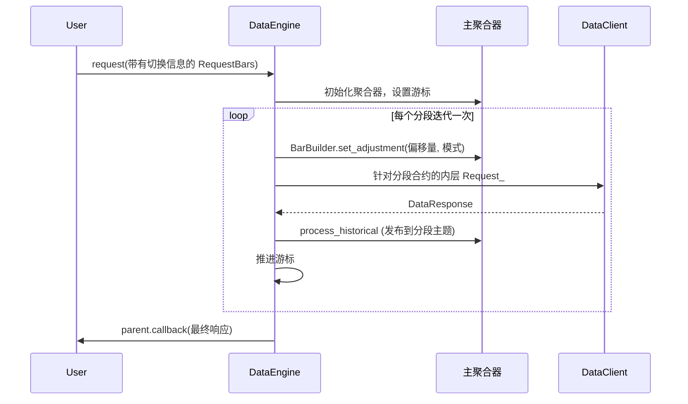
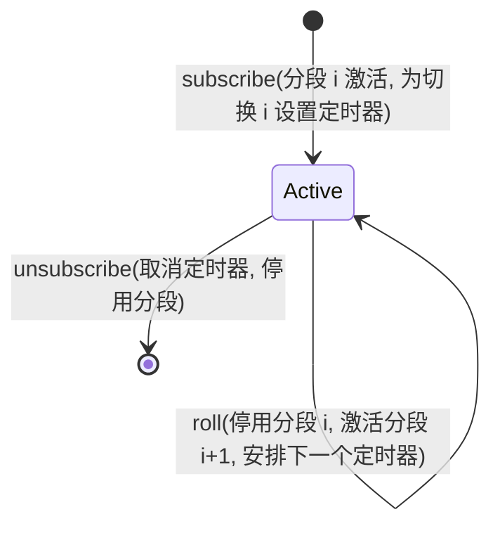

# 连续期货 (Continuous Futures)

连续期货 (Continuous Futures) 是一种衍生序列，它将连续的期货合约拼接成一个调整后的价格流。每个标的合约都会到期；连续序列通过在转换点展期 (Roll) 到下一个合约，并将历史价格平移到新合约的框架中，使生成的序列没有因展期引起的价格跳空，从而保持活跃。

Nautilus 将连续期货建模为一个目标的 `BarType`，加上在请求或订阅参数中提供的明确展期切换列表。数据引擎遍历每个合约分段 (Segment)，计算每个分段的累积价格调整量，并通过正常的柱状图 (Bar) 聚合路径处理调整后的源数据。

## 调整模式 (Adjustment modes)

`ContinuousFutureAdjustmentType` 将方向（向后或向前）与操作（价差或比例）相结合：

| 模式 | 操作 | 锚定分段 |
|-------------------|-----------------|----------------------|
| `BACKWARD_SPREAD` | 加法 (Additive) | 最近的合约 |
| `FORWARD_SPREAD` | 加法 (Additive) | 第一个合约 |
| `BACKWARD_RATIO` | 乘法 (Multiplicative) | 最近的合约 |
| `FORWARD_RATIO` | 乘法 (Multiplicative) | 第一个合约 |

在具有 `N` 个切换的第 `k` 个分段处的累积调整量为：

```text
BACKWARD_SPREAD: sum over i in [k, N) of (post_i - pre_i)
FORWARD_SPREAD:  sum over i in [0, k) of (pre_i - post_i)
BACKWARD_RATIO:  product over i in [k, N) of (post_i / pre_i)
FORWARD_RATIO:   product over i in [0, k) of (pre_i / post_i)
```

价差 (Spread) 模式累加加法偏移量。比例 (Ratio) 模式累积乘法因子，并要求价格必须严格为正。

## 输入 (Inputs)

连续期货请求或订阅是指在 `params` 中携带 `continuous_future_transitions` 条目的任何 `RequestBars` 或 `SubscribeBars`：

```python
params = {
    "continuous_future_transitions": [
        {
            "transition_time_ns": 1773671460000000000,  # 当 ESH26 展期至 ESM26 时
            "pre_instrument_id": "ESH26.XCME",
            "post_instrument_id": "ESM26.XCME",
            "pre_price": "6001.00",                     # 展期前 ESH26 的最后价格
            "post_price": "5995.50",                    # 展期后 ESM26 的第一笔价格
        },
        # ... 更多切换 ...
    ],
    "continuous_future_adjustment_mode": ContinuousFutureAdjustmentType.BACKWARD_SPREAD,
    # 可选：将累积调整的上限限制在 post_instrument_id 匹配的切换处（向后模式的锚点）。
    # "last_post_instrument_id": "ESM26.XCME",
    # 可选：将累积调整的下限限制在 pre_instrument_id 匹配的切换处（向前模式的锚点）。
    # "first_pre_instrument_id": "ESM26.XCME",
}
```

请求或命令上的 `bar_type` 是**目标**连续柱状图类型，例如 `"ES.XCME-1-MINUTE-LAST-INTERNAL@1-MINUTE-EXTERNAL"`。根标识符 (`ES.XCME`) 是连续根，而不是真实的合约。每个分段的原始源数据来自切换列表中的真实合约。

目标连续柱状图类型必须是**内部聚合 (Internally aggregated)** 的。不支持将外部聚合的柱状图作为连续目标，但它们可以作为每个分段的源数据。

### 有界链 (Bounded chains)

两个可选边界限制了展期表 (Roll table) 的活动部分：

- `last_post_instrument_id` 将上限限制在第一个 `post_instrument_id` 匹配的切换处。向后模式将其用作锚点（锚定分段的累积调整量为零）；向前模式使用它来限制后续合约的累积程度。
- `first_pre_instrument_id` 将下限限制在第一个 `pre_instrument_id` 匹配的切换处。向前模式将其用作锚点；向后模式使用它来限制更早合约的累积程度。

这允许调用者传递一个广泛的切换表，同时将调整后的序列锚定在两端的特定合约上。

## 验证 (Validation)

在分配任何聚合器之前，两个入口点都会运行 `engine.pyx::_continuous_future_validate_transitions`：

- `continuous_future_adjustment_mode` 必须解析为有效的 `ContinuousFutureAdjustmentType`。
- `continuous_future_transitions` 必须是字典行构成的列表或元组。
- 每一行必须包含非负整数 `transition_time_ns`，且切换时间必须严格递增。
- 每个 `pre_instrument_id` 和 `post_instrument_id` 必须解析为有效的 `InstrumentId`，且其交易所 (Venue) 与目标交易所一致。
- 链必须是连续的：第 `i` 行的 `post_instrument_id` 必须等于第 `i + 1` 行的 `pre_instrument_id`。
- 每一行必须包含有限的 `pre_price` 和 `post_price`。比例模式还要求两个价格都必须为正。
- 如果调用者提供了 `last_post_instrument_id`，它必须解析为一个 `InstrumentId`，匹配目标交易所，并出现在切换列表的 `post_instrument_id` 中。`first_pre_instrument_id` 同理。

验证失败时，助手会记录特定错误并返回。请求处理器还会调用 `_abort_request` 以丢弃其已开始设置的任何工作流状态。

## 目标合约自动合成 (Target instrument auto-synthesis)

连续根（例如 `ES.XCME`）是一个合成 ID，本身没有市场数据，但下游消费者（聚合器、缓存查找、序列化）仍然期望在缓存中有一个 `Instrument`。验证后，两个入口点都会调用 `engine.pyx::_continuous_future_ensure_target_instrument`：

- 如果目标 ID 已在缓存中，该助手将不执行任何操作。调用者可以预注册自定义的连续合约 (Instrument)，引擎会予以尊重。
- 否则，助手会从缓存中获取第一个分段的合约，并通过 `FuturesContract.to_dict_c` 和 `from_dict_c` 对其进行克隆，仅覆盖 `id`、`raw_symbol`，并将 `activation_ns` 和 `expiration_ns` 清除为 `0`。其他所有字段（货币、精度、增量、乘数、手数大小、标的资产、费用、保证金、交易所、刻度方案、信息）都复用自分段合约。
- 如果第一个分段合约尚未在缓存中或不是 `FuturesContract`，助手会记录警告并返回。随后调用者必须手动注册连续合约。

## 架构概览 (Architecture overview)



该设计有两个入口点，一种外层循环形状（遍历分段），两种获取每个分段数据的方法（历史子请求或实时子订阅），以及一种调整机制（在每个分段边界调用 `BarBuilder.set_adjustment`）。

## 分段 (Segments)

**分段 (Segment)** 是由一个真实合约拥有的连续时间片。切换 (Transitions) 将分段分开。给定 `transitions[0..N)`：

- 分段 0：在 `transitions[0].pre_instrument_id` 上的 `(-inf, transitions[0].time)`。
- 分段 k (k 属于 `[1, N)`)：在 `transitions[k-1].pre_instrument_id` 上的 `[transitions[k-1].time, transitions[k].time)`。
- 分段 N：在 `transitions[N-1].post_instrument_id` 上的 `[transitions[N-1].time, +inf)`。

`engine.pyx::_continuous_future_next_segment` 返回从 `cursor_ns` 开始并被钳制到 `end_ns` 的下一个分段。

## 请求流 (Request flow)

请求路径镜像了上一层的 `_handle_long_request`：每次迭代都会为每个分段的数据发起一次内层请求，内层请求的完成回调会推进游标 (Cursor)。



如果调用者在参数中设置了 `time_range_generator` 和 `durations_seconds`，则内层请求会继承它们，并自身变成一个长请求，将分段的时间范围进一步划分为 N 个子子请求。外层连续期货循环忽略内层分块：每个内层请求仍只向回发送一个合并后的响应，从而触发外层循环的下一个分段。

### 链式聚合器 (Chain aggregators)

如果调用者为多层内部聚合设置了 `bar_types = (bar_type_1, bar_type_2)`，则设置会创建所有以 `parent.id` 为键的聚合器。主聚合器（链的最底层）通过每分段的 msgbus 订阅接收分段源数据。其生成的柱状图发布到下一层订阅的历史主题中，因此链条会自动向上遍历。只有主聚合器的构建器会调用 `set_adjustment`。更高层次会对已经调整过的数据进行重新聚合。

## 订阅流 (Subscription flow)

一个小型的状态机通过单一的挂起时间告警来驱动每个活跃订阅：



当切换触发时，引擎会停用当前分段（退订源数据），激活下一个分段（解析新源数据、应用新偏移量、订阅），并为下一次切换重新挂载定时器。

## 源解析 (Source resolution)

对于任何目标为连续期货的 `BarType`，喂给主聚合器的原始数据存在于**分段合约 (Segment contract)** 上，而不是连续 ID 上。目标的形状决定了源类型：

```mermaid
flowchart TD
    Target[target_bar_type] --> Check1{是否为复合类型 (is_composite)?}
    Check1 -->|是| Ref[参考 = target.composite]
    Check1 -->|否| RefNo[参考 = target]
    Ref --> Check2{是否为外部聚合 (externally_aggregated)?}
    RefNo --> Check2
    Check2 -->|是| Bars["源 = 柱状图 (Bars) (RequestBars / SubscribeBars)"]
    Check2 -->|否| Check3{价格类型 (price_type)}
    Check3 -->|LAST| Trades["源 = 逐笔成交 (Trades) (TradeTicks)"]
    Check3 -->|MID/BID/ASK| Quotes["源 = 报价 (Quotes) (QuoteTicks)"]
```

## BarBuilder 调整 (BarBuilder adjustment)

构建器在每次调用 `update(price, ...)` 和 `update_bar(bar, ...)` 时在**入口处 (at ingress)** 应用调整。运行中的 OHLC 状态始终处于调整后的（通用）框架中，因此柱状图中间的调整更改仅影响后续价格。不需要对柱状图进行部分缓冲。

```mermaid
flowchart LR
    Tick[原始价格] --> AdjCheck{调整模式 (adjustment_mode)}
    AdjCheck -->|未激活| Raw[直接透传]
    AdjCheck -->|价差 (spread)| SpreadApply[价格 + 原始调整量]
    AdjCheck -->|比例 (ratio)| RatioApply[价格 * 比例调整量]
    Raw --> Update[更新 OHLC 状态]
    SpreadApply --> Update
    RatioApply --> Update
    Update --> Build[触发时构建]
```

`BarBuilder` 只关心比例与价差的区别，以决定是相加还是相乘。引擎在调用 `set_adjustment` 之前，将方向信息合并为累积偏移量的符号和大小。`reset()` 方法为序列中的下一个柱状图清除每根柱状图的 OHLCV 状态，但刻意保留调整配置：展期的发生频率远低于柱状图重置，因此调整被视为分段范围内的状态。

## 柱状图中间的展期边界 (Mid-bar roll boundary)

如果展期发生在正在进行的柱状图中间，构建器会保留当前的 OHLC 状态，并仅对后续更新应用新调整。边界前的部分保持旧的偏移量；边界后的部分使用新的偏移量。这是有意为之的策略：在每次展期时重写运行中的 OHLC 将需要按分段缓冲原始输入，这会增加成本，而在调整后的分段在边界处无缝构建的常见情况下，并不会改变调整后的结果。

## 局限性 (Limitations)

- 该功能需要提供切换元数据。引擎不会发现展期、选择合约或推断展期价格：这是调用者的责任。
- 比例调整在核心路径中通过 `float` 进行（`price_as_f64 * ratio` 然后 `price_new`）。对于高精度合约，由于舍入原因，生成的原始价格与等效的 `Decimal` 乘法相比可能会偏移 1 ULP。价差模式是精确的，因为它直接在 `PriceRaw` (int64/int128) 上操作。
