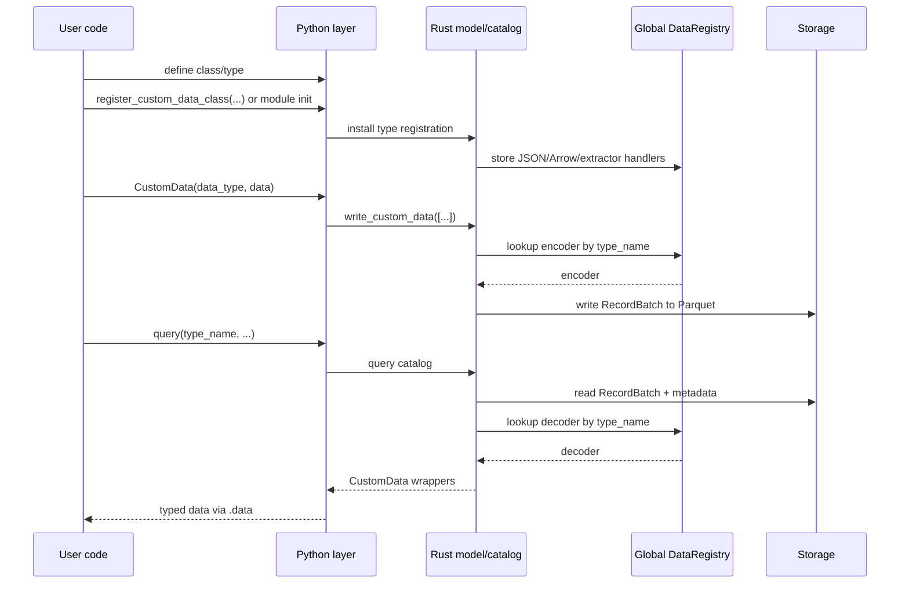
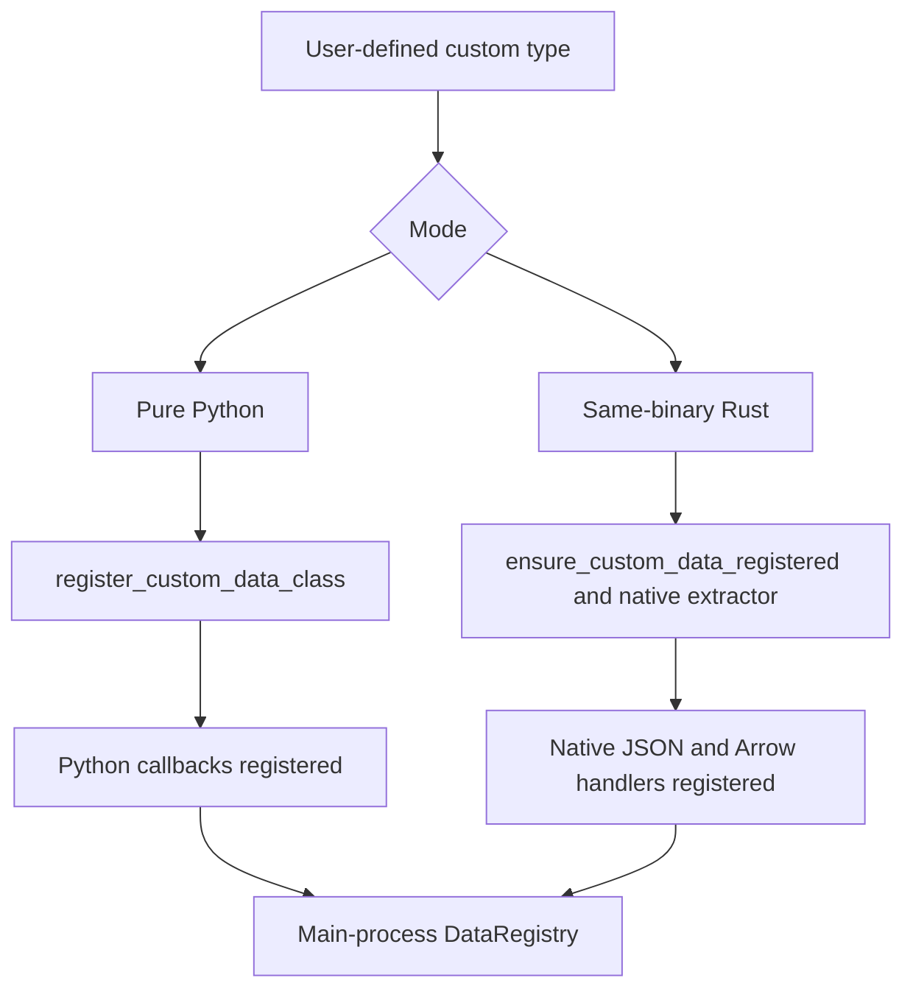
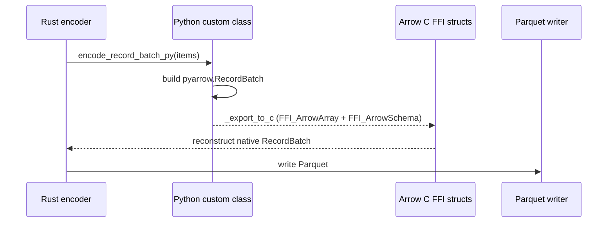

# 自定义数据 (Custom Data)

Nautilus Trader 支持使用 Python 和 Rust 编写自定义数据，并使这些数据通过平台其余部分所使用的相同运行时、持久化和查询流水线进行传输。

本文档解释了自定义数据如何：

- 在运行时注册。
- 跨 Python/Rust 边界进行包装。
- 与 Arrow/Parquet 进行双向序列化。
- 通过 Actor 和策略 (Strategy) 进行路由。

## 目标 (Goals)

自定义数据架构满足以下要求：

- 让用户能够定义纯 Python 自定义数据，而无需编写 Rust 代码。
- 让 Rust 定义的自定义数据能够使用原生的 Rust JSON 和 Arrow 处理器。
- 在 PyO3 边界处保留一个面向用户的单一 `CustomData` 包装器。
- 支持在 `ParquetDataCatalog` 中通过动态类型注册（而非硬编码模式）进行持久化。
- 使自定义数据能够通过正常的 Data Engine、Actor 和策略订阅流进行路由。

## 高层模型 (High-level model)

支持两种编写模式：

| 模式 | 示例 | 注册路径 | 编码/解码路径 | 包装器后端 |
|-------------------|----------------------------------------------------|---------------------------------------------------------|---------------------------------|---------------------------|
| 纯 Python | `@customdataclass_pyo3` 类 | `register_custom_data_class(...)` | Python 回调 + Arrow C FFI | `PythonCustomDataWrapper` |
| 同二进制 Rust | `#[custom_data]` 或 `#[custom_data(pyo3)]` 类型 | `ensure_custom_data_registered::<T>()` 和原生提取器 | 原生 Rust | 原生 Rust 负载 (Payload) |

两种模式最终都汇聚在同一个外部 PyO3 `CustomData` 包装器和相同的 `DataType` 身份模型上。

## 端到端流程 (End-to-end flow)

## 核心组件 (Core components)

### `DataRegistry`

`crates/model/src/data/registry.rs` 是主进程中自定义数据的核心运行时注册表模块。注册使用原子的 `DashMap::entry()`，以便并发的 `register_*` 和 `ensure_*` 调用不会产生竞争。

该模块包含几个由 `OnceLock` 初始化的 `DashMap` 单例：

- 以 `type_name` 为键的 JSON 反序列化器。
- 以 `type_name` 为键的 Arrow 模式 (Schema)、编码器和解码器。
- 将 Python 对象转换为 `Arc<dyn CustomDataTrait>` 的 Python 提取器。
- 为同二进制类型生成 Python 提取器的 Rust 提取器工厂。

Nautilus 不是将每种类型硬编码到主二进制文件中，而是在运行时使用存储在 `DataType` 和 Parquet 元数据中的 `type_name` 来解析处理器。

### `CustomData`

外部 PyO3 `CustomData` 包装器是跨越 FFI 边界的通用容器。

构造函数签名：`CustomData(data_type, data)`，其中 `DataType` 排在第一位，然后是内部负载 (Payload)。

它包含：

- 一个 `DataType`。
- 一个实现 `CustomDataTrait` 的内部自定义负载（包装在 `Arc<dyn CustomDataTrait>` 中）。

时间戳 (`ts_event`, `ts_init`) 被委托给内部的 `CustomDataTrait` 实现，并作为属性暴露在包装器上。

在 Python 侧，`CustomData` 暴露了值语义：实现了 `__eq__` 和 `__repr__`（相等性使用 Rust 的 `PartialEq` 逻辑）。实例有意被设计为不可哈希，以便相等性与内部负载的比较保持一致。

该包装器在两种自定义数据模式下共享。用户代码仅与一个 API 交互，即使底层负载可能是：

- 一个基于 Python 的包装器。
- 一个同二进制的 Rust 值。

#### `CustomData` JSON 信封 (Envelope)

当序列化为 JSON 时（例如用于 `to_json_bytes` / `from_json_bytes`、SQL 缓存或 Redis），`CustomData` 使用单一的规范信封，以便反序列化不依赖于用户负载的字段名：

- `type`：自定义类型名称（来自 `CustomDataTrait::type_name`）。
- `data_type`：一个包含 `type_name`、`metadata` 和可选 `identifier` 的对象。
- `payload`：仅包含内部负载（`CustomDataTrait::to_json` 的结果，作为值解析）。已注册的反序列化器在 `from_json` 中仅接收此值，因此用户结构体可以使用任何字段名（包括 `value`），而不会与包装器元数据冲突。

该信封由 Rust 的 `CustomData` 序列化生成，并在从 JSON 反序列化自定义数据时由 `DataRegistry` 消费。

### `DataType`

`DataType` 用于在路由和持久化时标识自定义数据。

构造函数：`DataType(type_name, metadata=None, identifier=None)`。

它包括：

- `type_name`。
- 可选的 `metadata` (元数据)。
- 可选的 `identifier` (标识符)（仅用于目录路径，不用于路由或相等性比较）。

相等性、哈希和议题 (Topic) 路由仅派生自 `type_name` 和 `metadata`。两个具有相同类型名称和元数据但标识符不同的 `DataType` 值在比较时相等，并发布到同一个消息总线议题。`identifier` 仅影响 `data/custom/<type_name>/<identifier...>` 下的存储路径。

自定义数据存储和查询使用 `DataType`，而不仅仅是裸的 Rust/Python 类名。这允许将相同的逻辑类型存储在不同的元数据或标识符下，同时仍然通过相同的已注册处理器进行解码。

## 注册架构 (Registration architecture)

注册桥接了 Python 对象和 Rust 特征对象 (Trait object) 之间的鸿沟。

### 纯 Python 注册 (Pure Python registration)

当 Python 代码调用 `register_custom_data_class(MyType)` 时：

1. 该类型在 Python 序列化层注册，以支持 JSON 和 Arrow。
2. Rust 注册一个 Python 提取器，将 Python 实例包装为 `PythonCustomDataWrapper`。
3. Rust 在 `DataRegistry` 中注册 Arrow 模式/编码/解码回调。

这条路径灵活且用户友好，但 Arrow 编码和重建依赖于 Python 回调。

### 同二进制 Rust 注册 (Same-binary Rust registration)

对于在 Nautilus 内部定义的 Rust 类型：

1. `#[custom_data]` 或 `#[custom_data(pyo3)]` 生成必要的特征 (Trait)、JSON 和 Arrow 实现。
2. `ensure_custom_data_registered::<T>()` 将原生的模式/编码器/解码器处理器插入 `DataRegistry` 中。
3. 对于暴露给 PyO3 的类型，原生提取器可以将 Python 实例转换回具体的 Rust 类型，而不是使用 Python 备用包装器。

这条路径在编码/解码时完全保持在原生 Rust 中。

### 注册优先级 (Registration precedence)

`register_custom_data_class(...)` 按以下顺序解析类型：

1. 同二进制原生 Rust 注册。
2. 纯 Python 备用注册。

该顺序为已在主二进制文件中原生知晓的类型保留了最快的可用路径。

## 包装器后端 (Wrapper backends)

在内部，外部 `CustomData` 包装器可以持有不同的负载实现。

### `PythonCustomDataWrapper`

用于纯 Python 自定义数据。

职责：

- 存储对 Python 对象的引用。
- 缓存 `ts_event`、`ts_init` 和 `type_name`。
- 实现 `CustomDataTrait`。
- 在持有 GIL 的情况下，调用 Python 方法进行 JSON 和 Arrow 相关操作。

当主进程没有该类型的原生 Rust 表示时，这是备用路径。

### 原生同二进制 Rust 负载 (Native same-binary Rust payload)

对于编译进 Nautilus 的 Rust 类型，内部负载就是具体的 Rust 类型本身，可以直接从 `Arc<dyn CustomDataTrait>` 向下转型 (Downcast)。

序列化或解码时不需要 Python 回调路径。

## 持久化架构 (Persistence architecture)

### 为什么需要动态 Arrow 注册

内置的 Nautilus 数据类型具有 Rust 二进制文件静态知晓的模式和编码器。自定义数据则不然。因此，持久化层使用已注册的 `type_name` 动态解析自定义数据。

### 目录写入流程

`ParquetDataCatalog` 期望自定义写入以 `CustomData` 值的形式进入。

自定义数据写入路径：

1. 从 `DataType` 中提取 `type_name`、`metadata` 和 `identifier`。
2. 在 `DataRegistry` 中查找 Arrow 编码器。
3. 将值编码为 `RecordBatch`。
4. 追加一个包含持久化 `DataType` 的 `data_type` 列。
5. 将 `type_name` 和元数据附加到 Arrow 模式。
6. 将批处理数据写入自定义数据路径下的 Parquet 文件。

路径布局为：

- `data/custom/<type_name>/<identifier...>`

标识符在成为路径段之前会进行规范化。

### 目录读取流程

查询时：

1. 目录读取匹配的 Parquet 文件。
2. 从模式元数据中提取 `type_name`。
3. 向 `DataRegistry` 请求已注册的解码器。
4. 将 `RecordBatch` 解码为 `Vec<Data>`。
5. 使用原始的 `DataType` 重建 `CustomData`。

这使得自定义数据查询解析与写入时注册具有对称性。在将 Feather 流转换为 Parquet 时（例如回测之后），自定义数据分支会解码批处理数据并通 `write_custom_data_batch` 写入，以便通过 Feather 写入器写入的自定义数据能正确转换为 Parquet。

## Arrow C FFI 桥接 (The Arrow C FFI bridge)

纯 Python 自定义数据无法直接提供原生的 Rust Arrow 编码逻辑。对于这些类型，Nautilus 使用 Arrow C FFI 接口在 Python 和 Rust 之间传递 `RecordBatch` 数据，而没有序列化开销。

### 纯 Python 编码路径 (Pure Python encode path)

对于纯 Python 类：

1. Rust 获取 GIL。
2. Rust 调用 Python 类上的 `encode_record_batch_py(...)`。
3. Python 将对象转换为 `pyarrow.RecordBatch`。
4. Python 通过 `_export_to_c` 将批处理数据导出到 Arrow C FFI 结构中。
5. Rust 从 FFI 结构体重建原生 `RecordBatch` 并写入。

### 纯 Python 解码路径 (Pure Python decode path)

对于反向过程：

1. Rust 将其 `RecordBatch` 转换为 Arrow C FFI 结构。
2. Python 通过 `RecordBatch._import_from_c` 导入批处理数据。
3. Python 调用类上的 `decode_record_batch_py(metadata, batch)`。
4. Rust 将返回的 Python 对象包装在 `PythonCustomDataWrapper` 中。

### 原生路径 (Native paths)

同二进制 Rust 自定义数据不使用 Arrow C FFI 桥接。这些类型使用在主进程中注册的原生 Rust 编码/解码处理器。

## 查询时的重建 (Reconstruction on query)

当从目录加载回自定义数据时，重建取决于后端：

- 同二进制 Rust 类型直接解码为原生 Rust 值。
- 纯 Python 类型使用已注册的 Python 类通过 `from_dict` 或 `from_json` 进行重建。

在所有情况下，调用者在 PyO3 API 边界处接收到的都是相同的外部 `CustomData` 包装器。

## 运行时集成 (Runtime integration)

自定义数据不仅是一项持久化功能。它还参与 Nautilus 的运行时路由。

相关的集成包括：

- `crates/data/src/engine/mod.rs` 通过消息总线发布 `CustomData`。
- `crates/common/src/msgbus/switchboard.rs` 从 `DataType` 派生自定义议题。
- `crates/common/src/actor/*` 将自定义数据路由到 Actor 订阅。
- `crates/trading/src/python/strategy.rs` 将自定义数据暴露给 Python 策略的 `on_data`。
- `crates/backtest/src/engine.rs` 将 `Data::Custom` 视为 Data Engine 交付的输入，而不是经交易所路由的数据。

已注册的自定义类型可以像其他数据系列一样，通过相同的运行时接口进行持久化、查询、订阅和消费。

## SQL 缓存和数据库集成 (SQL cache and database integration)

SQL 缓存/数据库层也支持 `CustomData`。

当前行为：

- PostgreSQL 将自定义数据存储在 `custom` 表中。
- 存储的记录包括 `data_type`、`metadata`、`identifier` 和完整的 JSON 负载。
- 读取时使用 `CustomData::from_json_bytes(...)` 重建 `CustomData`。
- Python SQL 绑定暴露了 `add_custom_data` 和 `load_custom_data`。
- Redis 缓存将自定义数据存储在键 `custom:<ts_init_020>:<uuid>` 下，值为完整的 `CustomData` JSON。
- Redis 的 `add_custom_data` 和 `load_custom_data` 按 `DataType`（type_name, metadata, identifier）过滤并返回按 `ts_init` 排序的结果；这通过 PyO3 `RedisCacheDatabase` API 暴露。

## Cython 自定义数据 (Cython custom data)

Cython 的 `@customdataclass` 系统与此架构是分开的。本文档描述的是 PyO3 自定义数据系统：

- PyO3 `CustomData`。
- 动态运行时注册。
- Arrow/Parquet 持久化。
- 原生 Rust 执行路径。

## 实际意义 (Practical implications)

该架构赋予了 Nautilus 两个重要的属性：

1. 对于只想编写 Python 的用户，具有 Python 优先的可扩展性。
2. 对于内置或编译的自定义类型，具有原生的 Rust 性能。

其结果是一个具有两个后端的概念性自定义数据系统，而不是将纯 Python 和纯 Rust 数据类型分成不同的功能孤岛。
