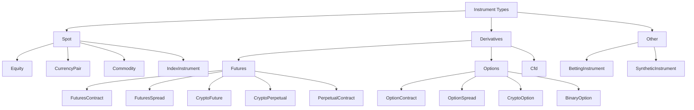
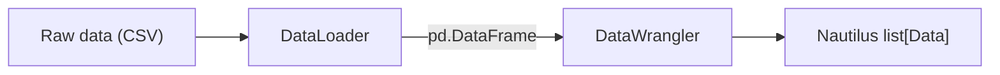

# 数据 (Data)

常见的内置数据类型包括：

- `OrderBookDelta` (L1/L2/L3)：代表最细粒度的订单簿更新。
- `OrderBookDeltas` (L1/L2/L3)：批量处理多个订单簿增量，以提高处理效率。
- `OrderBookDepth10`：聚合的订单簿快照（买卖双方各最多 10 档）。
- `QuoteTick`：代表盘口 (Top-of-book) 的最佳买价和卖价及其规模 / 数量 (Size)。
- `TradeTick`：交易对手之间的单次成交 (Trade) / 匹配事件。
- `Bar`：OHLCV (开盘价、最高价、最低价、收盘价、成交量) K 线 (Bar) / 蜡烛图，使用指定的 *聚合方法* 进行聚合。
- `MarkPriceUpdate`：合约 (Instrument) 的当前标记价格 (Mark Price)（通常用于衍生品交易）。
- `IndexPriceUpdate`：合约 (Instrument) 的指数价格 (Index Price)（用于标记价格计算的基础价格）。
- `FundingRateUpdate`：永续合约的资金费率 (Funding Rate)（多头和空头头寸之间的定期付款）。
- `InstrumentStatus`：合约级别的状态事件。
- `InstrumentClose`：合约的收盘价 (Closing Price)。

请参阅 API 参考以获取完整的内置数据类和包装器集合。

NautilusTrader 主要运行在细粒度的订单簿 (Order Book) 数据上，以实现执行模拟的最高真实性。回测 (Backtesting) 也可以根据所需的模拟保真度，在任何受支持的市场数据类型上运行。

## 订单簿 (Order books)

一个使用 Rust 实现的高性能订单簿 (Order Book) 可用于根据提供的数据维护订单簿状态。

`OrderBook` 实例在回测 (Backtesting) 和实盘交易中均按合约 (Instrument) 进行维护，提供以下订单簿类型：

- `L3_MBO`：**逐单行情 (Market by order, MBO)** 或 L3 数据，使用每个价格层级的每个订单簿事件，通过订单 ID 键控。
- `L2_MBP`：**逐价行情 (Market by price, MBP)** 或 L2 数据，按价格层级聚合订单簿事件。
- `L1_MBP`：**逐价行情 (Market by price, MBP)** 或 L1 数据，也称为最佳买卖价 (Best Bid and Offer, BBO)，仅捕获盘口更新。

:::note
盘口数据，如 `QuoteTick`、`TradeTick` 和 `Bar`，也可用于回测 (Backtesting)，市场运行在 `L1_MBP` 订单簿类型上。
:::

### 增量标志 (Delta flags) 和事件边界

每个 `OrderBookDelta` 都带有一个 `flags` 字段，使用 `RecordFlag` 位掩码值向 `DataEngine` 发出事件边界信号：

- `F_LAST`：标记逻辑事件组中的最后一个增量。启用 `buffer_deltas` 时，`DataEngine` 会累积增量，并且仅在遇到 `F_LAST` 时才发布给订阅者。每个事件组 **必须** 以设置了 `F_LAST` 的增量结束。
- `F_SNAPSHOT`：标记属于快照 (Snapshot) 的增量（与增量更新相对）。快照序列以 `Clear` 动作开始，随后是重建完整订单簿状态的 `Add` 增量。快照中的最后一个增量同时设置了 `F_SNAPSHOT | F_LAST`。

:::warning
如果事件组中的最后一个增量缺少 `F_LAST`，会导致缓冲消费者无限期地累积增量而不发布。这同样适用于增量更新和快照，包括仅发出 `Clear` 增量的空订单簿快照。
:::

## 合约 (Instruments)

NautilusTrader 支持现货、衍生品和专业市场的多种合约 (Instrument) 类型：



| 合约 (Instrument) | 描述 (Description) |
|----------------------|----------------------------------------------------------------------------------|
| `Equity`             | 通用股票合约。                                                       |
| `CurrencyPair`       | 现货/现金市场中的货币对。                                             |
| `Commodity`          | 现货/现金市场中的大宗商品。                                                 |
| `IndexInstrument`    | 现货指数（参考价格，不可直接交易）。                             |
| `FuturesContract`    | 通用可交割期货合约。                                            |
| `FuturesSpread`      | 可交割期货价差。                                                      |
| `CryptoFuture`       | 以加密资产作为标的和结算资产的可交割期货。             |
| `CryptoPerpetual`    | 加密货币永续期货（永续掉期）。                                       |
| `PerpetualContract`  | 资产类别无关的永续掉期（任何标的）。                            |
| `OptionContract`     | 通用期权合约。                                                         |
| `OptionSpread`       | 通用期权价差。                                                           |
| `CryptoOption`       | 加密货币期权合约。                                                          |
| `BinaryOption`       | 二元期权合约。                                                        |
| `Cfd`                | 差价合约 (Contract for Difference, CFD)。                                                   |
| `BettingInstrument`  | 博彩市场中的合约。                                                  |
| `SyntheticInstrument`| 合成合约，其价格通过公式从组件合约派生而来。 |

## K 线 (Bars) 和聚合

### K 线 (Bars) 简介

*K 线 (Bar)*（也称为蜡烛图、K 线图或 kline）是一种数据结构，代表特定时间段内的价格和成交量信息，包括：

- 开盘价 (Opening price)
- 最高价 (Highest price)
- 最低价 (Lowest price)
- 收盘价 (Closing price)
- 成交量 (Traded volume)（或以 Tick 作为成交量代理）

系统使用 *聚合方法* 生成 K 线 (Bar)，该方法根据特定标准对数据进行分组。

### 数据聚合的目的

NautilusTrader 中的数据聚合将细粒度的市场数据转换为结构化的 K 线 (Bar) 或蜡烛图，原因如下：

- 为技术指标和策略开发提供数据。
- 因为对于许多策略来说，时间聚合数据（如分钟 K 线）通常已经足够。
- 与高频 L1/L2/L3 市场数据相比，可以降低成本。

### 聚合方法

该平台实现了多种聚合方法：

| 名称 | 描述 | 类别 |
|:-------------------|:---------------------------------------------------------------------------|:-------------|
| `TICK`             | 若干数量 Tick 的聚合。                                          | 阈值 (Threshold) |
| `TICK_IMBALANCE`   | Tick 买卖不平衡的聚合。                            | 阈值 (Threshold) |
| `TICK_RUNS`        | 连续 Tick 买/卖运行的聚合。                          | 信息 (Information) |
| `VOLUME`           | 成交量 (Traded volume) 的聚合。                                              | 阈值 (Threshold) |
| `VOLUME_IMBALANCE` | 成交量 (Traded volume) 买卖不平衡的聚合。                    | 阈值 (Threshold) |
| `VOLUME_RUNS`      | 连续成交量 (Traded volume) 买/卖运行的聚合。                  | 信息 (Information) |
| `VALUE`            | 成交名义价值的聚合（也称为“美元 K 线”）。 | 阈值 (Threshold) |
| `VALUE_IMBALANCE`  | 成交名义价值买卖不平衡的聚合。        | 阈值 (Threshold) |
| `VALUE_RUNS`       | 连续成交名义价值买/卖运行的聚合。      | 信息 (Information) |
| `RENKO`            | 基于固定价格移动（以 Tick 为单位的砖块大小）的聚合。          | 阈值 (Threshold) |
| `MILLISECOND`      | 毫秒粒度的时间间隔聚合。                | 时间 (Time) |
| `SECOND`           | 秒粒度的时间间隔聚合。                     | 时间 (Time) |
| `MINUTE`           | 分钟粒度的时间间隔聚合。                     | 时间 (Time) |
| `HOUR`             | 小时粒度的时间间隔聚合。                       | 时间 (Time) |
| `DAY`              | 天粒度的时间间隔聚合。                        | 时间 (Time) |
| `WEEK`             | 周粒度的时间间隔聚合。                       | 时间 (Time) |
| `MONTH`            | 月粒度的时间间隔聚合。                      | 时间 (Time) |
| `YEAR`             | 年粒度的时间间隔聚合。                       | 时间 (Time) |

### 信息驱动的 K 线 (Information-driven bars)

信息驱动的 K 线 (Information-driven bars) 根据市场活动调整其采样频率，而不是使用固定间隔。它们基于 *主动方 (Aggressor side)* 的概念（交易发起者是买方还是卖方），分为两个系列：**不平衡 (Imbalance)** 和 **运行 (Runs)**。

**不平衡 K 线 (Imbalance bars)** 在 *净* 买/卖活动达到阈值时收盘。每笔成交都会贡献一个带符号的值：买方发起的成交为正，卖方发起的成交为负。当绝对不平衡达到配置的步长 (Step) 时，K 线收盘。这意味着相反的成交会相互抵消，因此不平衡 K 线在平衡市场中往往形成得较慢，而在定向移动期间形成得较快。

**运行 K 线 (Runs bars)** 在来自同一主动方的 *连续* 活动达到阈值时收盘。与不平衡 K 线不同，当主动方发生变化时，运行 K 线会重置其计数器。这使得它们对持续的单向压力而非净不平衡敏感。

这两个系列都有基于测量内容的三个变体：

| 变体 | 不平衡 (Imbalance) | 运行 (Runs) | 测量内容 |
|:--------|:-------------------|:--------------|:------------------------------------------|
| Tick    | `TICK_IMBALANCE`   | `TICK_RUNS`   | 成交次数（每笔成交计为 1） |
| 成交量 (Volume)  | `VOLUME_IMBALANCE` | `VOLUME_RUNS` | 成交量 (Quantity)                  |
| 价值 (Value)   | `VALUE_IMBALANCE`  | `VALUE_RUNS`  | 名义价值（价格 x 数量）         |

:::note
信息驱动的 K 线需要 `TradeTick` 数据，因为它们需要 `aggressor_side` 字段来对每笔成交进行分类。它们不能仅从 `QuoteTick` 数据聚合而成。
:::

### 聚合类型

NautilusTrader 实现了三种不同的数据聚合方法：

1. **成交到 K 线 (Trade-to-bar) 聚合**：从 `TradeTick` 对象（已执行的成交）创建 K 线
   - 使用场景：用于分析执行价格的策略或直接使用成交数据时。
   - 始终在 K 线规范中使用 `LAST` 价格类型。

2. **报价到 K 线 (Quote-to-bar) 聚合**：从 `QuoteTick` 对象（买/卖价）创建 K 线
   - 使用场景：用于关注买卖价差或市场深度分析的策略。
   - 在 K 线规范中使用 `BID`、`ASK` 或 `MID` 价格类型。

3. **K 线到 K 线 (Bar-to-bar) 聚合**：从较小时间周期的 `Bar` 对象创建较大时间周期的 `Bar` 对象
   - 使用场景：用于将现有的较小时间周期 K 线（如 1 分钟）重采样为较大时间周期（如 5 分钟、小时）。
   - 始终在规范中需要 `@` 符号。

### K 线类型 (Bar types)

NautilusTrader 根据以下组件定义唯一的 *K 线类型* (`BarType` 类)：

- **合约 ID (`InstrumentId`)**：指定该 K 线的特定合约。
- **K 线规范 (`BarSpecification`)**：
  - `step`：定义每个 K 线的间隔或频率。
  - `aggregation`：指定用于数据聚合的方法（见上表）。
  - `price_type`：指示 K 线价格的基础（例如：买价、卖价、中间价、最新价）。
- **聚合源 (`AggregationSource`)**：指示 K 线是在内部（在 Nautilus 内部）聚合的还是在外部（由交易场所或数据提供商）聚合的。

:::note
`BarSpecification` 验证固定子单位时间聚合，以便 K 线与其父时钟或日历单位整齐对齐。`MILLISECOND` 步长必须能整除 1000 且小于 1000；`SECOND` 和 `MINUTE` 步长必须能整除 60 且小于 60；`HOUR` 步长必须能整除 24 且小于 24；`MONTH` 步长必须能整除 12 且小于 12。当步长等于父单位时，请使用下一个更大的聚合，例如使用 `1-HOUR` 而不是 `60-MINUTE`。`DAY`、`WEEK`、`YEAR`、阈值、信息和 `RENKO` K 线不受此固定子单位规则的限制。

未来的版本将允许高级用户覆盖此验证，以使用不与时钟或日历边界对齐的任意 K 线周期。
:::

K 线类型也可以分为 *标准 (Standard)* 或 *复合 (Composite)*：

- **标准 (Standard)**：从细粒度的市场数据生成，如 Quote-Tick 或 Trade-Tick。
- **复合 (Composite)**：通过子采样从更高粒度的 K 线类型衍生而来（如 5 分钟 K 线从 1 分钟 K 线聚合而来）。

### 聚合源 (Aggregation sources)

K 线数据聚合可以是 *内部* 或 *外部*：

- `INTERNAL`：K 线在本地 Nautilus 系统边界内聚合。
- `EXTERNAL`：K 线在本地 Nautilus 系统边界外聚合（通常由交易场所或数据提供商聚合）。

对于 K 线到 K 线聚合，目标 K 线类型始终为 `INTERNAL`（因为你是在 Nautilus 内部进行聚合），但源 K 线可以是 `INTERNAL` 或 `EXTERNAL`，即你可以聚合外部提供的 K 线或已经聚合的内部 K 线。

### 使用 *字符串语法* 定义 K 线类型

#### 标准 K 线

你可以使用以下约定从字符串定义标准 K 线类型：

`{instrument_id}-{step}-{aggregation}-{price_type}-{INTERNAL | EXTERNAL}`

例如，要为纳斯达克 (XNAS) 上的 AAPL 成交（最新价）定义一个 `BarType`，使用 5 分钟间隔，由 Nautilus 在本地从成交数据聚合而成：

```python
bar_type = BarType.from_str("AAPL.XNAS-5-MINUTE-LAST-INTERNAL")
```

#### 复合 K 线

复合 K 线是通过将更高粒度的 K 线聚合到所需的 K 线类型而派生出来的。要定义复合 K 线，请使用以下约定：

`{instrument_id}-{step}-{aggregation}-{price_type}-INTERNAL@{step}-{aggregation}-{INTERNAL | EXTERNAL}`

**注意**：

- 派生的 K 线类型必须使用 `INTERNAL` 聚合源（因为这是 K 线聚合的方式）。
- 采样的 K 线类型必须比派生的 K 线类型具有更高的粒度。
- 采样的合约 ID 被推断为与派生的 K 线类型匹配。
- 复合 K 线可以从 `INTERNAL` 或 `EXTERNAL` 聚合源聚合而来。

例如，要为纳斯达克 (XNAS) 上的 AAPL 成交（最新价）定义一个 `BarType`，使用 5 分钟间隔，由 Nautilus 在本地从外部聚合的 1 分钟间隔 K 线聚合而成：

```python
bar_type = BarType.from_str("AAPL.XNAS-5-MINUTE-LAST-INTERNAL@1-MINUTE-EXTERNAL")
```

### 聚合语法示例

`BarType` 字符串格式编码了目标 K 线类型以及（可选的）源数据类型：

```
{instrument_id}-{step}-{aggregation}-{price_type}-{source}@{step}-{aggregation}-{source}
```

`@` 符号之后的部分是可选的，仅用于 K 线到 K 线聚合：

- **不带 `@`**：从 `TradeTick` 对象（当 price_type 为 `LAST` 时）或 `QuoteTick` 对象（当 price_type 为 `BID`、`ASK` 或 `MID` 时）聚合。
- **带有 `@`**：从现有的 `Bar` 对象聚合（指定源 K 线类型）。

#### 成交到 K 线示例

```python
def on_start(self) -> None:
    # 定义用于从 TradeTick 对象聚合的 K 线类型
    # 使用 price_type=LAST 表示源数据为 TradeTick
    bar_type = BarType.from_str("6EH4.XCME-50-VOLUME-LAST-INTERNAL")
    start = self.clock.utc_now() - timedelta(days=30)

    # 请求历史数据（将在 on_historical_data 处理器中接收 K 线）
    self.request_bars(bar_type, start=start)

    # 订阅实盘数据（将在 on_bar 处理器中接收 K 线）
    self.subscribe_bars(bar_type)
```

#### 报价到 K 线示例

```python
def on_start(self) -> None:
    # 从 ASK 价格（在 QuoteTick 对象中）创建 1 分钟 K 线
    bar_type_ask = BarType.from_str("6EH4.XCME-1-MINUTE-ASK-INTERNAL")

    # 从 BID 价格（在 QuoteTick 对象中）创建 1 分钟 K 线
    bar_type_bid = BarType.from_str("6EH4.XCME-1-MINUTE-BID-INTERNAL")

    # 从 MID 价格（QuoteTick 对象中 ASK 和 BID 价格的中间价）创建 1 分钟 K 线
    bar_type_mid = BarType.from_str("6EH4.XCME-1-MINUTE-MID-INTERNAL")
    start = self.clock.utc_now() - timedelta(days=30)

    # 请求历史数据并订阅实盘数据
    self.request_bars(bar_type_ask, start=start)  # 历史 K 线在 on_historical_data 中处理
    self.subscribe_bars(bar_type_ask)  # 实盘 K 线在 on_bar 中处理
```

#### K 线到 K 线示例

```python
def on_start(self) -> None:
    # 从 1 分钟 K 线（Bar 对象）创建 5 分钟 K 线
    # 格式：target_bar_type@source_bar_type
    # 注意：价格类型 (LAST) 仅在左侧目标方需要，在源方不需要
    bar_type = BarType.from_str("6EH4.XCME-5-MINUTE-LAST-INTERNAL@1-MINUTE-EXTERNAL")
    start = self.clock.utc_now() - timedelta(days=30)

    # 通过提供具有依赖顺序的聚合链来请求历史数据
    self.request_aggregated_bars([bar_type], start=start)

    # 订阅实盘更新（在 on_bar(...) 处理器中处理）
    self.subscribe_bars(bar_type)
```

#### 高级 K 线到 K 线示例

你可以创建复杂的聚合链，从已经聚合的 K 线中进行再聚合：

```python
# 首先从 TradeTick 对象创建 1 分钟 K 线（LAST 表示源为 TradeTick）
primary_bar_type = BarType.from_str("6EH4.XCME-1-MINUTE-LAST-INTERNAL")

# 然后从 1 分钟 K 线创建 5 分钟 K 线
# 注意 @1-MINUTE-INTERNAL 部分标识了源 K 线
intermediate_bar_type = BarType.from_str("6EH4.XCME-5-MINUTE-LAST-INTERNAL@1-MINUTE-INTERNAL")

# 然后从 5 分钟 K 线创建小时 K 线
# 注意 @5-MINUTE-INTERNAL 部分标识了源 K 线
hourly_bar_type = BarType.from_str("6EH4.XCME-1-HOUR-LAST-INTERNAL@5-MINUTE-INTERNAL")
```

### 使用 K 线：请求 (Request) vs 订阅 (Subscribe)

NautilusTrader 提供了两种不同的操作来使用 K 线：

- **`request_bars()`**：获取标准 `BarType` 的历史数据，由 `on_historical_data()` 处理器处理。
- **`request_aggregated_bars()`**：获取具有依赖顺序的 K 线类型列表的历史数据，实时构建内部 K 线。
- **`subscribe_bars()`**：建立由 `on_bar()` 处理器处理的实时数据提要。

这些方法在典型工作流中协同工作：

1. 首先，`request_bars()` 加载历史数据，以过去的行情行为初始化指标或策略状态。
2. 然后，`subscribe_bars()` 确保策略在实时形成新 K 线时继续接收它们。

在 `on_start()` 中的用法示例：

```python
def on_start(self) -> None:
    # 定义 K 线类型
    bar_type = BarType.from_str("6EH4.XCME-5-MINUTE-LAST-INTERNAL")
    start = self.clock.utc_now() - timedelta(days=30)

    # 在请求历史数据之前注册指标，以便它们也能接收历史更新
    self.register_indicator_for_bars(bar_type, self.my_indicator)

    # 请求历史数据以初始化指标
    # 这些 K 线将传递给策略中的 on_historical_data(...) 处理器
    self.request_bars(bar_type, start=start)

    # 订阅实时更新
    # 新的 K 线将传递给策略中的 on_bar(...) 处理器
    self.subscribe_bars(bar_type)
```

在策略中接收数据所需的处理器：

```python
def on_historical_data(self, data):
    # 处理来自 request_bars() 或 request_aggregated_bars() 的历史 Data 对象
    # 注意：使用 register_indicator_for_bars 注册的指标
    # 将使用历史数据自动更新
    pass

def on_bar(self, bar):
    # 处理来自 subscribe_bars() 的实时单个 K 线
    # 注册此 K 线类型的指标将自动更新，并且它们将在调用此处理器之前完成更新
    pass
```

### 带聚合的历史数据请求

在请求用于回测或初始化指标的历史 K 线时，对于标准 K 线类型使用 `request_bars()`，对于即时聚合使用 `request_aggregated_bars()`：

```python
start = self.clock.utc_now() - timedelta(days=30)

# 请求原始 1 分钟 K 线（从 TradeTick 对象聚合，由 LAST 价格类型指示）
self.request_bars(
    BarType.from_str("6EH4.XCME-1-MINUTE-LAST-EXTERNAL"),
    start=start,
)

# 请求从历史 Trade Tick 聚合而成的 K 线
self.request_aggregated_bars(
    [BarType.from_str("6EH4.XCME-100-VOLUME-LAST-INTERNAL")],
    start=start,
)

# 请求从 1 分钟 K 线聚合而成的 5 分钟 K 线
self.request_aggregated_bars(
    [BarType.from_str("6EH4.XCME-5-MINUTE-LAST-INTERNAL@1-MINUTE-EXTERNAL")],
    start=start,
)
```

### 常见陷阱

**在请求数据之前注册指标**：确保在请求历史数据之前注册指标，以便它们能够得到正确更新。

```python
start = self.clock.utc_now() - timedelta(days=30)

# 正确顺序
self.register_indicator_for_bars(bar_type, self.ema)
self.request_bars(bar_type, start=start)

# 错误顺序
self.request_bars(bar_type, start=start)  # 指标不会收到历史数据
self.register_indicator_for_bars(bar_type, self.ema)
```

### 性能考虑

K 线聚合器通过定点 `Price` 类型跟踪 OHLC 价格。Tick 和成交量聚合器的阈值比较使用整数算术，而基于价值和不平衡/运行的聚合器目前使用 `f64` 进行名义价值和带符号累积（这些正在迁移到定点整数算术）。聚合方法的选择对每次更新的开销有轻微影响：

- **时间 K 线** 是高吞吐量数据最高效的选择。聚合器在每次更新时累积 OHLCV 状态；K 线发射由定时器驱动，而不是由每个 Tick 逻辑驱动。
- **阈值 K 线**（Tick、成交量、价值）在每次更新时增加了一个轻量级的计数器或累加器检查。成交量和价值 K 线在单个大额成交超过剩余阈值时，可能会将其拆分到多个 K 线中。
- **信息驱动的 K 线**（不平衡、运行）需要在每次更新时跟踪主动方和带符号累积。其开销略高于阈值 K 线，但仍然很小。
- **Renko K 线** 是价格驱动的，可以从单次大幅价格变动中发射多个 K 线。除此之外，每次更新的成本与阈值 K 线相当。
- **复合 K 线**（K 线到 K 线）是在已有低时间周期 K 线时产生高时间周期 K 线最高效的方式，因为每个输入 K 线代表一个已经聚合的时期，而不是单个 Tick。

### 时间 K 线配置

时间 K 线行为通过 `DataEngineConfig` 控制。以下选项适用于所有基于时间的聚合（毫秒到年）：

| 选项 | 类型 | 默认值 | 描述 |
|:------------------------------------|:-------|:--------------|:------------------------------------------------------------------------------------------------------------------------------------------------|
| `time_bars_interval_type`           | `str`  | `"left-open"` | `"left-open"`：排除开始，包含结束。`"right-open"`：包含开始，排除结束。                                                      |
| `time_bars_timestamp_on_close`      | `bool` | `True`        | 当为 `True` 时，`ts_event` 为 K 线收盘时间。当为 `False` 时，`ts_event` 为 K 线开盘时间。                                                   |
| `time_bars_skip_first_non_full_bar` | `bool` | `False`       | 当聚合在间隔中间开始时，跳过发射 K 线，以避免启动时的部分 K 线。                                                     |
| `time_bars_build_with_no_updates`   | `bool` | `True`        | 当为 `True` 时，即使在间隔期间没有市场更新到达，也会发射 K 线。                                                            |
| `time_bars_origin_offset`           | `dict` | `None`        | 将 `BarAggregation` 类型映射到 `pd.Timedelta` 或 `pd.DateOffset` 值，用于偏移 K 线对齐（例如，对齐到 09:30 市场开盘）。          |
| `time_bars_build_delay`             | `int`  | `0`           | 构建 K 线之前的延迟（微秒）。在回测中很有用，以确保在定时器触发之前处理 K 线边界时间戳处的数据。 |

```python
from nautilus_trader.data.config import DataEngineConfig

config = DataEngineConfig(
    time_bars_timestamp_on_close=True,
    time_bars_build_with_no_updates=False,
    time_bars_skip_first_non_full_bar=True,
)
```

## 时间戳 (Timestamps)

该平台使用两个基本的时间戳字段，它们出现在许多对象中，包括市场数据、订单和事件。这些时间戳服务于不同的目的，并有助于在整个系统中维护精确的时间信息：

- `ts_event`：UNIX 时间戳（纳秒），代表事件实际发生的时间。
- `ts_init`：UNIX 时间戳（纳秒），代表 Nautilus 创建代表该事件的内部对象的时间。

### 示例

| **事件类型 (Event Type)** | **`ts_event`** | **`ts_init`** |
| -----------------| ------------------------------------------------------| --------------|
| `TradeTick`      | 成交在交易所发生的时间。 | Nautilus 收到成交数据的时间。 |
| `QuoteTick`      | 报价在交易所发生的时间。 | Nautilus 收到报价数据的时间。 |
| `OrderBookDelta` | 订单簿更新在交易所发生的时间。 | Nautilus 收到订单簿更新的时间。 |
| `Bar`            | K 线收盘时间（精确到分/小时）。 | Nautilus 生成（内部 K 线）或收到（外部 K 线）K 线数据的时间。 |
| `OrderFilled`    | 订单在交易所成交的时间。 | Nautilus 收到并处理成交确认的时间。 |
| `OrderCanceled`  | 撤单在交易所处理完毕的时间。 | Nautilus 收到并处理撤单确认的时间。 |
| `NewsEvent`      | 新闻发布的时间。 | 在 Nautilus 中创建事件对象（内部事件）或收到（外部事件）的时间。 |
| 自定义事件 | 事件条件实际发生的时间。 | 在 Nautilus 中创建事件对象（内部事件）或收到（外部事件）的时间。 |

:::note
`ts_init` 字段代表的是比事件“接收时间”更通用的概念。它表示在 Nautilus 内部初始化对象（如数据点或命令）的时间戳。这种区分很重要，因为 `ts_init` 不仅仅针对“收到的事件”，它适用于任何内部初始化过程。

例如，`ts_init` 字段也用于命令，而命令不存在接收的概念。这个更广泛的定义确保了系统中各种对象类型初始化时间戳的一致处理。
:::

### 延迟分析

双时间戳系统可以在平台内进行延迟分析：

- 延迟可以计算为 `ts_init - ts_event`。
- 此差值代表总系统延迟，包括网络传输时间、处理开销和任何排队延迟。
- 请记住，产生这些时间戳的时钟可能未同步。

### 特定环境行为

#### 回测 (Backtesting) 环境

- 数据通过稳定排序按 `ts_init` 排序。
- 这种行为确保了确定的处理顺序并模拟了现实的系统行为，包括延迟。

#### 实盘交易环境

- 系统随到随处理数据，以最大限度地减少延迟并实现实时决策。
  - 对于来自交易场所的数据，`ts_init` 通常是 Nautilus 在收到更新后创建本地对象的时间。
  - `ts_event` 反映了事件在外部发生的时间，从而可以对外部事件时间和系统接收时间进行准确比较。
- 我们可以使用 `ts_init` 和 `ts_event` 之间的差值来检测网络或处理延迟。

### 其他说明和注意事项

- 对于来自外部源的数据，`ts_init` 通常是本地接收或规范化时间，但由于时钟偏差，不能保证它一定大于或等于 `ts_event`。
- 对于在 Nautilus 内部创建的数据，`ts_init` 和 `ts_event` 可能相同，因为对象是在事件发生的同一时间初始化的。
- 并非每个具有 `ts_init` 字段的类型都一定具有 `ts_event` 字段。这反映了以下情况：
  - 对象的初始化与事件本身同时发生。
  - 外部事件时间的概念不适用。

#### 持久化数据

`ts_init` 字段保留了原始的初始化时间戳。对于交易场所数据，这通常是接收时间；对于内部创建的数据，它是该对象的创建时间。

## 数据流 (Data flow)

从 `DataEngine` 开始，无论[环境上下文](architecture.md#environment-contexts)（回测、沙盒、实盘）如何，数据都遵循相同的路径。在实盘和沙盒模式下，交易场所适配器 (Venue Adapter) 会创建一个标准化的数据对象并通过通道发送；在回测中，引擎直接提供数据。无论哪种方式，`DataEngine` 都会将其存储在 `Cache` 中（对于缓存类型），并在 `MessageBus` 上发布给订阅的处理器。
有关带序列图的逐步追踪，请参阅[数据流：Quote Tick 的一生](architecture.md#data-flow-life-of-a-quote-tick)。

对于需要更多灵活性的用户，平台还支持创建自定义数据类型。有关如何实现用户定义的数据类型的详细信息，请参阅下面的[自定义数据](#自定义数据)部分。

## 加载数据

NautilusTrader 支持三个主要用例的数据加载和转换：

- 为 `BacktestEngine` 运行回测提供数据。
- 通过 `ParquetDataCatalog.write_data(...)` 持久化数据目录的 Nautilus 特定 Parquet 格式，以便以后与 `BacktestNode` 一起使用。
- 用于研究目的（确保研究和回测之间的数据一致性）。

无论目的地如何，过程都是一样的：将各种外部数据格式转换为 Nautilus 数据结构。

为了实现这一点，两个主要组件是必要的：

- **DataLoader 类型**（通常针对原始来源/格式）：可以读取数据并返回具有所需 Nautilus 对象正确模式 (Schema) 的 `pd.DataFrame`。
- **DataWrangler 类型**（针对特定数据类型）：接收此 `pd.DataFrame` 并返回 Nautilus 对象的 `list[Data]`。

### 数据加载器 (Data Loaders)

数据加载器组件通常针对原始来源/格式以及每个集成。例如，币安 (Binance) 的订单簿数据以原始 CSV 文件形式存储，其格式与 [Databento Binary Encoding (DBN)](https://databento.com/docs/knowledge-base/new-users/dbn-encoding/getting-started-with-dbn) 文件完全不同。

### 数据清洗器 (Data Wranglers)

数据清洗器是针对特定的 Nautilus 数据类型实现的，可以在 `nautilus_trader.persistence.wranglers` 模块中找到。常见的 v1 清洗器包括：

- `OrderBookDeltaDataWrangler`
- `QuoteTickDataWrangler`
- `TradeTickDataWrangler`
- `BarDataWrangler`

对于 Arrow v2 / PyO3 工作流，v2 模块还提供了 `OrderBookDepth10DataWranglerV2`。

:::warning
有许多 **DataWrangler v2** 组件，它们通常接收具有不同固定宽度 Nautilus Arrow v2 模式的 `pd.DataFrame`，并输出 PyO3 Nautilus 对象，这些对象仅与目前正在开发的 Nautilus 核心新版本兼容。

**这些 PyO3 数据对象与预期使用 v1 遗留 Cython 对象的地方（例如，直接添加到 `BacktestEngine`）不兼容。**
:::

### 定点精度和原始值

NautilusTrader 对 `Price` (价格) 和 `Quantity` (数量) 类型使用定点算术，以进行精确的财务计算，而不会产生浮点误差。在创建数据或使用目录时，了解原始值 (Raw values) 的工作方式至关重要。

#### 原始值要求

在使用 `from_raw()` 构造 `Price` 或 `Quantity` 时，原始值 **必须** 是给定精度的比例因子的有效倍数。有效的原始值应来自：

- 访问现有值的 `.raw` 字段（例如 `price.raw`）。
- 使用 Nautilus 定点转换函数。
- 来自 Nautilus 生成的 Arrow 数据的值。

:::warning
不是有效倍数的原始值会导致恐慌 (Panic)。原始值必须能被 `10^(FIXED_PRECISION - precision)` 整除，其中 `FIXED_PRECISION` 在标准模式下为 9，在高精度模式下为 16。
:::

#### 自动原始值纠正

目录数据可能包含带有浮点精度误差的原始值。当原始值是使用 `int(value * FIXED_SCALAR)` 而不是感知精度的转换产生时，就会发生这种情况：

```python
int(value * FIXED_SCALAR)             # 引入浮点误差
round(value * 10**precision) * scale  # 正确的感知精度转换
```

例如，`int(0.67068 * 1e9)` 产生 `670680000000001`，而不是预期的 `670680000000000`。

Arrow 解码路径会通过舍入到最接近的有效倍数来自动纠正这些值，因此受影响的目录无需数据迁移即可工作。

:::note
这种纠正会在数据解码期间增加少量开销。
:::

### 转换流水线 (Transformation pipeline)

**过程流**：

1. 原始数据（例如 CSV）输入到流水线中。
2. DataLoader 处理原始数据并将其转换为 `pd.DataFrame`。
3. DataWrangler 进一步处理 `pd.DataFrame` 以生成 Nautilus 对象列表。
4. Nautilus `list[Data]` 是数据加载过程的输出。

下图说明了如何将原始数据转换为 Nautilus 数据结构：



具体来说，这将涉及：

- `BinanceOrderBookDeltaDataLoader.load(...)`：从磁盘读取币安提供的 CSV 文件，并返回 `pd.DataFrame`。
- `OrderBookDeltaDataWrangler.process(...)`：接收 `pd.DataFrame` 并返回 `list[OrderBookDelta]`。

以下示例显示了如何在 Python 中完成上述操作：

```python
from nautilus_trader import TEST_DATA_DIR
from nautilus_trader.adapters.binance.loaders import BinanceOrderBookDeltaDataLoader
from nautilus_trader.persistence.wranglers import OrderBookDeltaDataWrangler
from nautilus_trader.test_kit.providers import TestInstrumentProvider


# 加载原始数据
data_path = TEST_DATA_DIR / "binance" / "btcusdt-depth-snap.csv"
df = BinanceOrderBookDeltaDataLoader.load(data_path)

# 设置清洗器
instrument = TestInstrumentProvider.btcusdt_binance()
wrangler = OrderBookDeltaDataWrangler(instrument)

# 处理为 `OrderBookDelta` Nautilus 对象列表
deltas = wrangler.process(df)
```

## 数据目录 (Data catalog)

数据目录是 Nautilus 数据的中央存储库，以 [Parquet](https://parquet.apache.org) 文件格式持久化。它是回测和实盘交易场景的主要数据 management 系统，提供高效的市场数据存储、检索和流式传输功能。

### 概述和架构

NautilusTrader 数据目录建立在双后端架构之上，结合了 Rust 的性能和 Python 的灵活性：

**核心组件：**

- **ParquetDataCatalog**：数据操作的主要 Python 接口。
- **Rust 后端**：针对核心数据类型（`OrderBookDelta`、`OrderBookDeltas`、`OrderBookDepth10`、`QuoteTick`、`TradeTick`、`Bar`、`MarkPriceUpdate`）以及注册的同二进制 Rust 自定义数据的高性能查询引擎。
- **PyArrow 后端**：用于自定义数据类型和高级过滤的灵活备用方案。
- **fsspec 集成**：支持本地和云存储（S3、GCS、Azure 等）。

**关键优势**：

- **性能**：Rust 后端为核心市场数据类型提供了优化的查询性能。
- **灵活性**：PyArrow 后端处理自定义数据类型和复杂的过滤场景。
- **可扩展性**：高效的压缩和列式存储降低了存储成本并提高了 I/O 性能。
- **云原生**：通过 fsspec 内置支持云存储提供商。
- **无依赖性**：自包含解决方案，不需要外部数据库或服务。

**存储格式优势：**

- 与 CSV/JSON/HDF5 相比，具有卓越的压缩率和读取性能。
- 列式存储可实现高效的过滤和聚合。
- 支持数据模型更改的架构演进。
- 跨语言兼容性（Python、Rust、Java、C++ 等）。

用于 Parquet 格式的 Arrow 模式定义在两个地方：针对核心市场数据类型的 Rust `model` 和 `persistence` crate，以及针对其他类型的 Python `serialization/arrow/schema.py` 模块。

### 初始化

数据目录可以从 `NAUTILUS_PATH` 环境变量初始化，也可以通过显式传入路径对象初始化。

:::note[NAUTILUS_PATH 环境变量]
`NAUTILUS_PATH` 环境变量应指向包含 Nautilus 数据的 **根** 目录。目录将自动在此路径后附加 `/catalog`。

例如：

- 如果 `NAUTILUS_PATH=/home/user/trading_data`。
- 那么目录将位于 `/home/user/trading_data/catalog`。

这是使用 `ParquetDataCatalog.from_env()` 时的常见模式 - 请确保你的 `NAUTILUS_PATH` 指向父目录，而不是目录本身。
:::

以下示例显示了如何初始化一个在磁盘给定路径下已有预存数据的数据目录。

```python
from pathlib import Path
from nautilus_trader.persistence.catalog import ParquetDataCatalog


CATALOG_PATH = Path.cwd() / "catalog"

# 创建新的目录实例
catalog = ParquetDataCatalog(CATALOG_PATH)

# 替代方案：基于环境变量的初始化
catalog = ParquetDataCatalog.from_env()  # 使用 NAUTILUS_PATH 环境变量
```

### 文件系统协议和存储选项

该目录通过 fsspec 集成支持多种文件系统协议，可跨本地和云存储系统工作。

#### 支持的文件系统协议

**本地文件系统 (`file`)：**

```python
catalog = ParquetDataCatalog(
    path="/path/to/catalog",
    fs_protocol="file",  # 默认协议
)
```

**Amazon S3 (`s3`)：**

```python
catalog = ParquetDataCatalog(
    path="s3://my-bucket/nautilus-data/",
    fs_protocol="s3",
    fs_storage_options={
        "key": "your-access-key-id",
        "secret": "your-secret-access-key",
        "endpoint_url": "https://s3.amazonaws.com",  # 可选的自定义端点
    }
)
```

**Google Cloud Storage (`gcs`)：**

```python
catalog = ParquetDataCatalog(
    path="gcs://my-bucket/nautilus-data/",
    fs_protocol="gcs",
    fs_storage_options={
        "project": "my-project-id",
        "token": "/path/to/service-account.json",  # 或使用默认凭据的 "cloud"
    }
)
```

**Azure Blob Storage：**

`abfs` 协议

```python
catalog = ParquetDataCatalog(
    path="abfs://container@account.dfs.core.windows.net/nautilus-data/",
    fs_protocol="abfs",
    fs_storage_options={
        "account_name": "your-storage-account",
        "account_key": "your-account-key",
        # 或使用 SAS 令牌: "sas_token": "your-sas-token"
    }
)
```

`az` 协议

```python
catalog = ParquetDataCatalog(
    path="az://container/nautilus-data/",
    fs_protocol="az",
    fs_storage_options={
        "account_name": "your-storage-account",
        "account_key": "your-account-key",
        # 或使用 SAS 令牌: "sas_token": "your-sas-token"
    }
)
```

#### 基于 URI 的初始化

为了方便起见，你可以使用自动解析协议和存储选项的 URI 字符串：

```python
# 本地文件系统
catalog = ParquetDataCatalog.from_uri("/path/to/catalog")

# S3 存储桶
catalog = ParquetDataCatalog.from_uri("s3://my-bucket/nautilus-data/")

# 带有存储选项
catalog = ParquetDataCatalog.from_uri(
    "s3://my-bucket/nautilus-data/",
    fs_storage_options={
        "access_key_id": "your-key",
        "secret_access_key": "your-secret"
    }
)
```

### 写入数据

使用 `write_data()` 方法将数据存储在目录中。支持所有 Nautilus 内置 `Data` 对象，并且继承自 `Data` 的任何数据都可以写入。

```python
# 写入数据对象列表
catalog.write_data(quote_ticks)

# 写入自定义时间戳范围
catalog.write_data(
    trade_ticks,
    start=1704067200000000000,  # 可选的起始时间戳覆盖（UNIX 纳秒）
    end=1704153600000000000,    # 可选的结束时间戳覆盖（UNIX 纳秒）
)

# 对重叠数据跳过不相交检查 (disjoint check)
catalog.write_data(bars, skip_disjoint_check=True)
```

### 文件命名和数据组织

目录会根据正在写入的数据的时间戳范围自动生成文件名。文件命名使用 `{start_timestamp}_{end_timestamp}.parquet` 模式，其中每个时间戳都是 ISO 8601 值，通过将 `:` 和 `.` 替换为 `-` 转换为文件名安全形式。

数据按数据类型和标识符（合约 ID、K 线类型或自定义标识符）组织在目录中。通过删除 `/` 使标识符成为 URI 安全的：

```
catalog/
├── data/
│   ├── quote_ticks/
│   │   └── EURUSD.SIM/
│   │       └── 2024-01-01T00-00-00-000000000Z_2024-01-01T23-59-59-999999999Z.parquet
│   └── trade_ticks/
│       └── BTCUSD.BINANCE/
│           └── 2024-01-01T00-00-00-000000000Z_2024-01-01T23-59-59-999999999Z.parquet
```

**Rust 后端数据类型（性能增强）：**

以下数据类型使用优化的 Rust 实现：

- `OrderBookDelta`
- `OrderBookDeltas`
- `OrderBookDepth10`
- `QuoteTick`
- `TradeTick`
- `Bar`
- `MarkPriceUpdate`

:::warning
默认情况下，重叠写入会引发 `ValueError` 以维护数据完整性。需要时，在 `write_data()` 中使用 `skip_disjoint_check=True` 来绕过此检查。
:::

### 读取数据

使用 `query()` 方法从目录中读回数据：

```python
from nautilus_trader.model import QuoteTick, TradeTick

# 查询特定合约和时间范围的报价 Tick
quotes = catalog.query(
    data_cls=QuoteTick,
    identifiers=["EUR/USD.SIM"],
    start="2024-01-01T00:00:00Z",
    end="2024-01-02T00:00:00Z"
)

# 查询特定合约和时间范围的成交 Tick
trades = catalog.query(
    data_cls=TradeTick,
    identifiers=["BTC/USD.BINANCE"],
    start="2024-01-01",
    end="2024-01-02",
)
```

### `BacktestDataConfig` - 回测数据规范

`BacktestDataConfig` 类是在回测开始前指定数据需求的主要机制。它定义了应从目录加载哪些数据，以及在回测执行期间应如何对其进行过滤和处理。

#### 核心参数

**必填参数：**

- `catalog_path`：数据目录所在的路径。
- `data_cls`：数据类型类（例如 QuoteTick、TradeTick、OrderBookDelta、Bar）。

**可选参数：**

- `catalog_fs_protocol`：文件系统协议（'file'、's3'、'gcs' 等）。
- `catalog_fs_storage_options`：存储特定选项（凭据、区域等）。
- `catalog_fs_rust_storage_options`：Rust 后端的存储特定选项。
- `instrument_id`：要加载数据的特定合约。
- `instrument_ids`：合约列表（单个 instrument_id 的替代方案）。
- `start_time`：数据过滤的开始时间（ISO 字符串或 UNIX 纳秒）。
- `end_time`：数据过滤的结束时间（ISO 字符串或 UNIX 纳秒）。
- `filter_expr`：额外的 PyArrow 过滤器表达式。
- `client_id`：自定义数据类型的客户端 ID。
- `metadata`：数据查询的额外元数据。
- `bar_spec`：K 线数据的 K 线规范（例如 `"1-MINUTE-LAST"`）。当与 `instrument_id` 或 `instrument_ids` 结合使用时，这会构建 `...-EXTERNAL` K 线标识符。
- `bar_types`：完整 K 线类型的显式列表。对于 `INTERNAL` K 线或复合 K 线使用此项。
- `optimize_file_loading`：支持时加载目录而不是单个文件。

#### 基本用法示例

**加载报价 Tick：**

```python
from nautilus_trader.config import BacktestDataConfig
from nautilus_trader.model import QuoteTick, InstrumentId

data_config = BacktestDataConfig(
    catalog_path="/path/to/catalog",
    data_cls=QuoteTick,
    instrument_id=InstrumentId.from_str("EUR/USD.SIM"),
    start_time="2024-01-01T00:00:00Z",
    end_time="2024-01-02T00:00:00Z",
)
```

**加载多个合约：**

```python
data_config = BacktestDataConfig(
    catalog_path="/path/to/catalog",
    data_cls=TradeTick,
    instrument_ids=["BTC/USD.BINANCE", "ETH/USD.BINANCE"],
    start_time="2024-01-01T00:00:00Z",
    end_time="2024-01-02T00:00:00Z",
)
```

**加载 K 线数据：**

```python
data_config = BacktestDataConfig(
    catalog_path="/path/to/catalog",
    data_cls=Bar,
    instrument_id=InstrumentId.from_str("AAPL.NASDAQ"),
    bar_spec="5-MINUTE-LAST",  # 加载 AAPL.NASDAQ-5-MINUTE-LAST-EXTERNAL
    start_time="2024-01-01",
    end_time="2024-01-31",
)
```

#### 高级配置示例

**带自定义过滤的云存储：**

```python
data_config = BacktestDataConfig(
    catalog_path="s3://my-bucket/nautilus-data/",
    catalog_fs_protocol="s3",
    catalog_fs_storage_options={
        "key": "your-access-key",
        "secret": "your-secret-key",
        "region": "us-east-1"
    },
    data_cls=OrderBookDelta,
    instrument_id=InstrumentId.from_str("BTC/USD.COINBASE"),
    start_time="2024-01-01T09:30:00Z",
    end_time="2024-01-01T16:00:00Z",
)
```

**带客户端 ID 的自定义数据：**

```python
data_config = BacktestDataConfig(
    catalog_path="/path/to/catalog",
    data_cls="my_package.data.NewsEventData",
    client_id="NewsClient",
    metadata={"source": "reuters", "category": "earnings"},
    start_time="2024-01-01",
    end_time="2024-01-31",
)
```

#### 与 BacktestRunConfig 集成

`BacktestDataConfig` 对象通过 `BacktestRunConfig` 集成到回测框架中：

```python
from nautilus_trader.config import BacktestRunConfig, BacktestVenueConfig

# 定义多个数据配置
data_configs = [
    BacktestDataConfig(
        catalog_path="/path/to/catalog",
        data_cls=QuoteTick,
        instrument_id="EUR/USD.SIM",
        start_time="2024-01-01",
        end_time="2024-01-02",
    ),
    BacktestDataConfig(
        catalog_path="/path/to/catalog",
        data_cls=TradeTick,
        instrument_id="EUR/USD.SIM",
        start_time="2024-01-01",
        end_time="2024-01-02",
    ),
]

# 创建回测运行配置
run_config = BacktestRunConfig(
    venues=[BacktestVenueConfig(name="SIM", oms_type="HEDGING")],
    data=data_configs,  # 数据配置列表
    start="2024-01-01T00:00:00Z",
    end="2024-01-02T00:00:00Z",
)
```

#### 数据加载过程

回测运行时，`BacktestNode` 处理每个 `BacktestDataConfig`：

1. **目录加载**：从配置创建 `ParquetDataCatalog` 实例。
2. **查询构建**：从配置属性构建查询参数。
3. **数据检索**：使用适当的后端执行目录查询。
4. **合约加载**：根据需要加载合约定义。
5. **引擎集成**：以正确的排序将数据添加到回测引擎中。

系统自动处理：

- 合约 ID 解析和验证。
- 数据类型验证和转换。
- 大型数据集的内存高效流式传输。
- 错误处理和日志记录。

### DataCatalogConfig - 即时数据加载

`DataCatalogConfig` 类提供了即时数据加载场景的配置，特别适用于可能存在的合约数量庞大的回测。与预先指定回测数据的 `BacktestDataConfig` 不同，`DataCatalogConfig` 允许在运行时灵活访问目录。以这种方式定义的目录也可用于请求历史数据。

#### 核心参数

**必填参数：**

- `path`：数据目录所在的路径。

**可选参数：**

- `fs_protocol`：文件系统协议（'file'、's3'、'gcs'、'azure' 等）。
- `fs_storage_options`：协议特定存储选项。
- `fs_rust_storage_options`：Rust 后端的协议特定存储选项。
- `name`：目录配置的可选名称标识符。

#### 基本用法示例

**本地目录配置：**

```python
from nautilus_trader.persistence.config import DataCatalogConfig

catalog_config = DataCatalogConfig(
    path="/path/to/catalog",
    fs_protocol="file",
    name="local_market_data"
)

# 转换为目录实例
catalog = catalog_config.as_catalog()
```

**云存储配置：**

```python
catalog_config = DataCatalogConfig(
    path="s3://my-bucket/market-data/",
    fs_protocol="s3",
    fs_storage_options={
        "key": "your-access-key",
        "secret": "your-secret-key",
        "region": "us-west-2",
        "endpoint_url": "https://s3.us-west-2.amazonaws.com"
    },
    name="cloud_market_data"
)
```

#### 与实盘交易集成

`DataCatalogConfig` 常用于实盘交易配置中以访问历史数据：

```python
from nautilus_trader.config import TradingNodeConfig
from nautilus_trader.persistence.config import DataCatalogConfig

# 为实盘系统配置目录
catalog_config = DataCatalogConfig(
    path="/data/nautilus/catalog",
    fs_protocol="file",
    name="historical_data"
)

# 在交易节点配置中使用
node_config = TradingNodeConfig(
    # ... 其他配置
    catalogs=[catalog_config],  # 启用历史数据访问
)
```

#### 流式传输配置

要在实盘交易或回测期间将数据流式传输到目录，请使用 `StreamingConfig`：

```python
from nautilus_trader.persistence.config import StreamingConfig, RotationMode
import pandas as pd

streaming_config = StreamingConfig(
    catalog_path="/path/to/streaming/catalog",
    fs_protocol="file",
    flush_interval_ms=1000,  # 每秒刷新一次
    replace_existing=False,
    rotation_mode=RotationMode.INTERVAL,
    rotation_interval=pd.Timedelta(hours=1),
    max_file_size=1024 * 1024 * 100,  # 最大文件大小 100MB
)
```

#### 使用场景

**历史数据分析：**

- 在实盘交易期间加载历史数据以进行策略计算。
- 访问参考数据以进行合约查找。
- 检索过去的性能指标。

**动态数据加载：**

- 根据运行时条件加载数据。
- 实现自定义数据加载策略。
- 支持多个目录源。

**研究与开发：**

- 在 Jupyter notebook 中进行交互式数据探索。
- 临时分析和回测。
- 数据质量验证和监控。

### 查询系统和双后端架构

目录的查询系统采用双后端架构，根据数据类型和查询参数选择查询引擎。

#### 后端选择逻辑

**Rust 后端（高性能）：**

- **支持类型**：`OrderBookDelta`、`OrderBookDeltas`、`OrderBookDepth10`、`QuoteTick`、`TradeTick`、`Bar`、`MarkPriceUpdate`。
- **条件**：当 `files` 参数为 None（自动文件发现）时使用。
- **优势**：优化的性能、内存效率、原生 Arrow 集成。注册的同二进制 Rust 自定义数据类型也可以使用此路径。

**PyArrow 后端（灵活）：**

- **支持类型**：所有数据类型，包括自定义数据类。
- **条件**：用于自定义数据类型或指定了 `files` 参数时。
- **优势**：高级过滤、自定义数据支持、复杂的查询表达式。

#### 查询方法和参数

**核心查询参数：**

```python
catalog.query(
    data_cls=QuoteTick,                    # 要查询的数据类型
    identifiers=["EUR/USD.SIM"],           # 合约标识符
    start="2024-01-01T00:00:00Z",         # 开始时间（支持多种格式）
    end="2024-01-02T00:00:00Z",           # 结束时间
    files=None,                           # 保持未设置以进行自动文件发现
)
```

- `where=` 向 Rust 支持的查询传递 DataFusion SQL 谓词。
- `filter_expr=` 向 PyArrow 支持的查询传递解析后的 PyArrow 数据集表达式。

**时间格式支持：**

- ISO 8601 字符串：`"2024-01-01T00:00:00Z"`。
- UNIX 纳秒：`1704067200000000000`（或 ISO 格式：`"2024-01-01T00:00:00Z"`）。
- Pandas Timestamp：`pd.Timestamp("2024-01-01", tz="UTC")`。
- Python datetime 对象（推荐时区感知型）。

**过滤说明：**

- 对 Rust 支持的内置市场数据查询使用 `where=`。
- 对 PyArrow 支持的查询使用 `filter_expr=`，包括自定义数据以及使用 `files=` 强制进入 PyArrow 路径的查询。

### 目录操作

目录提供了多个用于维护和组织数据文件的操作函数。这些操作有助于优化存储、提高查询性能并维护数据完整性。

#### 重置文件名

重置 Parquet 文件名以匹配其实际内容时间戳。这可以确保基于文件名的过滤正常工作。

**重置目录中的所有文件：**

```python
# 重置目录中所有的 parquet 文件名
catalog.reset_all_file_names()
```

**重置特定数据类型：**

```python
# 重置所有报价 Tick 文件的文件名
catalog.reset_data_file_names(QuoteTick)

# 重置特定合约成交文件的文件名
catalog.reset_data_file_names(TradeTick, "BTC/USD.BINANCE")
```

#### 合并目录

将多个小的 Parquet 文件合并为较大的文件，以提高查询性能并减少存储开销。

**合并整个目录：**

```python
# 合并目录中的所有文件
catalog.consolidate_catalog()

# 合并特定时间范围内的文件
catalog.consolidate_catalog(
    start="2024-01-01T00:00:00Z",
    end="2024-01-02T00:00:00Z",
    ensure_contiguous_files=True
)
```

**合并特定数据类型：**

```python
# 合并所有报价 Tick 文件
catalog.consolidate_data(QuoteTick)

# 合并特定合约的文件
catalog.consolidate_data(
    TradeTick,
    identifier="BTC/USD.BINANCE",
    start="2024-01-01",
    end="2024-01-31"
)
```

#### 按周期合并目录

将数据文件拆分为固定的时间周期，以实现标准化的文件组织。

**按周期合并整个目录：**

```python
import pandas as pd

# 按 1 天周期合并所有文件
catalog.consolidate_catalog_by_period(
    period=pd.Timedelta(days=1)
)

# 在时间范围内按 1 小时周期合并
catalog.consolidate_catalog_by_period(
    period=pd.Timedelta(hours=1),
    start="2024-01-01T00:00:00Z",
    end="2024-01-02T00:00:00Z"
)
```

**按周期合并特定数据：**

```python
# 按 4 小时周期合并报价数据
catalog.consolidate_data_by_period(
    data_cls=QuoteTick,
    period=pd.Timedelta(hours=4)
)

# 按 30 分钟周期合并特定合约
catalog.consolidate_data_by_period(
    data_cls=TradeTick,
    identifier="EUR/USD.SIM",
    period=pd.Timedelta(minutes=30),
    start="2024-01-01",
    end="2024-01-31"
)
```

#### 删除数据范围

删除特定数据类型和合约在指定时间范围内的数据。此操作将永久删除数据并智能地处理文件交集。

**删除整个目录范围：**

```python
# 删除整个目录中特定时间范围内的所有数据
catalog.delete_catalog_range(
    start="2024-01-01T00:00:00Z",
    end="2024-01-02T00:00:00Z"
)

# 删除从开始到特定时间的所有数据
catalog.delete_catalog_range(end="2024-01-01T00:00:00Z")
```

**删除特定数据类型：**

```python
# 删除特定合约的所有报价 Tick 数据
catalog.delete_data_range(
    data_cls=QuoteTick,
    identifier="BTC/USD.BINANCE"
)

# 删除特定时间范围内的成交数据
catalog.delete_data_range(
    data_cls=TradeTick,
    identifier="EUR/USD.SIM",
    start="2024-01-01T00:00:00Z",
    end="2024-01-31T23:59:59Z"
)
```

:::warning
删除操作会永久移除数据且无法撤销。与删除范围部分重叠的文件将被拆分，以保留范围之外的数据。
:::

### Feather 流式传输和转换

该目录支持在回测期间将数据流式传输到临时的 Feather 文件，随后可以将其转换为永久的 Parquet 格式以便进行高效查询。

**示例：期权希腊值 (Option Greeks) 流式传输**

```python
from option_trader.greeks import GreeksData
from nautilus_trader.persistence.config import StreamingConfig

# 1. 为自定义数据配置流式传输
streaming = StreamingConfig(
    catalog_path=catalog.path,
    include_types=[GreeksData],
    flush_interval_ms=1000,
)

# 2. 在启用流式传输的情况下运行回测
engine_config = BacktestEngineConfig(streaming=streaming)
results = node.run()

# 3. 将流式传输的数据转换为永久目录
catalog.convert_stream_to_data(
    results[0].instance_id,
    GreeksData,
)

# 4. 查询转换后的数据
greeks_data = catalog.query(
    data_cls=GreeksData,
    start="2024-01-01",
    end="2024-01-31",
    where="delta > 0.5",
)
```

### 目录摘要

NautilusTrader 数据目录提供了市场数据 management：

**核心功能**：

- **双后端**：Rust 性能 + Python 灵活性。
- **多协议**：支持本地、S3、GCS、Azure 存储。
- **流式传输**：Feather -> Parquet 转换流水线。
- **操作**：重置文件名、合并数据、按周期组织。

**关键用例**：

- **回测**：通过 `BacktestDataConfig` 进行预配置的数据加载。
- **实盘交易**：通过 `DataCatalogConfig` 进行按需数据访问。
- **维护**：文件合并和组织操作。
- **研究**：交互式查询和分析。

## 数据迁移

NautilusTrader 在 `nautilus_model` crate 中定义了一种内部数据格式。这些模型被序列化为 Arrow record batch 并写入 Parquet 文件。使用这些 Nautilus 格式的 Parquet 文件时，Nautilus 回测效率最高。

然而，在[精度模式](../getting_started/installation.md#precision-mode)之间迁移数据模型以及架构更改可能具有挑战性。本指南解释了如何使用我们的实用工具处理数据迁移。

### 迁移工具

`nautilus_persistence` crate 提供了两个关键实用程序：

#### `to_json`

将 Parquet 文件转换为 JSON，同时保留元数据：

- 创建两个文件：
  - `<input>.json`：包含反序列化后的数据。
  - `<input>.metadata.json`：包含架构元数据和行组 (row group) 配置。

- 从文件名自动检测数据类型：
  - `OrderBookDelta`（包含 "deltas" 或 "order_book_delta"）
  - `QuoteTick`（包含 "quotes" 或 "quote_tick"）
  - `TradeTick`（包含 "trades" 或 "trade_tick"）
  - `Bar`（包含 "bars"）

#### `to_parquet`

将 JSON 转换回 Parquet 格式：

- 读取数据 JSON 和元数据 JSON 文件。
- 保留原始元数据中的行组大小。
- 使用 ZSTD 压缩。
- 创建 `<input>.parquet`。

### 迁移过程

以下迁移示例均使用成交 (trades) 数据（你也可以以同样的方式迁移其他数据类型）。所有命令应从 `persistence` crate 目录的根目录运行。

#### 从标准精度（64 位）迁移到高精度（128 位）

此示例描述了要从标准精度架构迁移到高精度架构的场景。

:::note
如果你是从对价格和规模使用 `Int64` 和 `UInt64` Arrow 数据类型的目录进行迁移，请务必在编译编写初始 JSON 的代码 **之前** 查看提交 [e284162](https://github.com/nautechsystems/nautilus_trader/commit/e284162cf27a3222115aeb5d10d599c8cf09cf50)。
:::

**1. 从标准精度 Parquet 转换为 JSON**：

```bash
cargo run --bin to_json trades.parquet
```

这将创建 `trades.json` 和 `trades.metadata.json` 文件。

**2. 从 JSON 转换为高精度 Parquet**：

添加 `--features high-precision` 标志以将数据写入为高精度（128 位）架构的 Parquet。

```bash
cargo run --features high-precision --bin to_parquet trades.json
```

这将创建一个具有高精度架构数据的 `trades.parquet` 文件。

#### 迁移架构更改

此示例描述了要从一个架构版本迁移到另一个架构版本的场景。

**1. 从旧架构 Parquet 转换为 JSON**：

如果源数据使用高精度（128 位）架构，请添加 `--features high-precision` 标志。

```bash
cargo run --bin to_json trades.parquet
```

这将创建 `trades.json` 和 `trades.metadata.json` 文件。

**2. 切换到新架构版本**：

```bash
git checkout <new-version>
```

**3. 从 JSON 转换回新架构 Parquet**：

```bash
cargo run --features high-precision --bin to_parquet trades.json
```

这将创建一个具有新架构的 `trades.parquet` 文件。

### 最佳实践

- 始终先使用小型数据集测试迁移。
- 保留原始文件的备份。
- 迁移后验证数据完整性。
- 在将迁移应用于生产数据之前，先在暂存环境中执行迁移。

## 自定义数据 (Custom data)

由于 Nautilus 设计的模块化特性，可以设置具有非常灵活的数据流的系统，包括自定义的用户定义数据类型。本指南涵盖了此功能的一些可能用例。

可以在 Nautilus 系统内创建自定义数据类型。首先，你需要通过继承 `Data` 来定义你的数据。

:::info
由于 `Data` 不持有状态，因此不一定必须调用 `super().__init__()`。
:::

```python
from nautilus_trader.core import Data


class MyDataPoint(Data):
    """
    这是一个用户定义的数据类示例，继承自基类 `Data`。

    此类中的字段 `label`、`x`、`y` 和 `z` 是任意用户数据的示例。
    """

    def __init__(
        self,
        label: str,
        x: int,
        y: int,
        z: int,
        ts_event: int,
        ts_init: int,
    ) -> None:
        self.label = label
        self.x = x
        self.y = y
        self.z = z
        self._ts_event = ts_event
        self._ts_init = ts_init

    @property
    def ts_event(self) -> int:
        """
        数据事件发生时的 UNIX 时间戳（纳秒）。

        Returns
        -------
        int

        """
        return self._ts_event

    @property
    def ts_init(self) -> int:
        """
        对象初始化时的 UNIX 时间戳（纳秒）。

        Returns
        -------
        int

        """
        return self._ts_init
```

`Data` 抽象基类充当系统内的契约，并要求所有类型的数据具有两个属性：`ts_event` 和 `ts_init`。它们分别代表事件发生和对象初始化时的 UNIX 纳秒时间戳。

满足该契约的推荐方法是将 `ts_event` 和 `ts_init` 分配给备份字段，然后如上所示为每个字段实现 `@property`（为了完整起见，文档字符串是从 `Data` 基类复制的）。

:::info
这些时间戳使 Nautilus 能够使用单调递增的 `ts_init` UNIX 纳秒正确地为回测排序数据流。
:::

我们现在可以使用这种数据类型进行回测和实盘交易。例如，我们现在可以创建一个适配器，它能够解析并创建此类型的对象 - 并将它们发送回 `DataEngine` 供订阅者消费。

你可以使用消息总线在你的 Actor/策略中发布自定义数据类型，方式如下：

```python
self.publish_data(
    DataType(MyDataPoint, metadata={"some_optional_category": 1}),
    MyDataPoint(...),
)
```

`metadata` 字典可以选择性地添加更细粒度的信息，这些信息用于在使用消息总线发布数据的议题 (Topic) 名称中。

额外的元数据信息也可以传递给 `BacktestDataConfig` 配置对象，以便丰富和描述在回测上下文中使用的自定义数据对象：

```python
from nautilus_trader.config import BacktestDataConfig

data_config = BacktestDataConfig(
    catalog_path=str(catalog.path),
    data_cls=MyDataPoint,
    metadata={"some_optional_category": 1},
)
```

你可以通过以下方式在你的 Actor/策略中订阅自定义数据类型：

```python
self.subscribe_data(
    data_type=DataType(MyDataPoint,
    metadata={"some_optional_category": 1}),
    client_id=ClientId("MY_ADAPTER"),
)
```

`client_id` 提供了一个标识符，用于将数据订阅路由到特定客户端。

这将导致你的 Actor/策略将这些收到的 `MyDataPoint` 对象传递给你的 `on_data` 方法。你需要检查类型，因为此方法充当所有自定义数据的灵活处理器。

```python
def on_data(self, data: Data) -> None:
    # 首先检查数据类型
    if isinstance(data, MyDataPoint):
        # 对数据进行处理
```

### 发布和接收信号数据

以下是从 Actor 或策略中使用 `MessageBus` 发布和接收信号数据的示例。信号是一种自动生成的自定义数据，由包含仅一个基本类型值（str、float、int、bool 或 bytes）的名称标识。

```python
self.publish_signal("signal_name", value, ts_event)
self.subscribe_signal("signal_name")

def on_signal(self, signal):
    print("Signal", signal)
```

### 期权希腊值示例

此示例演示了如何为期权希腊值（特别是 Delta）创建自定义数据类型。通过遵循这些步骤，你可以创建自定义数据类型、订阅它们、发布它们，并将它们存储在 `Cache` 或 `ParquetDataCatalog` 中以便高效检索。

```python
import msgspec
from nautilus_trader.core import Data
from nautilus_trader.core.datetime import unix_nanos_to_iso8601
from nautilus_trader.model import DataType
from nautilus_trader.serialization.base import register_serializable_type
from nautilus_trader.serialization.arrow.serializer import register_arrow
import pyarrow as pa

from nautilus_trader.model import InstrumentId
from nautilus_trader.core.datetime import dt_to_unix_nanos, unix_nanos_to_dt, format_iso8601


class GreeksData(Data):
    def __init__(
        self, instrument_id: InstrumentId = InstrumentId.from_str("ES.GLBX"),
        ts_event: int = 0,
        ts_init: int = 0,
        delta: float = 0.0,
    ) -> None:
        self.instrument_id = instrument_id
        self._ts_event = ts_event
        self._ts_init = ts_init
        self.delta = delta

    def __repr__(self):
        return (f"GreeksData(ts_init={unix_nanos_to_iso8601(self._ts_init)}, instrument_id={self.instrument_id}, delta={self.delta:.2f})")

    @property
    def ts_event(self):
        return self._ts_event

    @property
    def ts_init(self):
        return self._ts_init

    def to_dict(self):
        return {
            "instrument_id": self.instrument_id.value,
            "ts_event": self._ts_event,
            "ts_init": self._ts_init,
            "delta": self.delta,
        }

    @classmethod
    def from_dict(cls, data: dict):
        return GreeksData(InstrumentId.from_str(data["instrument_id"]), data["ts_event"], data["ts_init"], data["delta"])

    def to_bytes(self):
        return msgspec.msgpack.encode(self.to_dict())

    @classmethod
    def from_bytes(cls, data: bytes):
        return cls.from_dict(msgspec.msgpack.decode(data))

    def to_catalog(self):
        return pa.RecordBatch.from_pylist([self.to_dict()], schema=GreeksData.schema())

    @classmethod
    def from_catalog(cls, table: pa.Table):
        return [GreeksData.from_dict(d) for d in table.to_pylist()]

    @classmethod
    def schema(cls):
        return pa.schema(
            {
                "instrument_id": pa.string(),
                "ts_event": pa.int64(),
                "ts_init": pa.int64(),
                "delta": pa.float64(),
            }
        )
```

#### 发布和接收数据

以下是从 Actor 或策略中使用 `MessageBus` 发布和接收数据的示例：

```python
register_serializable_type(GreeksData, GreeksData.to_dict, GreeksData.from_dict)

def publish_greeks(self, greeks_data: GreeksData):
    self.publish_data(DataType(GreeksData), greeks_data)

def subscribe_to_greeks(self):
    self.subscribe_data(DataType(GreeksData))

def on_data(self, data):
    if isinstance(data, GreeksData):
        print("Data", data)
```

#### 使用缓存写入和读取数据

以下是从 Actor 或策略中使用 `Cache` 写入和读取数据的示例：

```python
def greeks_key(instrument_id: InstrumentId):
    return f"{instrument_id}_GREEKS"

def cache_greeks(self, greeks_data: GreeksData):
    self.cache.add(greeks_key(greeks_data.instrument_id), greeks_data.to_bytes())

def greeks_from_cache(self, instrument_id: InstrumentId):
    return GreeksData.from_bytes(self.cache.get(greeks_key(instrument_id)))
```

#### 使用目录写入和读取数据

对于将自定义数据流式传输到 Feather 文件或将其写入目录中的 Parquet 文件（需要使用 `register_arrow`）：

```python
register_arrow(GreeksData, GreeksData.schema(), GreeksData.to_catalog, GreeksData.from_catalog)

from nautilus_trader.persistence.catalog import ParquetDataCatalog
catalog = ParquetDataCatalog('.')

catalog.write_data([GreeksData()])
```

### 自动创建自定义数据类

`@customdataclass` 装饰器允许创建一个具有上述所有功能默认实现的自定义数据类。

如果需要，也可以覆盖每个方法。以下是其用法示例：

```python
from nautilus_trader.model.custom import customdataclass


@customdataclass
class GreeksTestData(Data):
    instrument_id: InstrumentId = InstrumentId.from_str("ES.GLBX")
    delta: float = 0.0


GreeksTestData(
    instrument_id=InstrumentId.from_str("CL.GLBX"),
    delta=1000.0,
    ts_event=1,
    ts_init=2,
)
```

#### 带有 PyO3 目录的仅 Python 自定义数据

要将自定义数据与 Rust 支持的目录（来自 `nautilus_pyo3` 的 `ParquetDataCatalog`）一起使用，请使用 `@customdataclass_pyo3()` 装饰器而不是 `@customdataclass`。这会添加 Rust 目录所需的方（JSON 和 Arrow IPC 序列化）。定义类后，注册它一次。你可以传递 **类型**（推荐）或 **示例实例**：

```python
from nautilus_trader.core.nautilus_pyo3 import ParquetDataCatalog
from nautilus_trader.core.nautilus_pyo3.model import CustomData
from nautilus_trader.core.nautilus_pyo3.model import DataType
from nautilus_trader.core.nautilus_pyo3.model import register_custom_data_class
from nautilus_trader.model.custom import customdataclass_pyo3


@customdataclass_pyo3()
class MarketTickPython:
    symbol: str = ""
    price: float = 0.0
    volume: int = 0


# 按类型注册（不需要实例；调用一次，例如在启动时）
register_custom_data_class(MarketTickPython)

catalog = ParquetDataCatalog("/path/to/catalog")
data_type = DataType("MarketTickPython", metadata={"exchange": "NASDAQ"})
wrapped = [
    CustomData(
        data_type,
        MarketTickPython(ts_event=1, ts_init=1, symbol="AAPL", price=150.5, volume=1000),
    ),
]
catalog.write_custom_data(wrapped)
result = catalog.query("MarketTickPython")
ticks = [item.data for item in result]
```

有关详细信息，请参阅 `nautilus_trader.model.custom.customdataclass_pyo3`。

#### 自定义数据类型存根 (Stub)

为了获得更好的 IDE 代码建议，你可以为自定义数据类型创建一个具有正确构造函数签名以及属性类型提示的 `.pyi` 存根文件。当构造函数在运行时动态生成时，这特别有用，因为它允许 IDE 识别并为类的方和属性提供建议。

例如，如果你在 `greeks.py` 中定义了一个自定义数据类，你可以创建一个相应的 `greeks.pyi` 文件，并带有以下构造函数签名：

```python
from nautilus_trader.core import Data
from nautilus_trader.model import InstrumentId


class GreeksData(Data):
    instrument_id: InstrumentId
    delta: float

    def __init__(
        self,
        ts_event: int = 0,
        ts_init: int = 0,
        instrument_id: InstrumentId = InstrumentId.from_str("ES.GLBX"),
        delta: float = 0.0,
  ) -> GreeksData: ...
```

## 相关指南

- [合约 (Instruments)](instruments.md) - 数据引用的金融合约。
- [期权 (Options)](options.md) - 期权合约、期权链订阅和行权价过滤。
- [希腊值 (Greeks)](greeks.md) - 交易场所提供的以及本地计算的期权希腊值。
- [缓存 (Cache)](cache.md) - 数据存储和检索。
- [适配器 (Adapters)](adapters.md) - 数据源和连接。
