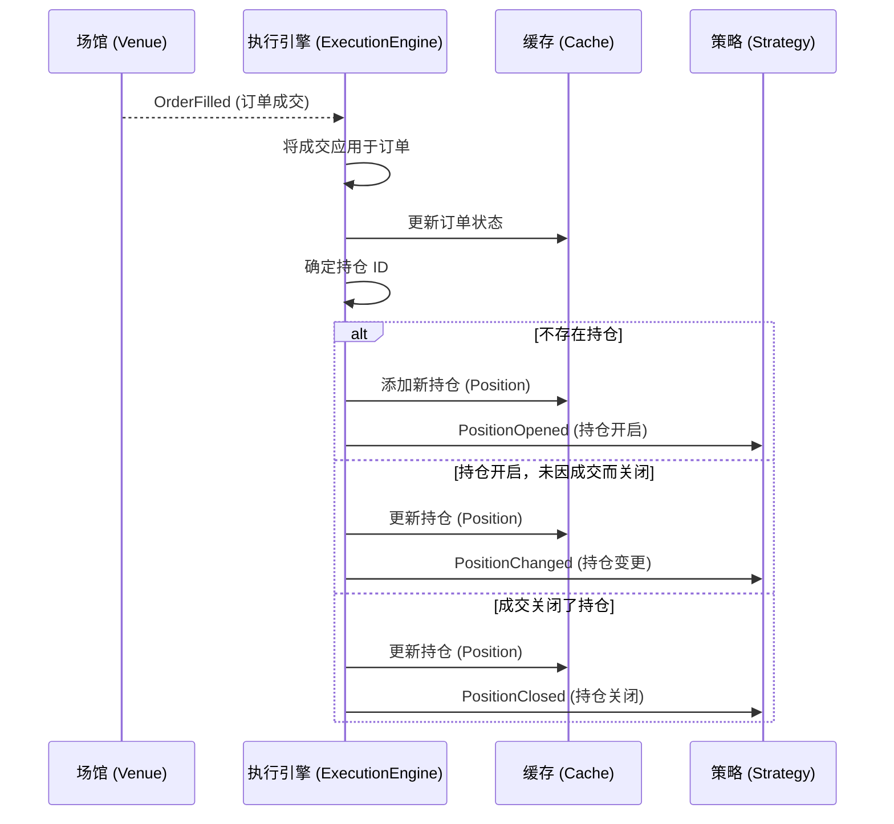

# 事件 (Events)

NautilusTrader 是事件驱动的：系统中的每一个状态变化都由一个事件对象表示，该对象通过 `消息总线 (MessageBus)` 流向策略 (Strategy) 和执行器 (Actor) 的处理程序。本指南涵盖了事件类型、它们如何被调度，以及订单成交如何产生持仓事件。

## 事件类别

| 类别       | 示例                                              | 来源                            |
|----------|-------------------------------------------------|---------------------------------|
| 订单 (Order) | `OrderAccepted`, `OrderFilled`, `OrderCanceled` | `ExecutionEngine` (来自场馆)      |
| 持仓 (Position) | `PositionOpened`, `PositionChanged`             | `ExecutionEngine` (来自成交)      |
| 账户 (Account) | `AccountState`                                  | `ExecutionClient` / `Portfolio` |
| 时间 (Time) | `TimeEvent`                                     | `Clock` (定时器和警报)           |

## 处理程序调度

当事件到达策略时，系统会按固定的优先级顺序调用处理程序。第一个匹配的处理程序运行，然后是下一级，因此您可以根据需要的粒度处理事件。

### 订单事件 (Order events)

1. 特定处理程序（例如 `on_order_filled`）
2. `on_order_event`（接收所有订单事件）
3. `on_event`（接收所有事件）

### 持仓事件 (Position events)

1. 特定处理程序（例如 `on_position_opened`）
2. `on_position_event`（接收所有持仓事件）
3. `on_event`（接收所有事件）

### 时间事件 (Time events)

定时器和警报产生 `TimeEvent` 对象。在调用 `set_timer` 或 `set_time_alert` 时传递 `callback`，以便将事件定向到您自己的方法。如果您省略回调，事件将传递给 `on_event`。

## 订单事件 (Order events)

每个订单事件都对应于 [订单状态机 (Order state machine)](orders.md#order-state-flow) 中的一个状态转换。`ExecutionEngine` 将事件应用于订单，更新 `缓存 (Cache)`，并将其发布在 `消息总线 (MessageBus)` 上。下表显示了主要的转换；部分成交和触发订单支持额外的转换，详细文档请参阅完整的 [订单状态流](orders.md#order-state-flow)。

| 事件                     | 主要转换                             | 处理程序 (Handler)           |
|------------------------|-------------------------------------|----------------------------|
| `OrderInitialized`     | （在本地创建）                         | `on_order_initialized`     |
| `OrderDenied`          | Initialized -> Denied               | `on_order_denied`          |
| `OrderEmulated`        | Initialized -> Emulated             | `on_order_emulated`        |
| `OrderReleased`        | Emulated -> Released                | `on_order_released`        |
| `OrderSubmitted`       | Initialized/Released -> Submitted   | `on_order_submitted`       |
| `OrderAccepted`        | Submitted -> Accepted               | `on_order_accepted`        |
| `OrderRejected`        | Submitted -> Rejected               | `on_order_rejected`        |
| `OrderTriggered`       | Accepted -> Triggered               | `on_order_triggered`       |
| `OrderPendingUpdate`   | Accepted -> PendingUpdate           | `on_order_pending_update`  |
| `OrderPendingCancel`   | Accepted -> PendingCancel           | `on_order_pending_cancel`  |
| `OrderUpdated`         | PendingUpdate -> Accepted           | `on_order_updated`         |
| `OrderModifyRejected`  | PendingUpdate -> Accepted           | `on_order_modify_rejected` |
| `OrderCancelRejected`  | PendingCancel -> Accepted           | `on_order_cancel_rejected` |
| `OrderCanceled`        | PendingCancel/Accepted -> Canceled  | `on_order_canceled`        |
| `OrderExpired`         | Accepted -> Expired                 | `on_order_expired`         |
| `OrderFilled`          | Accepted -> Filled/PartiallyFilled  | `on_order_filled`          |

### 通用订单事件字段

所有订单事件都共享这些字段：

| 字段                | 描述                                     |
|--------------------|------------------------------------------|
| `trader_id`        | 交易者实例标识符。                          |
| `strategy_id`      | 提交订单的策略。                            |
| `instrument_id`    | 订单所属的合约 (Instrument)。               |
| `client_order_id`  | 客户端分配的订单标识符。                     |
| `venue_order_id`   | 场馆 (Venue) 分配的订单标识符。              |
| `account_id`       | 订单所属的账户。                            |
| `reconciliation`   | 是否在对账 (Reconciliation) 期间生成。        |
| `event_id`         | 唯一事件标识符。                            |
| `ts_event`         | 事件发生的时间戳。                          |
| `ts_init`          | 事件创建的时间戳。                          |

单个事件会增加特定类型的字段（例如 `OrderFilled` 增加了 `last_qty`、`last_px`、`trade_id`、`commission`）。有关每种事件类型的完整字段列表，请参阅 API 参考。

:::tip 提示
重写 `on_order_event` 以在一个地方处理所有订单事件。特定的处理程序会先触发，因此您可以混合使用这两种方法。
:::

## 持仓事件 (Position events)

持仓事件是成交事件的直接结果。`ExecutionEngine` 处理每个 `OrderFilled`，更新或创建持仓，并发送相应的持仓事件。

| 事件                | 何时触发                                   | 处理程序 (Handler)      |
|---------------------|-------------------------------------------|-----------------------|
| `PositionOpened`    | 第一次成交创建新持仓。                       | `on_position_opened`  |
| `PositionChanged`   | 随后的成交改变了数量或方向。                  | `on_position_changed` |
| `PositionClosed`    | 成交使数量减少到零。                         | `on_position_closed`  |

### 从成交到持仓：因果链

下图显示了单个 `OrderFilled` 事件如何产生持仓事件。这是订单管理和持仓跟踪之间的关键纽带。



**分步说明：**

1. **成交到达。** `ExecutionEngine` 从场馆适配器接收 `OrderFilled` 事件。
2. **订单状态更新。** 引擎将成交应用于订单对象，并将更新后的订单写入 `缓存 (Cache)`。
3. **持仓 ID 解析。** 引擎根据 OMS 类型和策略配置确定此成交属于哪个持仓。
4. **持仓创建或更新。** 三种结果：
   - 此 ID **不存在持仓**：引擎从成交创建 `Position`，将其添加到 `Cache`，并发送 `PositionOpened`。
   - 成交后**持仓存在并保持开启**：引擎将成交应用于持仓，更新 `Cache`，并发送 `PositionChanged`。
   - **持仓存在并关闭**（数量达到零）：引擎应用成交，更新 `Cache`，并发送 `PositionClosed`。
5. **反手 (Flip) 情况。** 当一次成交使持仓反转（例如多头 10 手，成交卖出 15 手）时，引擎会将成交分成两部分：一部分关闭原持仓 (`PositionClosed`)，另一部分开启新持仓 (`PositionOpened`)。

### 持仓事件字段

| 字段                 | Opened | Changed | Closed | 描述                              |
|----------------------|--------|---------|--------|-----------------------------------|
| `trader_id`          | ✓      | ✓       | ✓      | 交易者实例标识符。                  |
| `strategy_id`        | ✓      | ✓       | ✓      | 拥有该持仓的策略。                  |
| `instrument_id`      | ✓      | ✓       | ✓      | 持仓所属的合约 (Instrument)。       |
| `position_id`        | ✓      | ✓       | ✓      | 唯一持仓标识符。                    |
| `account_id`         | ✓      | ✓       | ✓      | 持仓所属的账户。                    |
| `opening_order_id`   | ✓      | ✓       | ✓      | 开启该持仓的订单。                  |
| `closing_order_id`   | -      | -       | ✓      | 关闭该持仓的订单。                  |
| `entry`              | ✓      | ✓       | ✓      | 开仓成交的方向。                    |
| `side`               | ✓      | ✓       | ✓      | 当前持仓方向。                      |
| `signed_qty`         | ✓      | ✓       | ✓      | 有符号数量（负数=空头）。            |
| `quantity`           | ✓      | ✓       | ✓      | 无符号持仓数量。                    |
| `peak_qty`           | -      | ✓       | ✓      | 持有的最大数量。                    |
| `last_qty`           | ✓      | ✓       | ✓      | 最后一次成交的数量。                |
| `last_px`            | ✓      | ✓       | ✓      | 最后一次成交的价格。                |
| `currency`           | ✓      | ✓       | ✓      | 结算货币。                         |
| `avg_px_open`        | ✓      | ✓       | ✓      | 平均入场价格。                      |
| `avg_px_close`       | -      | ✓       | ✓      | 平均出场价格。                      |
| `realized_return`    | -      | ✓       | ✓      | 已实现收益率。                      |
| `realized_pnl`       | -      | ✓       | ✓      | 已实现盈亏。                       |
| `unrealized_pnl`     | -      | ✓       | ✓      | 未实现盈亏。                       |
| `duration_ns`        | -      | -       | ✓      | 持有时间（纳秒）。                  |
| `ts_opened`          | -      | ✓       | ✓      | 持仓开启的时间戳。                  |
| `ts_closed`          | -      | -       | ✓      | 持仓关闭的时间戳。                  |
| `event_id`           | ✓      | ✓       | ✓      | 唯一事件标识符。                    |
| `ts_event`           | ✓      | ✓       | ✓      | 触发成交的时间戳。                  |
| `ts_init`            | ✓      | ✓       | ✓      | 事件创建的时间戳。                  |

### 跟踪订单到持仓

`缓存 (Cache)` 提供了在订单和持仓之间导航的方法：

```python
# 从持仓开始，查找所有贡献了成交的订单
orders = self.cache.orders_for_position(position.id)

# 从订单开始，查找它所属的持仓
position = self.cache.position_for_order(order.client_order_id)

# 开仓订单直接存储在持仓对象上
opening_order_id = position.opening_order_id
```

## 账户事件 (Account events)

`AccountState` 事件表示余额和保证金快照。它们在以下情况下触发：

- 场馆报告账户更新（通过执行客户端）。
- `投资组合 (Portfolio)` 在持仓更新后重新计算账户状态（对于启用了 `calculate_account_state` 的保证金账户）。

账户状态包含余额、保证金、账户类型和基础货币。`Portfolio` 内部订阅这些事件以维持风险敞口和余额跟踪。

## 事件订阅

除了策略处理程序外，执行器可以为它们不交易的合约订阅特定的事件流。这些订阅直接使用 `消息总线 (MessageBus)`，不涉及 `数据引擎 (DataEngine)`。

| 方法                         | 处理程序 (Handler)     | 接收                           |
|------------------------------|-----------------------|--------------------------------|
| `subscribe_order_fills()`    | `on_order_filled()`   | 合约的所有成交。                  |
| `subscribe_order_cancels()`  | `on_order_canceled()` | 合约的所有撤单。                  |

这些对于监控执行质量或跨策略成交率而不参与订单管理的监控执行器非常有用。

有关详细信息和示例，请参阅 [订单成交订阅](actors.md#order-fill-subscriptions) 和 [订单撤销订阅](actors.md#order-cancel-subscriptions)。

## 相关指南

- [订单 (Orders)](orders.md) - 订单类型和状态机。
- [持仓 (Positions)](positions.md) - 持仓生命周期和盈亏 (PnL)。
- [执行 (Execution)](execution.md) - 执行流程和风险检查。
- [策略 (Strategies)](strategies.md) - 策略中的处理程序实现。
- [架构 (Architecture)](architecture.md) - 数据和执行流模式。
