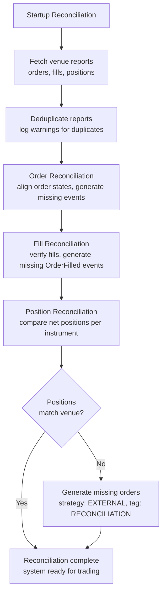

# 实盘交易 (Live Trading)

NautilusTrader 可以在无需修改代码的情况下，将经过回测 (Backtesting) 的策略 (Strategies) 部署到实盘市场。相同的执行单元 (Actors)、策略 (Strategies) 和执行算法 (Execution Algorithms) 既可以在回测引擎上运行，也可以在实盘交易节点上运行。

**实盘交易涉及真实的财务风险。在部署到生产环境之前，请务必了解系统配置、节点运行、执行对账 (Execution reconciliation) 以及回测 (Backtesting) 与实盘交易之间的差异。**

## 配置 (Configuration)

有关配置结构体如何处理默认值、`T` 与 `Option<T>` 语义以及生成器模式 (Builder patterns)，请参阅[配置 (Configuration)](configuration.md) 概念指南。有关 `TradingNodeConfig` 的逐步设置、执行引擎选项、策略 (Strategy) 配置以及多场内 (Multi-venue) 连接，请参阅[配置实盘交易节点](../how_to/configure_live_trading.md)操作指南。

## 执行对账 (Execution reconciliation)

执行对账 (Execution reconciliation) 将场内 (Venue) 的实际订单和持仓状态与系统根据事件构建的内部状态进行对齐。由于回测 (Backtesting) 控制了交易双方，因此仅 `LiveExecutionEngine` 执行对账。

:::note[术语]
**在途订单 (In-flight order)** 是指正在等待场内确认的订单：

- `SUBMITTED` - 初始提交，等待接受/拒绝。
- `PENDING_UPDATE` - 请求修改，等待确认。
- `PENDING_CANCEL` - 请求取消，等待确认。

这些订单由持续对账循环监控，以检测陈旧或丢失的消息。
:::

### 提交结果策略 (Submit outcome policy)

实盘适配器 (Adapters) 仅在场内提供明确证据表明拒绝了订单时，才必须发出 `OrderRejected`。示例包括：场内订单响应显示拒绝状态、拒绝的订单状态报告、或者明确确认提交的订单已被拒绝的场内错误响应。

如果提交调用失败且场内结果未知，适配器会记录失败并将本地订单保持在“在途 (In-flight)”状态。WebSocket 更新、未平仓订单轮询、在途检查或启动对账必须解析最终状态。未知结果包括传输错误、请求超时、断开连接、取消本地任务、缺少确认、服务器错误以及返回订单 ID 后的提交后查找失败。

在向场内发送请求之前，使用 `OrderDenied` 进行本地验证。不要将模糊的提交失败转换为 `OrderRejected`，因为这会使本地订单进入终结状态，并阻止后续的成交信息到达策略 (Strategy)。

两种场景：

- **存在缓存状态**：报告数据生成缺失的事件以对齐状态。
- **不存在缓存状态**：场内的所有订单和持仓均从零开始生成。

:::tip
将所有执行事件持久化到缓存数据库。这减少了对场内历史记录的依赖，并允许即使在较短的回溯窗口内也能进行全面恢复。
:::

### 对账配置 (Reconciliation configuration)

除非将 `reconciliation` 设置为 false，否则执行引擎会在启动时为每个场内 (Venue) 对账状态。`reconciliation_lookback_mins` 参数控制引擎请求历史记录的回溯时长。

:::tip
不要设置 `reconciliation_lookback_mins`。这允许引擎请求场内提供的最大执行历史记录。
:::

:::warning
回溯窗口之前的执行仍会生成对齐事件，但相比更长的窗口会有一些信息丢失。某些场内还会过滤或丢弃较旧的执行数据。将所有事件持久化到缓存数据库可防止这两个问题。
:::

每个策略 (Strategy) 都可以通过 `external_order_claims` 配置参数，认领在对账期间生成的针对合约 (Instrument) ID 的外部订单。这允许策略在不存在缓存状态时恢复对未平仓订单的管理。

在持仓对账期间生成的策略 ID 为 `EXTERNAL` 且标签为 `RECONCILIATION` 的订单是引擎内部的。它们无法通过 `external_order_claims` 认领，也不应由用户策略管理。

:::tip
要在您的策略 (Strategy) 中检测外部订单，请检查 `order.strategy_id.value == "EXTERNAL"`。这些订单像任何其他订单一样参与投资组合 (Portfolio) 计算和持仓跟踪。
:::

有关所有实盘交易选项，请参阅 `LiveExecEngineConfig` [API 参考手册](/docs/python-api-latest/config.html#nautilus_trader.live.config.LiveExecEngineConfig)。

### 对账流程 (Reconciliation procedure)

所有适配器执行客户端都遵循相同的对账流程，调用三个方法来生成执行汇总状态：

- `generate_order_status_reports`
- `generate_fill_reports`
- `generate_position_status_reports`

系统针对这些代表外部现实的报告进行状态对账：

- **重复检查**：
  - 对批次内的订单报告进行去重并记录警告。
  - 将重复的成交 ID 记录为警告以便调查。
- **订单对账**：
  - 生成并应用事件，将订单从缓存状态移动到当前状态。
  - 为缺失的成交报告推断 `OrderFilled` 事件。
  - 为无法识别的客户端订单 ID 或缺少客户端订单 ID 的报告生成外部订单事件。
  - 通过基于容差的价格和佣金比较，验证成交报告数据的一致性。
- **持仓对账**：
  - 使用合约 (Instrument) 精度，将每个合约的净持仓与场内持仓报告进行匹配。
  - 当订单对账留下的持仓与场内不同时，生成外部订单事件。
  - 当启用 `generate_missing_orders`（默认：True）时，生成策略 ID 为 `EXTERNAL` 且标签为 `RECONCILIATION` 的订单以对齐差异。
  - 在生成对账订单时遵循价格层级：
    1. **计算出的对账价格**（首选）：目标是正确的平均持仓。
    2. **市场中间价**：使用当前的买卖价中点。
    3. **当前持仓均价**：使用现有持仓的平均价格。
    4. **市价单 (MARKET order)**（最后手段）：仅在没有价格数据（无持仓、无市场数据）时使用。
  - 在可以确定价格时（情况 1-3）使用限价 (LIMIT) 订单，以保留损益 (PnL) 的准确性。
  - 精度舍入后忽略零数量差异。
- **部分窗口调整**：
  - 当设置了 `reconciliation_lookback_mins` 时，窗口可能会错过开仓成交。
  - 系统使用生命周期分析调整成交，以准确重建持仓：
    - 检测过零点（持仓数量穿过零 FLAT）以识别不同的生命周期。
    - 当最早的生命周期不完整时，添加合成开仓成交。
    - 当当前生命周期与场内持仓匹配时，过滤掉旧的生命周期。
    - 用反映场内持仓的单个合成成交替换不匹配的当前生命周期。
  - 合成成交使用计算出的对账价格，以达到正确的平均持仓。
  - 详情请参阅[部分窗口调整场景](#部分窗口调整场景)。
- **异常处理**：
  - 单个适配器的失败不会终止整个对账过程。
  - 在订单状态报告之前到达的成交报告将被推迟，直到订单状态可用。

如果对账失败，系统将记录错误且不会启动。

### 常见对账场景

下表涵盖了启动对账（汇总状态）和运行时检查（在途订单检查、未平仓订单轮询、自有订单簿审计）。

#### 启动对账 (Startup reconciliation)

| 场景                                   | 描述                                                                              | 系统行为                                                                 |
|----------------------------------------|----------------------------------------------------------------------------------|--------------------------------------------------------------------------|
| **订单状态差异**                       | 本地状态与场内不同（例如，本地为 `SUBMITTED`，场内为 `REJECTED`）。              | 更新本地订单以匹配场内状态，发出缺失事件。                               |
| **丢失成交**                           | 场内已成交订单但引擎丢失了事件。                                                 | 生成缺失的 `OrderFilled` 事件。                                          |
| **多次成交**                           | 订单有多次部分成交，引擎丢失了其中一些。                                         | 从场内报告重建完整的成交历史。                                           |
| **外部订单**                           | 订单存在于场内/交易所但不存在于本地缓存中。                                     | 创建策略 ID 为 `EXTERNAL` 且标签为 `VENUE` 的订单。                      |
| **部分成交后取消**                     | 订单部分成交后被场内取消。                                                       | 更新状态为 `CANCELED`，保留成交历史。                                    |
| **不同的成交数据**                     | 场内报告的成交价格/佣金与缓存的不同。                                           | 保留缓存数据，记录差异。                                                 |
| **过滤订单**                           | 通过配置标记为待过滤的订单。                                                     | 根据 `filtered_client_order_ids` 或合约 (Instrument) 过滤器跳过。        |
| **重复订单报告**                       | 多个订单共享同一个标识符。                                                       | 去重并记录警告。                                                         |
| **持仓数量不匹配（多头）**             | 内部多头持仓与场内不同（例如，100 对 150）。                                    | 当 `generate_missing_orders=True` 时，以计算价格生成买入限价单 (BUY LIMIT)。 |
| **持仓数量不匹配（空头）**             | 内部空头持仓与场内不同（例如，-100 对 -150）。                                  | 当 `generate_missing_orders=True` 时，以计算价格生成卖出限价单 (SELL LIMIT)。|
| **持仓减少**                           | 场内持仓小于内部持仓（例如，内部多头 150，场内多头 100）。                      | 以计算价格生成反向限价 (LIMIT) 订单。                                    |
| **持仓方向翻转**                       | 内部持仓与场内相反（例如，内部多头 100，场内空头 50）。                          | 生成限价订单以平仓内部持仓并开启外部持仓。                               |
| **内部对账订单**                       | 策略 ID 为 `EXTERNAL` 且标签为 `RECONCILIATION` 的订单。                        | 无论 `filter_unclaimed_external_orders` 如何设置，永不被过滤。           |

#### 运行时检查 (Runtime checks)

| 场景                              | 描述                                                   | 系统行为                                                            |
|-----------------------------------|--------------------------------------------------------|---------------------------------------------------------------------|
| **模糊的提交失败**                | 提交调用失败且无场内拒绝确认。                         | 记录失败，保持订单在途，等待对账。                                  |
| **在途订单超时**                  | 订单在超过阈值后仍未确认。                             | 在 `inflight_check_retries` 之后，解析为 `REJECTED`。                |
| **未平仓订单检查差异**            | 定期轮询检测到场内状态变化。                           | 在 `open_check_interval_secs` 确认状态并应用转换。                  |
| **自有订单簿审计不匹配**          | 自有订单簿与场内公开订单簿发生偏差。                   | 在 `own_books_audit_interval_secs` 审计，记录不一致性。             |

### 常见对账问题

- **成交报告丢失**：某些场内会过滤掉较旧的交易。增加 `reconciliation_lookback_mins` 或本地缓存所有事件。
- **持仓不匹配**：早于回溯窗口的外部订单会导致持仓漂移。重启前平仓所有账户以重置状态。
- **重复订单 ID**：去重并记录警告。频繁重复可能表明场内数据完整性有问题。
- **精度差异**：使用合约 (Instrument) 精度处理微小的十进制差异。较大的差异可能表明存在丢失的订单。
- **报告顺序错误**：在订单状态报告之前到达的成交报告将被推迟，直到订单状态可用。

:::tip
对于持久性问题，请在重启前丢弃缓存状态或平仓账户。
:::

### 对账不变性 (Reconciliation invariants)

对账系统维护四个不变性：

1. **持仓数量**：最终数量在合约 (Instrument) 精度范围内与场内匹配。
2. **平均入场价**：持仓的平均入场价在容差（默认 0.01%）范围内与场内报告的价格匹配。
3. **损益 (PnL) 完整性**：所有生成的成交（包括合成成交）均使用计算出的价格，以保留正确的浮动盈亏。
4. **ID 确定性**：对账期间发出的合成 `trade_id` 和 `venue_order_id` 是逻辑事件的确定性函数。相同的逻辑成交或持仓调整订单在重启后产生相同的 ID，因此重放的对账事件会与早期运行进行去重，而不是被视为新事件。

即使在以下情况下，这些不变性仍然成立：

- 对账窗口错过了完整的成交历史。
- 场内报告中缺少成交信息。
- 持仓生命周期超出了回溯窗口。
- 发生了多次过零。

### 部分窗口调整场景

当 `reconciliation_lookback_mins` 限制窗口时，系统分析成交的持仓生命周期，并进行调整以准确重建持仓。

| 场景                                       | 描述                                                                        | 系统行为                                                             |
|--------------------------------------------|----------------------------------------------------------------------------|----------------------------------------------------------------------|
| **完整的生命周期**                         | 捕获了从开仓到当前状态的所有成交。                                         | 不进行调整。                                                         |
| **不完整的单一生命周期**                   | 窗口错过了开仓成交，无过零点。                                             | 以计算出的价格添加合成开仓成交。                                     |
| **多个生命周期，当前匹配**                 | 检测到过零点，当前生命周期与场内匹配。                                     | 过滤掉旧的生命周期，仅返回当前的。                                   |
| **多个生命周期，当前不匹配**               | 检测到过零点，当前生命周期与场内不同。                                     | 用单个合成成交替换当前生命周期。                                     |
| **空仓 (FLAT)**                            | 无论成交历史如何，场内报告为空仓。                                         | 不进行调整。                                                         |
| **无成交**                                 | 窗口内不包含成交报告。                                                     | 不进行调整，结果为空。                                               |

**关键概念：**

- **过零点 (Zero-crossing)**：持仓数量穿过零 (FLAT)，标志着生命周期的边界。
- **生命周期 (Lifecycle)**：过零点之间的一系列成交，代表一个开仓-平仓循环。
- **合成成交 (Synthetic fill)**：代表缺失活动的计算成交报告，其定价旨在实现正确的平均持仓。
- **容差 (Tolerance)**：持仓匹配使用可配置的价格容差（默认 0.0001 = 0.01%）以吸收微小的计算差异。

## 相关指南

- [配置实盘交易节点](../how_to/configure_live_trading.md) - 节点和引擎配置。
- [适配器 (Adapters)](adapters.md) - 场内连接。
- [执行 (Execution)](execution.md) - 实盘环境中的订单执行。
- [回测 (Backtesting)](backtesting.md) - 部署前测试策略。
