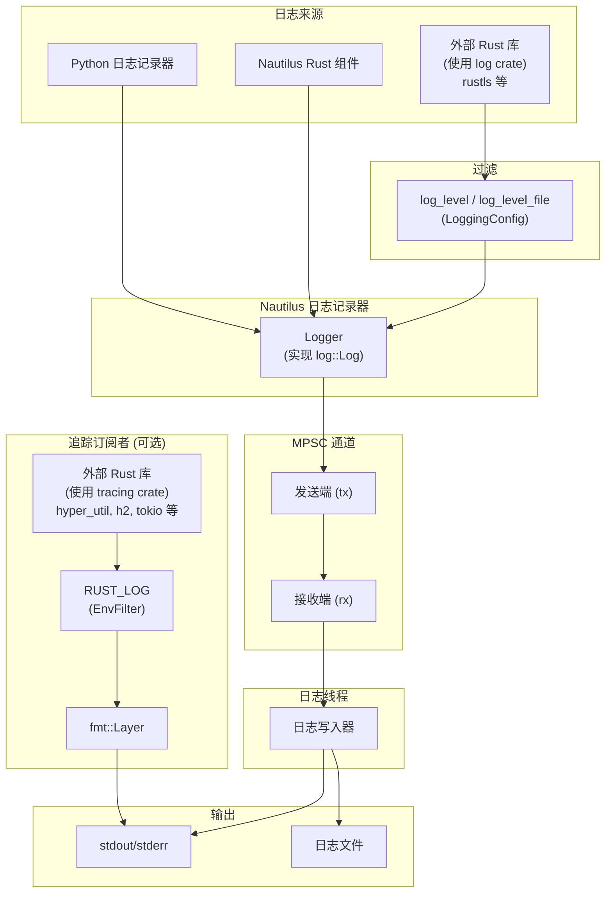

# 日志 (Logging)

该平台通过使用 Rust 实现的高性能日志子系统（Logging subsystem），为回测 (Backtesting) 和实盘交易 (Live trading) 提供日志记录，并采用 `log` crate 的标准化门面 (Facade)。

核心日志记录器运行在一个单独的线程中，并使用多生产者单消费者 (MPSC) 通道接收日志消息。这种设计确保了主线程保持高性能，避免了由日志字符串格式化或文件 I/O 操作引起的潜在瓶颈。

日志输出是可配置的，支持：

- **stdout/stderr 写入器**：用于控制台输出
- **文件写入器**：用于日志的持久化存储

:::info 信息
可以集成诸如 [Vector](https://github.com/vectordotdev/vector) 之类的基础设施来收集和聚合系统内的事件。
:::

## 架构 (Architecture)

日志子系统从多个来源捕获事件，并通过 MPSC 通道将它们路由到专用的日志线程：



- **Python 和 Nautilus 组件**：直接通过 Nautilus 日志记录器记录。
- **外部 `log` crate 用户**：通过 `LoggingConfig` 中的 `log_level`/`log_level_file` 进行过滤。
- **外部 `tracing` crate 用户**：启用时，输出直接发送到 stdout（独立于 Nautilus 日志），并通过 `RUST_LOG` 环境变量进行过滤。
- **日志线程**：所有 Nautilus 日志事件都通过 MPSC 通道发送到专用线程，确保主线程不被 I/O 操作阻塞。

## 配置

可以通过导入 `LoggingConfig` 对象来配置日志。默认情况下，具有 'INFO' `LogLevel` 及更高级别的日志事件将被写入 stdout/stderr。

日志级别 (`LogLevel`) 值包括以下内容（符合标准日志级别约定）。

支持以下日志级别：

- `OFF` - 禁用日志。
- `TRACE` - 最详细；仅由 Rust 组件发出（不能从 Python 生成）。
- `DEBUG` - 详细的诊断信息。
- `INFO` - 常规操作消息。
- `WARNING` - 不妨碍操作的潜在问题。
- `ERROR` - 可能影响功能的错误。

:::tip 提示
您可以将 `TRACE` 设置为过滤级别，以捕获来自 Rust 组件的追踪日志，尽管 Python 代码不能直接发出它们。
:::

有关更多详细信息，请参阅 `LoggingConfig` [API 参考](/docs/python-api-latest/config.html#nautilus_trader.common.config.LoggingConfig)。

日志可以通过以下方式进行配置：

- stdout/stderr 的最低 `LogLevel`。
- 日志文件的最低 `LogLevel`。
- 日志文件轮换前的最大大小。
- 轮换时保留的最大备份日志文件数量。
- 带有日期或时间戳组件的自动日志文件命名，或自定义日志文件名称。
- 写入日志文件的目录。
- 纯文本或 JSON 日志文件格式。
- 按日志级别过滤单个组件。
- 日志行中的 ANSI 颜色。
- 完全绕过日志。
- 在初始化时将 Rust 配置打印到 stdout。
- 可选地通过 PyO3 桥接 (`use_pyo3`) 初始化日志，以捕获由 Rust 组件发出的日志事件。
- 如果日志文件已存在，则在启动时截断现有的日志文件 (`clear_log_file`)。

### 标准输出日志 (Standard output logging)

日志消息通过 stdout/stderr 写入器写入控制台。可以使用 `log_level` 参数配置最低日志级别。

### 文件日志 (File logging)

默认情况下，日志文件写入当前工作目录。命名约定和轮换行为是可配置的，并根据您的设置遵循特定模式。

您可以使用 `log_directory` 指定自定义日志目录和/或使用 `log_file_name` 指定自定义文件基本名称。

**日志文件格式：**

- `None`（默认）- 带有 `.log` 扩展名的纯文本格式。
- `"json"` - 带有 `.json` 扩展名的 JSON 格式，适用于日志聚合工具。

有关日志文件命名约定和轮换行为的详细信息，请参阅下面的 [日志文件轮换](#log-file-rotation) 和 [日志文件命名规范](#log-file-naming-convention) 部分。

#### 日志文件轮换 (Log file rotation) {#log-file-rotation}

轮换行为取决于是否存在大小限制以及是否提供了自定义文件名：

- **基于大小的轮换**：
  - 通过指定 `log_file_max_size` 参数启用（例如，`100_000_000` 表示 100 MB）。
  - 当写入日志条目会导致当前文件超过此大小时，文件将被关闭并创建一个新文件。
- **基于日期的轮换（仅限默认命名）**：
  - 当未指定 `log_file_max_size` 且未提供自定义 `log_file_name` 时适用。
  - 在每个 UTC 日期变更（午夜）时，当前日志文件将被关闭并启动一个新文件，即每天创建一个文件。
- **不轮换**：
  - 当提供了自定义 `log_file_name` 但没有 `log_file_max_size` 时，日志将继续追加到同一个文件。
  - 注意：基于大小的轮换具有优先级——如果同时提供了自定义名称和大小限制，仍会发生轮换。
- **备份文件管理**：
  - 由 `log_file_max_backup_count` 参数控制（默认值：5），限制保留的轮换文件总数。
  - 当超过此限制时，最旧的备份文件将被自动移除。

#### 日志文件命名规范 (Log file naming convention) {#log-file-naming-convention}

默认命名约定确保日志文件具有唯一的可识别性和时间戳。格式取决于是否启用了文件轮换：

**启用了文件轮换时**：

- **格式**：`{trader_id}_{%Y-%m-%d_%H%M%S:%3f}_{instance_id}.{log|json}`
- **示例**：`TESTER-001_2025-04-09_210721:521_d7dc12c8-7008-4042-8ac4-017c3db0fc38.log`
- **组件**：
  - `{trader_id}`：交易者标识符（例如 `TESTER-001`）。
  - `{%Y-%m-%d_%H%M%S:%3f}`：符合 ISO 8601 标准的完整日期时间，具有毫秒级分辨率。
  - `{instance_id}`：唯一的实例标识符。
  - `{log|json}`：基于格式设置的文件后缀。

**未启用基于大小的轮换时（默认命名）**：

- **格式**：`{trader_id}_{%Y-%m-%d}_{instance_id}.{log|json}`
- **示例**：`TESTER-001_2025-04-09_d7dc12c8-7008-4042-8ac4-017c3db0fc38.log`
- **组件**：
  - `{trader_id}`：交易者标识符。
  - `{%Y-%m-%d}`：仅日期 (YYYY-MM-DD)。
  - `{instance_id}`：唯一的实例标识符。
  - `{log|json}`：基于格式设置的文件后缀。
- **注意**：在默认命名且没有大小限制的情况下，日志在 UTC 午夜每日轮换。

**自定义命名**：

如果设置了 `log_file_name`（例如 `my_custom_log`）：

- 禁用轮换时：文件名将完全按照提供的方式命名（例如 `my_custom_log.log`）。
- 启用轮换时：文件名将包含自定义名称和时间戳（例如 `my_custom_log_2025-04-09_210721:521.log`）。

### 组件日志过滤 (Component log filtering)

`log_component_levels` 参数可用于单独设置每个组件的日志级别。输入值应该是组件 ID 字符串到日志级别字符串的字典：`dict[str, str]`。

下面是一个交易节点日志配置示例，其中包含上述一些选项：

```python
from nautilus_trader.config import LoggingConfig
from nautilus_trader.config import TradingNodeConfig

config_node = TradingNodeConfig(
    trader_id="TESTER-001",
    logging=LoggingConfig(
        log_level="INFO",
        log_level_file="DEBUG",
        log_file_format="json",
        log_component_levels={ "Portfolio": "INFO" },
    ),
    ... # 省略
)
```

对于回测，可以使用 `BacktestEngineConfig` 类代替 `TradingNodeConfig`，因为两者的选项相同。

### 环境变量配置 (Environment variable configuration)

`NAUTILUS_LOG` 环境变量提供了一种使用分号分隔的规范字符串配置日志的替代方法。这对于仅限 Rust 的二进制文件或当您想要在不修改代码的情况下覆盖日志设置时非常有用。

```bash
export NAUTILUS_LOG="stdout=Info;fileout=Debug;RiskEngine=Error;is_colored"
```

**支持的键：**

| 键                    | 类型       | 描述                                             |
|-----------------------|-----------|--------------------------------------------------|
| `stdout`              | 日志级别   | stdout 输出的最高级别。                             |
| `fileout`             | 日志级别   | 文件输出的最高级别。                               |
| `is_colored`          | 标志 (Flag) | 启用 ANSI 颜色（默认值：true）。                    |
| `print_config`        | 标志 (Flag) | 启动时将配置打印到 stdout。                         |
| `log_components_only` | 标志 (Flag) | 仅记录具有显式过滤器的组件。                        |
| `<Component>`         | 日志级别   | 特定组件的级别（精确匹配）。                        |
| `<module::path>`      | 日志级别   | 特定模块的级别（前缀匹配，仅限 Rust）。               |

规范字符串中存在标志即表示启用（不需要值）。日志级别不区分大小写：`Off`、`Trace`、`Debug`、`Info`、`Warning`（或 `Warn`）、`Error`。

:::note 注意
对于仅限 Rust 的二进制文件，设置 `NAUTILUS_LOG` 可以在第一次使用时启用日志子系统的延迟初始化，而无需显式调用 `init_logging()`。
:::

### 仅记录组件日志 (Components-only logging)

当专注于嘈杂系统的子集时，启用 `log_components_only` 以仅记录 `log_component_levels` 中明确列出的组件的消息。无论全局 `log_level` 或文件级别如何，所有其他组件都将被抑制。

示例（Python 配置）：

```python
logging = LoggingConfig(
    log_level="INFO",
    log_component_levels={
        "RiskEngine": "DEBUG",
        "Portfolio": "INFO",
    },
    log_components_only=True,
)
```

如果通过环境使用 Rust 规范字符串进行配置，请将 `log_components_only` 与组件过滤器一起包含，例如：

```bash
export NAUTILUS_LOG="stdout=Info;log_components_only;RiskEngine=Debug;Portfolio=Info"
```

### 模块路径过滤 (仅限 Rust)

使用 `NAUTILUS_LOG` 环境变量时，除了组件名称外，您还可以按 Rust 模块路径进行过滤。包含 `::` 的键被视为具有前缀匹配的模块路径过滤器，而不包含 `::` 的键则是具有精确匹配的组件过滤器。

```bash
# 将所有适配器过滤为 Warn，但专门允许 OKX 使用 Debug
export NAUTILUS_LOG="stdout=Info;nautilus_okx=Warn;nautilus_okx::websocket=Debug"
```

最长匹配前缀具有优先级。在上面的示例中，`nautilus_okx::websocket::handler` 将使用 `Debug` 级别（更长的前缀），而 `nautilus_okx::data` 将使用 `Warn`。

:::tip 提示
当未提供显式组件时，Rust 日志宏会自动捕获模块路径。这使得模块级过滤可以与标准日志调用一起使用。
:::

:::note 注意
模块路径过滤仅通过 `NAUTILUS_LOG` 环境变量可用。Python 的 `log_component_levels` 配置仅使用组件名称匹配。
:::

:::warning 警告
如果 `log_components_only=True`（或规范字符串中存在 `log_components_only`）且 `log_component_levels` 为空，则不会向 stdout/stderr 或文件发出任何日志消息。请至少添加一个组件过滤器或禁用仅记录组件。
:::

### 日志颜色 (Log colors)

ANSI 颜色代码提高了终端中日志的可读性。在不支持 ANSI 颜色渲染的环境（例如某些云环境或文本编辑器）中，这些颜色代码可能不合适，因为它们可能显示为原始文本。

为了适应此类场景，可以将 `LoggingConfig.log_colors` 选项设置为 `false`。禁用 `log_colors` 将防止在日志消息中添加 ANSI 颜色代码，从而避免在没有颜色支持的环境中出现原始转义代码。

## 直接使用日志记录器

可以直接使用 `Logger` 对象，并且可以在任何地方初始化它们（与 Python 内置的 `logging` API 非常相似）。

如果您***没有***使用已经初始化 `NautilusKernel`（和日志记录）的对象（如 `BacktestEngine` 或 `TradingNode`），那么您可以通过以下方式激活日志记录：

```python
from nautilus_trader.common.component import init_logging
from nautilus_trader.common.component import Logger

log_guard = init_logging()
logger = Logger("MyLogger")
```

有关更多详细信息，请参阅 [`init_logging` API 参考](/docs/python-api-latest/common.html)。

:::warning 警告
每个进程只能通过 `init_logging` 调用初始化一个日志子系统。可以同时存在多个 `LogGuard` 实例（最多 255 个），并且日志线程将保持活动状态，直到所有守卫都被释放。
:::

## LogGuard：管理日志生命周期

`LogGuard` 确保日志子系统在进程的整个生命周期中保持活动和运行状态。它防止在同一进程中运行多个引擎时日志子系统过早关闭。

### 引用计数实现 (Reference counting implementation)

日志系统使用引用计数来跟踪活动的 `LogGuard` 实例：

- **计数器递增**：创建新的 `LogGuard` 时，原子计数器递增。
- **计数器递减**：当 `LogGuard` 被释放时，计数器递减。
- **日志线程终止**：当计数器达到零（最后一个 `LogGuard` 被释放）时，日志线程将正确合并 (join)，以确保在进程终止之前写入所有挂起的日志消息。
- **最大守卫数**：系统支持多达 255 个并发 `LogGuard` 实例。尝试创建更多实例将引发 `RuntimeError`。

该机制确保了：

1. `LogGuard` 保持日志线程处于活动状态并在释放时刷新 (flush)；突然终止（崩溃、终止信号）仍可能导致缓冲日志丢失。
2. 只要存在任何 `LogGuard`，日志线程就保持活动状态。
3. 在正常关闭时，所有缓冲的日志都会正确刷新到其目的地。

### 为什么要使用 LogGuard？

如果没有 `LogGuard`，在同一进程中运行连续引擎的任何尝试都可能导致如下错误：

```
Error sending log event: [INFO] ...
```

这是因为当第一个引擎被销毁时，日志子系统的底层通道和 Rust `Logger` 也会随之关闭。结果，后续引擎失去了对日志子系统的访问权限，从而导致这些错误。

通过使用 `LogGuard`，您可以确保在同一进程中的多次回测或引擎运行中保持一致的日志记录行为。`LogGuard` 保留了日志子系统的资源，并确保即使引擎被销毁和初始化，日志仍能继续正常工作。

:::note 注意
需要使用 `LogGuard` 才能在具有多个引擎的进程中保持一致的日志记录行为。
:::

## 运行多个引擎

以下示例演示了在同一进程中顺序运行多个引擎时如何使用 `LogGuard`：

```python
log_guard = None  # 初始化 LogGuard 引用

for i in range(number_of_backtests):
    engine = setup_engine(...)

    # 分配引用给 LogGuard
    if log_guard is None:
        log_guard = engine.get_log_guard()

    # 添加执行器并执行引擎
    actors = setup_actors(...)
    engine.add_actors(actors)
    engine.run()
    engine.dispose()  # 安全销毁
```

### 步骤

- **初始化 LogGuard 一次**：从第一个引擎获取 `LogGuard` (`engine.get_log_guard()`)，并在整个进程中保留它。这确保了日志子系统保持活动状态。
- **安全销毁引擎**：每个引擎在回测完成后都会被安全销毁。在 `engine.dispose()` 之后，`LogGuard` 仍然有效——只有引擎被清理，日志子系统则不会。
- **复用 LogGuard**：后续引擎复用同一个 `LogGuard` 实例，防止日志子系统过早关闭。

### 注意事项

- **每个进程多个 LogGuard**：系统支持每个进程最多 255 个并发 `LogGuard` 实例。每个守卫在创建时递增引用计数器，在释放时递减。
- **线程安全**：日志子系统（包括 `LogGuard`）是线程安全的，即使在多线程环境中也能确保一致的行为。
- **自动清理**：当最后一个 `LogGuard` 被释放（引用计数达到零）时，日志线程将正确合并，以确保在进程终止前写入所有待处理日志。

## 用于外部 Rust 库的追踪订阅者 (Tracing subscriber)

对于使用 `tracing` crate 的外部 Rust crate，可以通过启用追踪订阅者来显示其日志输出。这对于调试外部依赖项或集成作为独立 PyO3 扩展编译的自定义 Rust 组件（如特征提取器或适配器）非常有用。

### 启用订阅者

通过在 `LoggingConfig` 中设置 `use_tracing=True` 来启用追踪订阅者：

```python
from nautilus_trader.config import LoggingConfig
from nautilus_trader.config import TradingNodeConfig

config_node = TradingNodeConfig(
    trader_id="TESTER-001",
    logging=LoggingConfig(
        log_level="INFO",
        use_tracing=True,
    ),
    ... # 省略
)
```

或者，直接调用 `init_tracing()`：

```python
from nautilus_trader.core import nautilus_pyo3

nautilus_pyo3.init_tracing()
```

### 使用 RUST_LOG 进行过滤

`RUST_LOG` 环境变量控制显示哪些追踪事件：

```bash
# 显示来自您的 crate 的 debug 日志，以及来自 hyper 的 warn 及以上级别的日志
RUST_LOG=my_feature_extractor=debug,hyper=warn python my_script.py
```

如果未设置 `RUST_LOG`，则默认过滤级别为 `warn`。

### 工作原理

追踪订阅者使用具有自定义格式化程序的 `tracing-subscriber` fmt 层，直接输出到 stdout。这与 Nautilus 日志基础设施是分开的——追踪输出使用与 Nautilus 对齐的格式，具有纳秒级的时间戳。

示例追踪输出：

```
2026-01-24T05:51:42.809619000Z [DEBUG] hyper_util::client::legacy::connect::http: connecting to 104.18.5.240:443
2026-01-24T05:51:42.810543000Z [DEBUG] hyper_util::client::legacy::pool: pooling idle connection for ("https", api.example.com)
```

**与 Nautilus 日志的区别：**

- 追踪输出直接发送到 stdout，不经过 Nautilus 日志线程。
- 追踪事件不会被写入 Nautilus 日志文件。
- 过滤仅受 `RUST_LOG` 控制，独立于 `LoggingConfig`。

对于使用 `log` crate 的外部库（如 `rustls`），它们的事件会通过 Nautilus 日志记录器，并由 `LoggingConfig` 中的 `log_level`/`log_level_file` 进行过滤。

:::tip 提示
`RUST_LOG` 仅影响使用 `tracing` 的 crate。对于使用 `log` 的 crate，请通过 `LoggingConfig` 或 `NAUTILUS_LOG` 环境变量配置详细程度（例如 `NAUTILUS_LOG=stdout=Debug`）。
:::

:::note 注意
每个进程只能初始化一次追踪订阅者。在 `LoggingConfig` 中使用 `use_tracing=True` 时，后续的内核创建将安全地跳过重新初始化。如果已经初始化，直接调用 `init_tracing()` 将引发错误。
:::

## 特定平台的注意事项

### Windows 关闭行为

在 Windows 上，解释器关闭期间的不确定性垃圾回收偶尔会阻止日志线程正确合并。当最后一个 `LogGuard` 被释放时，日志子系统会向后台线程发出关闭信号并合并它，以确保所有挂起的消息都被写入。如果 Python 的垃圾回收器将释放守卫延迟到解释器关闭开始之后，此合并可能无法完成，从而导致日志被截断。

此问题记录在 GitHub [issue #3027](https://github.com/nautechsystems/nautilus_trader/issues/3027) 中。目前正在考虑一种更具确定性的关闭机制。

## 相关指南

- [架构 (Architecture)](architecture.md) - 包括日志基础设施在内的系统架构。
