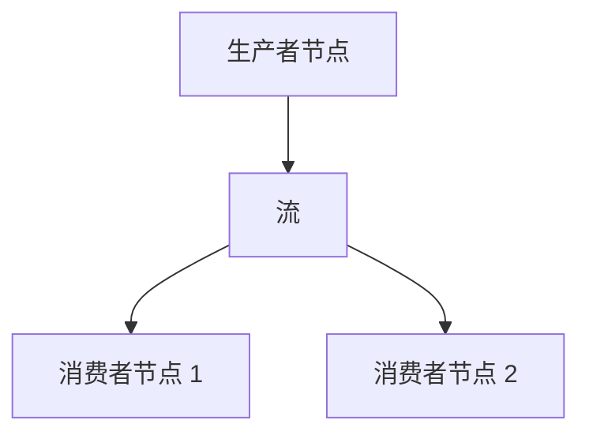

# 消息总线 (Message Bus)

`消息总线 (MessageBus)` 通过消息传递实现系统组件之间的通信。这种设计创建了一个松耦合的架构，组件之间无需直接依赖即可进行交互。

*消息传递模式 (Messaging patterns)* 包括：

- 点对点 (Point-to-Point)
- 发布/订阅 (Publish/Subscribe)
- 请求/响应 (Request/Response)

通过 `MessageBus` 交换的消息分为三类：

- 数据 (Data)
- 事件 (Event)
- 命令 (Command)

## 消息完整性

消息一旦创建，其字段就不能被更改。这包括容器字段，如 `params` 映射。组件可以读取消息并从中导出本地状态，但不得重写原始消息。

不可变消息使每个消费者看到的输入都相同，保留了发送时的真实情况，并消除了共享状态竞争的问题。回放、调试和审计都依赖于消息在调度后保持稳定。

由此产生了三条所有权规则：

- 调用方提供的请求选项保留在消息中。
- 返回给调用方的响应元数据保留在响应中。
- 组件工作流状态（限定的日期范围、分组状态、回放游标、计数器、处理标志）保留在由组件拥有的、以消息或请求 ID 为键的上下文中。

当组件需要派生消息时，它会使用所需的值创建一个新消息，而不是重写原始消息。

## 数据和信号发布

虽然 `MessageBus` 是一个较低级别的组件，用户通常间接与其交互，但 `Actor` 和 `Strategy` 类提供了基于它构建的便捷方法：

```python
def publish_data(self, data_type: DataType, data: Data) -> None:
def publish_signal(self, name: str, value, ts_event: int = 0) -> None:
```

这些方法允许您高效地发布自定义数据和信号，而无需直接使用 `MessageBus` 接口。

## 直接访问

对于高级用户或特殊用例，在 `Actor` 和 `Strategy` 类中可以通过 `self.msgbus` 引用直接访问消息总线，它提供了完整的消息总线接口。

要直接发布自定义消息，您可以将主题指定为 `str`，并将任何 Python `object` 指定为消息负载 (Payload)，例如：

```python
self.msgbus.publish("MyTopic", "MyMessage")
```

## 消息风格 (Messaging styles)

NautilusTrader 是一个**事件驱动 (Event-driven)** 的框架，组件通过发送和接收消息进行通信。了解不同的消息风格有助于构建交易系统。

本指南解释了 NautilusTrader 中可用的三种主要消息模式：

| **消息风格**                                    | **用途**                       | **最适用于**                                          |
|:---------------------------------------------|:------------------------------|:------------------------------------------------------|
| **MessageBus - 发布/订阅到主题 (Topics)**        | 消息总线的底层、直接访问            | 自定义事件、系统级通信                                  |
| **基于执行器 (Actor) - 发布/订阅数据 (Data)**     | 结构化交易数据交换                | 交易指标、技术指标、需要持久化的数据                     |
| **基于执行器 (Actor) - 发布/订阅信号 (Signal)**   | 轻量级通知                      | 简单的警报、标志、状态更新                               |

每种方法服务于不同的目的。本节将帮助您决定使用哪种模式。

### MessageBus 发布/订阅到主题

#### 概念

`MessageBus` 是 NautilusTrader 中所有消息的中央枢纽。它支持 **发布/订阅 (Publish/Subscribe)** 模式，组件可以将事件发布到 **命名主题 (Named topics)**，其他组件可以订阅以接收这些消息。这使组件解耦，允许它们通过消息总线间接交互。

#### 核心优势和用例

消息总线方法在以下情况下是理想的：

- 系统内的**跨组件通信**。
- **灵活性**，可以定义任何主题并发送任何类型的负载（任何 Python 对象）。
- 发布者和订阅者之间的**解耦**，他们不需要彼此了解。
- **全局覆盖**，消息可以被多个订阅者接收。
- 处理不符合预定义 `Actor` 模型的事件。
- 需要对消息传递进行完全控制的高级场景。

#### 注意事项

- 您必须手动跟踪主题名称（拼写错误可能导致漏掉消息）。
- 您必须手动定义处理程序。

#### 快速概览代码

```python
from nautilus_trader.core.message import Event

# 定义一个自定义事件
class Each10thBarEvent(Event):
    TOPIC = "each_10th_bar"  # 主题名称
    def __init__(self, bar):
        self.bar = bar

# 在组件中订阅 (在 Strategy 中)
self.msgbus.subscribe(Each10thBarEvent.TOPIC, self.on_each_10th_bar)

# 发布一个事件 (在 Strategy 中)
event = Each10thBarEvent(bar)
self.msgbus.publish(Each10thBarEvent.TOPIC, event)

# 处理程序 (在 Strategy 中)
def on_each_10th_bar(self, event: Each10thBarEvent):
    self.log.info(f"Received 10th bar: {event.bar}")
```

#### 完整示例

[MessageBus 示例](https://github.com/nautechsystems/nautilus_trader/tree/develop/examples/backtest/example_09_messaging_with_msgbus)

### 基于执行器 (Actor) 的发布/订阅数据

#### 概念

这种方法提供了一种在系统中的 `Actor` 之间交换交易特定数据的方法（注意：每个 `Strategy` 都继承自 `Actor`）。它继承自 `Data`，这确保了事件的正确时间戳和排序——这对于正确的回测处理至关重要。

#### 核心优势和用例

数据发布/订阅方法在以下情况下运行良好：

- **交换结构化交易数据**，如市场数据、指标、自定义指标或期权希腊字母 (Option greeks)。
- **正确的事件排序**，通过内置时间戳（`ts_event`, `ts_init`）实现，这对回测准确性至关重要。
- **数据持久化和序列化**，通过 `@customdataclass` 装饰器实现，并与 NautilusTrader 的数据目录系统集成。
- 系统组件之间的**标准化交易数据交换**。

#### 注意事项

- 需要定义一个继承自 `Data` 或使用 `@customdataclass` 的类。

#### 继承 `Data` 类 vs. 使用 `@customdataclass`

**继承 `Data` 类：**

- 定义了抽象属性 `ts_event` 和 `ts_init`，必须由子类实现。这些确保了在回测中根据时间戳进行正确的数据排序。

**`@customdataclass` 装饰器：**

- 如果尚未存在 `ts_event` 和 `ts_init` 属性，则添加它们。
- 提供序列化函数：`to_dict()`、`from_dict()`、`to_bytes()`、`to_arrow()` 等。
- 实现数据持久化和外部通信。

#### 快速概览代码

```python
from nautilus_trader.core.data import Data
from nautilus_trader.model.custom import customdataclass

@customdataclass
class GreeksData(Data):
    delta: float
    gamma: float

# 发布数据 (在 Actor / Strategy 中)
data = GreeksData(delta=0.75, gamma=0.1, ts_event=1_630_000_000_000_000_000, ts_init=1_630_000_000_000_000_000)
self.publish_data(GreeksData, data)

# 订阅接收数据 (在 Actor / Strategy 中)
self.subscribe_data(GreeksData)

# 处理程序 (这是具有固定名称的静态回调函数)
def on_data(self, data: Data):
    if isinstance(data, GreeksData):
        self.log.info(f"Delta: {data.delta}, Gamma: {data.gamma}")
```

#### 完整示例

[基于执行器的 Data 示例](https://github.com/nautechsystems/nautilus_trader/tree/develop/examples/backtest/example_10_messaging_with_actor_data)

### 基于执行器 (Actor) 的发布/订阅信号

#### 概念

**信号 (Signals)** 是执行器框架内发布和订阅简单通知的一种轻量级方式。这是最简单的消息传递方法，不需要自定义类定义。

#### 核心优势和用例

信号消息传递方法在以下情况下运行良好：

- **简单、轻量级的通知/警报**，如 "RiskThresholdExceeded" 或 "TrendUp"。
- **快速、即时的消息传递**，无需定义自定义类。
- **以原始数据（`int`、`float` 或 `str`）的形式广播警报或标志**。
- **简单的 API 集成**，使用直截了当的方法（`publish_signal`、`subscribe_signal`）。
- **多订阅者通信**，所有订阅者在发布信号时都会收到信号。
- **极低的设置开销**，无需类定义。

#### 注意事项

- 每个信号只能包含**单个值**，类型为：`int`、`float` 和 `str`。这意味着不支持复杂的数据结构或其他 Python 类型。
- 在 `on_signal` 处理程序中，您只能使用 `signal.value` 来区分信号，因为在处理程序中无法访问信号名称。

#### 快速概览代码

```python
# 为了更好的组织定义信号常量（可选但推荐）
import types
from nautilus_trader.core.datetime import unix_nanos_to_dt
from nautilus_trader.common.enums import LogColor

signals = types.SimpleNamespace()
signals.NEW_HIGHEST_PRICE = "NewHighestPriceReached"
signals.NEW_LOWEST_PRICE = "NewLowestPriceReached"

# 订阅信号 (在 Actor/Strategy 中)
self.subscribe_signal(signals.NEW_HIGHEST_PRICE)
self.subscribe_signal(signals.NEW_LOWEST_PRICE)

# 发布信号 (在 Actor/Strategy 中)
self.publish_signal(
    name=signals.NEW_HIGHEST_PRICE,
    value=signals.NEW_HIGHEST_PRICE,  # 为了简单起见，值可以与名称相同
    ts_event=bar.ts_event,  # 来自触发事件的时间戳
)

# 处理程序 (这是具有固定名称的静态回调函数)
def on_signal(self, signal):
    # 重要：我们针对 signal.value 进行匹配，而不是 signal.name
    match signal.value:
        case signals.NEW_HIGHEST_PRICE:
            self.log.info(
                f"New highest price was reached. | "
                f"Signal value: {signal.value} | "
                f"Signal time: {unix_nanos_to_dt(signal.ts_event)}",
                color=LogColor.GREEN
            )
        case signals.NEW_LOWEST_PRICE:
            self.log.info(
                f"New lowest price was reached. | "
                f"Signal value: {signal.value} | "
                f"Signal time: {unix_nanos_to_dt(signal.ts_event)}",
                color=LogColor.RED
            )
```

#### 完整示例

[基于执行器的 Signal 示例](https://github.com/nautechsystems/nautilus_trader/tree/develop/examples/backtest/example_11_messaging_with_actor_signals)

### 总结和决策指南

以下是帮助您决定使用哪种消息样式的快速参考：

#### 决策指南：选择哪种样式？

| **用例**                                     | **推荐方法**                                                               | **所需设置**           |
|:--------------------------------------------|:-------------------------------------------------------------------------|:---------------------|
| 自定义事件或系统级通信                         | `MessageBus` + 主题发布/订阅                                                 | 主题 + 处理程序管理    |
| 结构化交易数据                                | `Actor` + 数据发布/订阅 + 如果需要序列化则可选 `@customdataclass`                | 继承自 `Data` 的新类定义（`on_data` 处理程序已预定义） |
| 简单的警报/通知                               | `Actor` + 信号发布/订阅                                                     | 仅信号名称            |

## 外部发布 (External publishing) {#external-publishing}

`MessageBus` 可以由任何为其编写了集成的数据库或消息代理技术提供 *支持 (backed)*，从而实现消息的外部发布。

:::info 信息
Redis 目前支持外部发布的所有可序列化消息。最低支持的 Redis 版本为 6.2（[流 (streams)](https://redis.io/docs/latest/develop/data-types/streams/) 功能所需）。
:::

在底层，当配置了后端数据库（或任何其他兼容技术）时，所有传出消息首先被序列化，然后通过多生产者单消费者 (Multiple-Producer Single-Consumer, MPSC) 通道传输到单独的线程（在 Rust 中实现）。在这个单独的线程中，消息被写入其最终目的地，目前是 Redis 流 (streams)。

将 I/O 卸载到单独的线程可以保持主线程不被阻塞。

### 序列化 (Serialization)

Nautilus 支持对以下内容进行序列化：

- 所有 Nautilus 内置类型（序列化为包含可序列化原语的字典 `dict[str, Any]`）。
- Python 原始类型 (`str`, `int`, `float`, `bool`, `bytes`)。

您可以通过 `serialization` 子包注册自定义类型，从而添加对这些类型的序列化支持。

```python
def register_serializable_type(
    cls,
    to_dict: Callable[[Any], dict[str, Any]],
    from_dict: Callable[[dict[str, Any]], Any],
):
    ...
```

- `cls`: 要注册的类型。
- `to_dict`: 从对象实例化原始类型字典的委托。
- `from_dict`: 从原始类型字典实例化对象的委托。

## 配置

可以通过导入 `MessageBusConfig` 对象并将其传递给您的 `TradingNodeConfig` 来配置消息总线外部后端技术。下面将描述这些配置选项中的每一个。

```python
...  # 省略其他配置
message_bus=MessageBusConfig(
    database=DatabaseConfig(),
    encoding="json",
    timestamps_as_iso8601=True,
    buffer_interval_ms=100,
    autotrim_mins=30,
    use_trader_prefix=True,
    use_trader_id=True,
    use_instance_id=False,
    streams_prefix="streams",
    types_filter=[QuoteTick, TradeTick],
)
...
```

### 数据库配置 (Database config)

必须提供 `DatabaseConfig`。对于本地回环上的默认 Redis 设置，您可以传递 `DatabaseConfig()`，它将使用匹配的默认值。

### 编码 (Encoding)

`MessageBus` 使用的内置 `Serializer` 目前支持两种编码：

- JSON (`json`)
- MessagePack (`msgpack`)

使用 `encoding` 配置选项控制消息写入编码。

:::tip 提示
默认使用 `msgpack` 编码，因为它提供了最优的序列化和内存性能。在性能不是首要考虑因素时，我们建议使用 `json` 编码以提高可读性。
:::

### 时间戳格式 (Timestamp formatting)

默认情况下，时间戳格式化为 UNIX 纪元纳秒整数。或者，您可以通过将 `timestamps_as_iso8601` 设置为 `True` 来配置 ISO 8601 字符串格式化。

### 消息流键 (Message stream keys)

消息流键对于识别单个交易节点和组织流中的消息至关重要。它们可以根据您的特定要求和用例进行定制。在消息总线流的上下文中，交易者键的结构通常如下：

```
trader:{trader_id}:{instance_id}:{streams_prefix}
```

以下选项可用于配置消息流键：

#### 交易者前缀 (Trader prefix)

键是否应以 `trader` 字符串开头。

#### 交易者 ID (Trader ID)

键是否应包含节点的交易者 ID。

#### 实例 ID (Instance ID)

每个交易节点都被分配一个唯一的“实例 ID”，即 UUIDv4。当消息分布在多个流中时，此实例 ID 有助于区分单个交易者。通过将 `use_instance_id` 配置选项设置为 `True`，您可以在交易者键中包含实例 ID。当您需要在多节点交易系统中的各种流中跟踪和识别交易者时，这特别有用。

#### 流前缀 (Streams prefix)

`streams_prefix` 字符串使您能够对单个交易者实例的所有流进行分组，或组织多个实例的消息。通过将字符串传递给 `streams_prefix` 配置选项来配置此项，确保其他前缀设置为 false。

#### 每个主题一个流 (Stream per topic)

指示生产者是否为每个主题写入单独的流。这对于 Redis 后端特别有用，因为 Redis 在监听流时不支持通配符主题。如果设置为 False，所有消息都将写入同一个流。

:::info 信息
Redis 不支持通配符流主题。为了更好地与 Redis 兼容，建议将此选项设置为 False。
:::

### 类型过滤 (Types filtering)

当消息发布在消息总线上时，如果配置并启用了消息总线后端，它们将被序列化并写入流。为了防止高频报价等数据淹没流，您可以过滤掉某些类型的消息，使其不进行外部发布。

要启用此过滤机制，请将 `type` 对象列表传递给消息总线配置中的 `types_filter` 参数，指定哪些类型的消息应从外部发布中排除。

```python
from nautilus_trader.config import MessageBusConfig
from nautilus_trader.model.data import QuoteTick
from nautilus_trader.model.data import TradeTick

# 创建一个具有类型过滤功能的 MessageBusConfig 实例
message_bus = MessageBusConfig(
    types_filter=[QuoteTick, TradeTick]
)
```

### 流自动修剪 (Stream auto-trimming)

`autotrim_mins` 配置参数允许您指定消息流中自动流修剪的回溯窗口（以分钟为单位）。自动流修剪通过删除较旧的消息来帮助管理消息流的大小，确保流在存储和性能方面保持可管理。

:::info 信息
目前的 Redis 实现将 `autotrim_mins` 维护为最大宽度（加上大约一分钟，因为流修剪频率不超过每分钟一次）。而不是基于当前挂钟时间的最大回溯窗口。
:::

## 外部流 (External streams)

`TradingNode` (节点) 内的消息总线被称为“内部消息总线”。生产者节点是将消息发布到外部流的节点（参见 [外部发布](#external-publishing)）。消费者节点监听外部流，以在其内部消息总线上接收并发布反序列化的消息负载。



:::tip 提示
将 `LiveDataEngineConfig.external_clients` 设置为旨在表示外部流式客户端的 `client_id` 列表。`DataEngine` 将过滤掉这些客户端的订阅命令，确保外部流式传输为这些客户端的任何订阅提供必要的数据。
:::

### 配置示例

以下示例详细说明了一个流式设置，其中生产者节点在外部发布 Binance 数据，下游消费者节点将这些数据消息发布到其内部消息总线上。

#### 生产者节点

我们将生产者节点的 `MessageBus` 配置为发布到 `"binance"` 流。`use_trader_id`、`use_trader_prefix` 和 `use_instance_id` 设置均设为 `False`，以确保消费者节点可以注册简单且可预测的流键。

```python
message_bus=MessageBusConfig(
    database=DatabaseConfig(
        connection_timeout=2,
        response_timeout=2,
    ),
    use_trader_id=False,
    use_trader_prefix=False,
    use_instance_id=False,
    streams_prefix="binance",  # <---
    stream_per_topic=False,
    autotrim_mins=30,
),
```

#### 消费者节点

我们将消费者节点的 `MessageBus` 配置为从同一个 `"binance"` 流接收消息。该节点将监听外部流键，以将这些消息发布到其内部消息总线上。此外，我们将客户端 ID `"BINANCE_EXT"` 声明为外部客户端。这确保了 `DataEngine` 不会尝试向此客户端 ID 发送数据命令，因为我们希望这些消息从外部流发布到内部消息总线上，节点已经订阅了相关主题。

```python
data_engine=LiveDataEngineConfig(
    external_clients=[ClientId("BINANCE_EXT")],
),
message_bus=MessageBusConfig(
    database=DatabaseConfig(
        connection_timeout=2,
        response_timeout=2,
    ),
    external_streams=["binance"],  # <---
),
```

## 相关指南

- [执行器 (Actors)](actors.md) - 执行器使用消息总线进行事件处理。
- [架构 (Architecture)](architecture.md) - 消息总线在系统架构中的作用。
