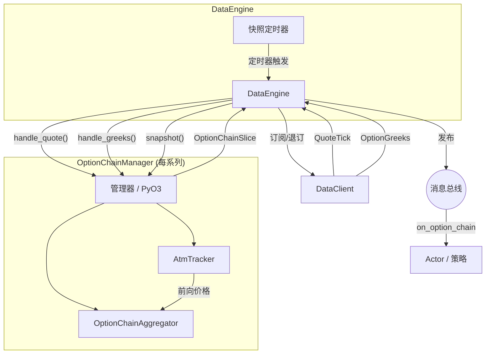

# 期权 (Options)

Nautilus 为传统市场和加密货币市场的期权交易提供了一流的支持。这包括期权特有的合约类型、交易所提供的希腊字母 (Greeks) 流、期权链聚合，以及用于风险管理的本地 Black-Scholes 希腊字母计算器。

## 期权合约类型 (Option instrument types)

平台定义了多种期权合约类型：

| 合约 (Instrument) | 描述 |
|------------------|----------------------------------------------------------------------------------------|
| `OptionContract` | 在标的资产上具有行权价和到期日的交易所交易期权（看跌或看涨）。 |
| `OptionSpread` | 交易所定义的多腿 (Multi-leg) 期权策略（垂直、日历、跨式），作为单行显示。 |
| `CryptoOption` | 以加密货币为报价/结算方式的加密标的期权；包含反向 (Inverse) 或双币 (Quanto) 风格。 |
| `BinaryOption` | 基于二元结果结算为 0 或 1 的固定收益期权。 |

与希腊字母相关的元数据因合约类型而异：

- `OptionContract`、`CryptoOption`：完整的希腊字母输入，包括 `strike_price`（行权价）、`option_kind`（期权种类：CALL/PUT）、`expiration_utc`（到期时间）、`underlying`（标的资产）、`multiplier`（乘数）。
- `OptionSpread`：最多由 4 个期权腿 (Legs) 组成，每个腿按比例加权。具有 `underlying`（标的资产）、`expiration_utc`（到期时间）和 `strategy_type`（策略类型：垂直、日历、跨式等）。每腿的 `strike_price` 和 `option_kind` 存在于每腿的 `OptionContract` 上，而不是在价差合约本身。希腊字母是按腿计算并聚合的。价差合约通常用于下单（交易所将其作为单个订单执行），而各个腿则显示为持仓。
- `BinaryOption`：具有 `expiration_utc` 和 `outcome`（结果）/ `description`（描述），但没有 `strike_price`、`option_kind` 或 `underlying`。

## 订阅希腊字母 (Subscribing to Greeks)

像 Deribit、Bybit 和 OKX 这样的交易场所在发布其期权市场数据的同时，也会发布实时的希腊字母。Nautilus 提供两个级别的订阅：

- **单合约希腊字母 (Per-instrument Greeks)**：订阅单个期权合约。
- **期权链切片 (Option chain slices)**：订阅整个期权系列的聚合视图。

### 单合约希腊字母 (Per-instrument Greeks)

从 Actor 或策略订阅单个期权合约的交易所提供的希腊字母：

```python
from nautilus_trader.model.identifiers import ClientId

client_id = ClientId("DERIBIT")
self.subscribe_option_greeks(instrument_id, client_id=client_id)
```

通过实现 `on_option_greeks` 处理器来处理传入的更新：

```python
def on_option_greeks(self, greeks) -> None:
    self.log.info(
        f"{greeks.instrument_id}: "
        f"delta={greeks.delta:.4f} gamma={greeks.gamma:.6f} "
        f"vega={greeks.vega:.4f} theta={greeks.theta:.4f} "
        f"mark_iv={greeks.mark_iv} underlying={greeks.underlying_price}"
    )
```

停止接收更新：

```python
self.unsubscribe_option_greeks(instrument_id, client_id=client_id)
```

### 期权链订阅 (Option chain subscriptions)

期权链订阅将期权系列中所有行权价的报价和希腊字母聚合为周期性的 `OptionChainSlice` 快照。`DataEngine` 为每个系列创建一个 `OptionChainManager` 并负责其完整的生命周期：通过管理器路由传入的数据、发布快照以及管理底层线路订阅。

```python
from nautilus_trader.core import nautilus_pyo3

series_id = nautilus_pyo3.OptionSeriesId(...)  # 标识系列（交易所、标的、到期日）

# 订阅平值 (ATM) 上下各 5 个行权价，每 1000 毫秒生成一次快照
strike_range = nautilus_pyo3.StrikeRange.atm_relative(strikes_above=5, strikes_below=5)
self.subscribe_option_chain(
    series_id,
    strike_range=strike_range,
    snapshot_interval_ms=1000,
)
```

通过实现 `on_option_chain` 处理器来处理快照：

```python
def on_option_chain(self, chain) -> None:
    for strike in chain.strikes():
        call = chain.get_call(strike)
        put = chain.get_put(strike)
        if call and call.greeks:
            self.log.info(f"Call {strike}: delta={call.greeks.delta:.4f}")
```

### 行权价范围过滤 (Strike range filtering)

`StrikeRange` 控制期权链订阅中哪些行权价处于激活状态：

| 变体 | 描述 | 示例 |
|----------------|----------------|-----------------------------------------------|
| `Fixed` | 订阅显式指定的行权价集合。 | `nautilus_pyo3.StrikeRange.fixed([...])` |
| `AtmRelative` | 当前平值 (ATM) 行权价上方 N 个和下方 N 个行权价。 | `nautilus_pyo3.StrikeRange.atm_relative(5, 5)` |
| `AtmPercent` | 平值 (ATM) 周围一定百分比带宽内的所有行权价。 | `nautilus_pyo3.StrikeRange.atm_percent(0.10)` |

对于基于平值 (ATM) 的变体，订阅将被延迟，直到平值价格确定。平值价格派生自交易所提供的 `OptionGreeks` 更新中嵌入的远期价格 (Forward price)（`underlying_price` 字段）。它也可以通过 HTTP 获取的初始远期价格进行种子设定，从而在实时 WebSocket 报价到达之前实现即时启动。随着平值价格的变动，激活的行权价集合会自动重新平衡。

### 快照模式与原始模式 (Snapshot vs. raw mode)

`snapshot_interval_ms` 参数控制发布行为：

- **快照模式 (Snapshot mode)** (`snapshot_interval_ms=1000`)：报价和希腊字母累积在缓冲区中，并根据定时器作为 `OptionChainSlice` 发布。适用于周期性的投资组合再平衡或 UI 显示。
- **原始模式 (Raw mode)** (`snapshot_interval_ms=None`)：每个报价或希腊字母更新都会立即发布一个切片。适用于对单个更新敏感的低延迟策略。

## 期权链架构 (Option chain architecture)

期权链系统是事件驱动的，并围绕每系列隔离而构建。`DataEngine` 为每个订阅的期权系列创建一个 `OptionChainManager`（封装了 Rust `OptionChainAggregator` 和 `AtmTracker` 的 PyO3 包装器）。引擎拥有完整的生命周期：订阅路由、定时器管理和消息总线发布。管理器仅处理聚合状态和平值追踪。



### 组件职责 (Component responsibilities)

#### 数据引擎 (DataEngine)

为每个活跃的 `OptionSeriesId` 持有一个 `OptionChainManager`。在 `SubscribeOptionChain` 时，它从缓存中解析合约，创建管理器，向数据客户端订阅活跃的合约，并设置快照定时器。在每个定时器触发时，它调用 `manager.check_rebalance()` 和 `manager.snapshot()`，并将任何订阅变更直接转发给数据客户端。在 `UnsubscribeOptionChain` 或所有合约到期时，它会拆除管理器，取消定时器，并退订线路级别的馈送。

#### 期权链管理器 (OptionChainManager - PyO3)

它是 `OptionChainAggregator` 和 `AtmTracker` 的一个薄 PyO3 包装器。它不与消息总线、时钟或数据客户端交互。`DataEngine` 通过 `handle_quote()` 和 `handle_greeks()` 向其喂入市场数据，并通过 `snapshot()` 检索快照。这两个 `handle_*` 方法都返回一个布尔值，指示平值 (ATM) 启动是否已发生（第一个平值价格已到达），引擎以此来触发真实激活合约集的订阅。

#### 期权链聚合器 (OptionChainAggregator)

使用“保留最新 (keep-latest)”语义将报价和希腊字母累积到看涨/看跌缓冲区中。自上次快照以来未更新的合约仍会包含在内。在合约的任何报价到达之前到达的希腊字母会被保存在 `pending_greeks` 缓冲区中，并在第一个报价到达时附加。在每次调用 `snapshot()` 时，聚合器会生成一个不可变的 `OptionChainSlice`。

#### 平值追踪器 (AtmTracker)

根据传入的 `OptionGreeks` 事件中的 `underlying_price` 字段（交易所提供的该到期日的前向价格）反应性地派生平值 (ATM) 价格。它可以预先设定一个来自 HTTP 前向价格响应的种子，以便在无需等待 WebSocket 报价的情况下立即启动。

### 启动与再平衡 (Bootstrap and rebalancing)

对于基于平值的行权价范围（`AtmRelative`、`AtmPercent`），在平值价格确定之前无法确定激活的合约集。有两种启动路径：

**即时启动（前向价格可用）：**

1. `DataEngine` 收到 `SubscribeOptionChain`，从缓存中解析该系列的所有合约，并向数据客户端请求前向价格。
2. 当收到前向价格响应时，引擎在创建管理器时预先设定平值价格种子。管理器在构造期间计算激活的行权价集。
3. 引擎立即订阅激活的合约。

**延迟启动（无前向价格）：**

1. 与上述相同，但在响应中未找到匹配的前向价格。
2. 引擎创建管理器时没有初始平值价格。激活集为空，且不进行该期权链的线路订阅。
3. 启动依赖于已经从其他订阅（例如单合约的 `subscribe_option_greeks` 调用）流入的相关希腊字母数据。当引擎通过 `handle_greeks()` 喂入一个带有 `underlying_price` 的 `OptionGreeks` 事件时，管理器启动并返回 `True`。引擎随后订阅现在的激活合约集。

一旦启动，聚合器就会监控平值价格的偏移。在每个快照定时器触发时，引擎调用 `check_rebalance()`，该方法返回任何要添加或删除的合约。滞后阈值 (Hysteresis threshold) 和冷却期可防止在行权价边界附近发生震荡。

## OptionGreeks 数据类型 (OptionGreeks data type)

`OptionGreeks` 承载了交易所提供的单个期权合约的敏感度和隐含波动率：

| 字段 | 类型 | 描述 |
|--------------------|------------------|-------------------------------------------------------|
| `instrument_id` | `InstrumentId` | 这些希腊字母所属的期权合约。 |
| `delta` | `float` | 标的资产每变动一个单位，期权价格的变化率。 |
| `gamma` | `float` | 标的资产每变动一个单位，Delta 的变化率。 |
| `vega` | `float` | 隐含波动率变动 1% 的敏感度。 |
| `theta` | `float` | 每日时间衰减 (dV/dt / 365.25)。 |
| `rho` | `float` | 利率变动的敏感度。 |
| `mark_iv` | `float` 或 None | 标记隐含波动率 (Mark IV)。 |
| `bid_iv` | `float` or None | 买价隐含波动率 (Bid IV)。 |
| `ask_iv` | `float` or None | 卖价隐含波动率 (Ask IV)。 |
| `underlying_price` | `float` or None | 计算时的标的资产价格。 |
| `open_interest` | `float` or None | 合约的持仓量 (Open Interest)。 |
| `ts_event` | `int` | 事件的 UNIX 时间戳（纳秒）。 |
| `ts_init` | `int` | 初始化时的 UNIX 时间戳（纳秒）。 |

## OptionChainSlice 数据类型 (OptionChainSlice data type)

`OptionChainSlice` 是整个期权系列在某个时间点的快照。

属性：

| 属性 | 类型 | 描述 |
|--------------|----------------------|------------------------------------------|
| `series_id` | `OptionSeriesId` | 期权系列标识符。 |
| `atm_strike` | `Price` or None | 当前平值 (ATM) 行权价（如果已确定）。 |
| `ts_event` | `int` | UNIX 时间戳（纳秒）。 |
| `ts_init` | `int` | UNIX 时间戳（纳秒）。 |

看涨和看跌数据通过方法访问，而不是作为直接属性。
这些方法返回的每个 `OptionStrikeData` 都包含该行权价的 `quote` (`QuoteTick`) 和可选的 `greeks` (`OptionGreeks`)。

方法：

- `strikes()`：期权链中所有唯一的行权价。
- `strike_count()`、`call_count()`、`put_count()`：计数。
- `get_call(strike)`、`get_put(strike)`：完整的 `OptionStrikeData`。
- `get_call_greeks(strike)`、`get_put_greeks(strike)`：仅希腊字母。
- `get_call_quote(strike)`、`get_put_quote(strike)`：仅报价。
- `is_empty()`：如果期权链没有数据，则为 true。

## 适配器支持 (Adapter support)

目前以下适配器支持期权希腊字母订阅：

| 适配器 | 单合约希腊字母 | 期权链 |
|---------|:---------------------:|:-------------:|
| Deribit | ✓ | ✓ |
| Bybit | ✓ | ✓ |
| OKX | ✓ | - |

## 另请参阅 (See also)

- [希腊字母 (Greeks)](greeks.md) - 本地希腊字母计算和投资组合风险管理。
- [数据 (Data)](data.md) - 内置数据类型和订阅模型。
- [Actor (Actors)](actors.md) - 订阅和处理器参考表。
