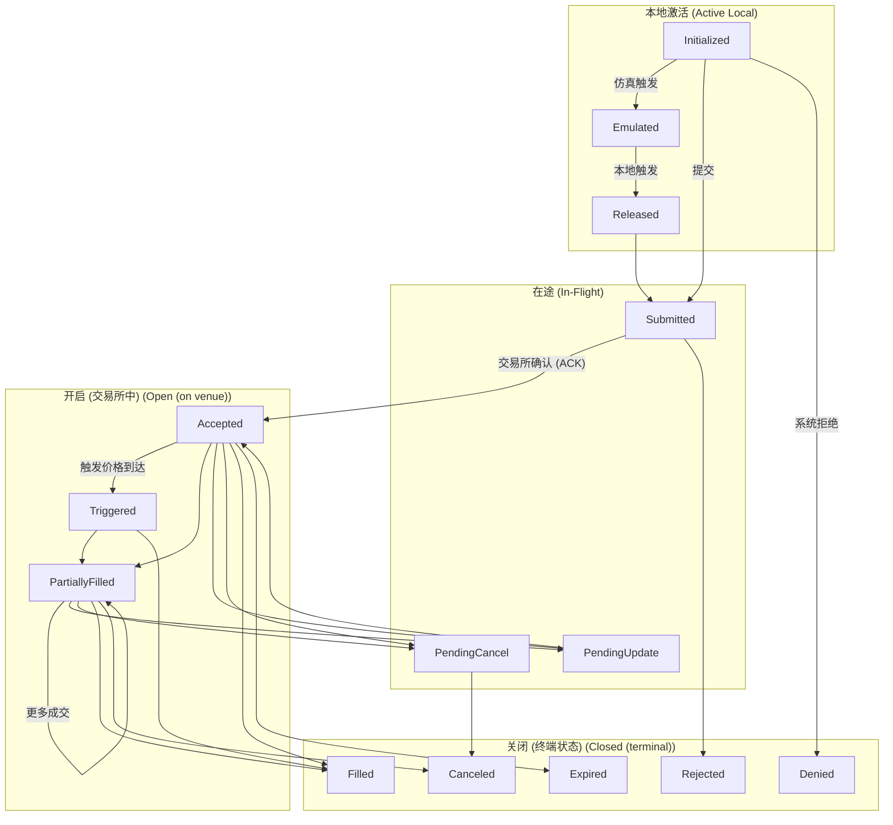

# 订单 (Orders)

NautilusTrader 支持广泛的订单类型 (Order types) 和执行指令 (Execution instructions)，尽可能地展示交易场所的所有功能。交易者可以为任何交易策略中的订单执行和管理定义指令和偶然性。

## 概览 (Overview)

所有订单类型都源于两个基本类型：*市价 (Market)* 和 *限价 (Limit)* 订单。在流动性方面，它们是相反的。
*市价 (Market)* 订单通过以最佳可用价格立即执行来消耗流动性，而 *限价 (Limit)* 订单通过在订单簿中以指定价格挂单直到匹配来提供流动性。

平台上可用的订单类型包括（使用 `OrderType` 枚举值）：

- `MARKET` (市价单)
- `LIMIT` (限价单)
- `STOP_MARKET` (止损市价单)
- `STOP_LIMIT` (止损限价单)
- `MARKET_TO_LIMIT` (市价转限价单)
- `MARKET_IF_TOUCHED` (触及市价单)
- `LIMIT_IF_TOUCHED` (触及限价单)
- `TRAILING_STOP_MARKET` (跟踪止损市价单)
- `TRAILING_STOP_LIMIT` (跟踪止损限价单)

:::info
NautilusTrader 为许多订单类型和执行指令提供统一的 API，但并非所有交易场所都支持每个选项。
如果订单包含目标交易场所不支持的指令或选项，系统将不会提交该订单。
相反，它会记录一条清晰的、解释性的错误。
:::

### 术语 (Terminology)

- 如果订单类型为 `MARKET` 或作为 *可成交 (marketable)* 订单执行（即消耗流动性），则该订单是 **主动的 (aggressive)**。
- 如果订单不可成交（即提供流动性），则该订单是 **被动的 (passive)**。
- 如果订单在本地系统边界内处于以下三个非终端状态之一，则该订单是 **本地激活的 (active local)**：
  - `INITIALIZED` (已初始化)
  - `EMULATED` (仿真中)
  - `RELEASED` (已发布)
- 当订单处于以下状态之一时，该订单是 **在途的 (in-flight)**：
  - `SUBMITTED` (已提交)
  - `PENDING_UPDATE` (待更新)
  - `PENDING_CANCEL` (待取消)
- 当订单处于以下（非终端）状态之一时，该订单是 **开启的 (open)**：
  - `ACCEPTED` (已接受)
  - `TRIGGERED` (已触发)
  - `PENDING_UPDATE` (待更新)
  - `PENDING_CANCEL` (待取消)
  - `PARTIALLY_FILLED` (部分成交)
- 当订单处于以下（终端）状态之一时，该订单是 **关闭的 (closed)**：
  - `DENIED` (已拒绝 - 系统级)
  - `REJECTED` (已拒绝 - 交易所级)
  - `CANCELED` (已取消)
  - `EXPIRED` (已过期)
  - `FILLED` (已成交)

### 订单状态流 (Order state flow)

下图说明了订单生命周期和主要状态转换：



### 订单状态定义 (Order status definitions)

| 状态 (Status)      | 描述 (Description)                                                                               |
|--------------------|--------------------------------------------------------------------------------------------------|
| `INITIALIZED`      | 订单在 Nautilus 系统内实例化。                                                                   |
| `DENIED`           | 订单因无效、无法处理或超过风险限制而被 Nautilus 拒绝。                                           |
| `EMULATED`         | 订单正在由 `OrderEmulator` 组件进行仿真。                                                        |
| `RELEASED`         | 订单从 `OrderEmulator` 组件中发布。                                                              |
| `SUBMITTED`        | 订单已提交至交易场所（等待确认）。                                                               |
| `ACCEPTED`         | 交易场所确认已接收且订单有效（现在可能正在运行）。                                               |
| `REJECTED`         | 订单被交易场所拒绝。                                                                             |
| `CANCELED`         | 订单已取消（终端状态）。                                                                         |
| `EXPIRED`          | 订单达到其 GTD 过期时间（终端状态）。                                                           |
| `TRIGGERED`        | 订单的止损 (STOP) 价格在交易场所被触发。                                                         |
| `PENDING_UPDATE`   | 订单在交易场所有待处理的修改请求。                                                               |
| `PENDING_CANCEL`   | 订单在交易场所有待处理的取消请求。                                                               |
| `PARTIALLY_FILLED` | 订单在交易场所已部分成交。                                                                       |
| `FILLED`           | 订单已完全成交 (Filled)（终端状态）。                                                           |

## 执行指令 (Execution instructions)

某些交易场所允许交易者指定订单处理和执行的条件和限制。以下是可用的不同执行指令的简要摘要。

### 有效时限 (Time in force)

订单的有效时限指定订单在任何剩余数量被取消之前保持开启或激活状态的时间。

- `GTC` **(直至取消有效 / Good Till Cancel)**：订单保持激活状态，直到由交易者或交易场所取消。
- `IOC` **(立即成交或取消 / Immediate or Cancel / Fill and Kill)**：订单立即执行，任何未填充的部分将被取消。
- `FOK` **(全部成交或取消 / Fill or Kill)**：订单立即全部执行，否则完全不执行。
- `GTD` **(指定日期前有效 / Good Till Date)**：订单保持激活状态，直到指定的过期日期和时间。
- `DAY` **(当日有效 / Good for session/day)**：订单保持激活状态，直到当前交易时段结束。
- `AT_THE_OPEN` **(开盘单 / OPG)**：订单仅在交易时段开盘时激活。
- `AT_THE_CLOSE` **(收盘单)**：订单仅在交易时段收盘时激活。

### 过期时间 (Expire time)

此指令应与 `GTD` 有效时限配合使用，以指定订单将过期并从交易场所的订单簿（或订单管理系统）中移除的时间。

### 只做 Maker (Post-only)

标记为 `post_only` 的订单将仅参与向限价订单簿提供流动性，而永远不会作为主动方 (aggressor) 发起消耗流动性的交易。此选项对于做市商或寻求将订单限制在流动性 *制造者 (maker)* 费用层的交易者非常重要。

### 只减仓 (Reduce-only)

设置为 `reduce_only` 的订单将仅减少合约 (Instrument) 上的现有仓位 (Position)，而永远不会开设新仓位（如果已经持平）。此指令的确切行为在不同交易场所之间可能有所不同。

然而，Nautilus `SimulatedExchange` 中的行为是真实交易场所的典型行为。

- 如果关联的仓位 (Position) 关闭（变得持平），订单将被取消。
- 随着关联仓位的大小减小，订单数量将相应减少。

### 展示数量 (Display quantity)

`display_qty` 指定限价 (Limit) 订单中在限价订单簿上展示的部分。这些也被称为冰山订单 (iceberg orders)，因为有一个可见的部分被展示，而更多的数量被隐藏。将展示数量指定为零也相当于将订单设置为 `hidden` (隐藏)。

### 触发类型 (Trigger type)

也称为 [触发方法 (trigger method)](https://www.interactivebrokers.com/en/software/tws/usersguidebook/configuretws/Modify%20the%20Stop%20Trigger%20Method.htm)，适用于条件触发订单，指定触发止损价格的方法。

- `DEFAULT`：交易场所的默认触发类型（通常为 `LAST_PRICE` 或 `BID_ASK`）。
- `LAST_PRICE`：触发价格将基于最后成交价。
- `BID_ASK`：触发价格将基于买单的买入价和卖单的卖出价。
- `DOUBLE_LAST`：触发价格将基于最后两个连续的成交价。
- `DOUBLE_BID_ASK`：触发价格将基于最后两个连续的买入或卖出价（视情况而定）。
- `LAST_OR_BID_ASK`：触发价格将基于最后成交价或买入/卖出价。
- `MID_POINT`：触发价格将基于买入价和卖出价的中值。
- `MARK_PRICE`：触发价格将基于交易场所对该合约 (Instrument) 的标记价格。
- `INDEX_PRICE`：触发价格将基于交易场所对该合约 (Instrument) 的指数价格。

### 触发偏移类型 (Trigger offset type)

适用于条件跟踪止损触发订单，指定基于偏离 *市场*（视情况而定为买入、卖出或最后成交价）的偏移量来触发止损价格修改的方法。

- `DEFAULT`：交易场所的默认偏移类型（通常为 `PRICE`）。
- `PRICE`：偏移基于价格差。
- `BASIS_POINTS`：偏移基于以基点表示的价格百分比差异（100bp = 1%）。
- `TICKS`：偏移基于跳动点 (ticks) 的数量。
- `PRICE_TIER`：偏移基于交易场所特定的价格层级。

### 挂钩订单 (Contingent orders)

可以在订单之间指定更高级的关系。
例如，可以分配子订单仅在父订单被激活或填充时触发，或者可以将订单链接起来，以便一个订单取消或减少另一个订单的数量。有关更多详细信息，请参阅 [高级订单](#高级订单-advanced-orders) 部分。

## 订单工厂 (Order factory)

创建新订单最简单的方法是使用内置的 `OrderFactory`，它会自动附加到每个 `Strategy` 类。该工厂将负责处理底层细节——例如确保分配正确的交易者 ID 和策略 ID，生成必要的初始化 ID 和时间戳，并抽象掉不一定适用于正在创建的订单类型的参数，或者仅在指定更高级执行指令时才需要的参数。

这使得工厂具有更简单的订单创建方法可以使用，所有示例都在 `Strategy` 上下文中使用 `OrderFactory`。

有关更多详细信息，请参阅 [`OrderFactory` API 参考](/docs_zh/python-api-latest/common.html#nautilus_trader.common.factories.OrderFactory)。

## 订单类型 (Order types)

以下描述了平台上可用的订单类型并附有代码示例。
任何可选参数都将通过包含默认值的注释清晰地标记。

### 市价单 (Market)

*市价 (Market)* 订单是交易者要求以最佳可用价格立即交易给定数量的指令。您还可以指定多个有效时限选项，并指示此订单是否仅旨在减少仓位 (Position)。

在以下示例中，我们在 Interactive Brokers [IdealPro](https://ibkr.info/node/1708) 外汇 ECN 上创建了一个 *市价 (Market)* 订单，使用美元购买 100,000 澳元：

```python
from nautilus_trader.model.enums import OrderSide
from nautilus_trader.model.enums import TimeInForce
from nautilus_trader.model import InstrumentId
from nautilus_trader.model import Quantity
from nautilus_trader.model.orders import MarketOrder

order: MarketOrder = self.order_factory.market(
    instrument_id=InstrumentId.from_str("AUD/USD.IDEALPRO"),
    order_side=OrderSide.BUY,
    quantity=Quantity.from_int(100_000),
    time_in_force=TimeInForce.IOC,  # <-- 可选 (默认 GTC)
    reduce_only=False,  # <-- 可选 (默认 False)
    tags=["ENTRY"],  # <-- 可选 (默认 None)
)
```

有关更多详细信息，请参阅 [`MarketOrder` API 参考](/docs_zh/python-api-latest/model/orders.html#nautilus_trader.model.orders.market.MarketOrder)。

### 限价单 (Limit)

*限价 (Limit)* 订单以特定价格放置在限价订单簿上，并且仅在该价格（或更好的价格）执行。

在以下示例中，我们在 Binance Futures 加密货币交易所创建了一个 *限价 (Limit)* 订单，作为做市商以 5000 USDT 的限价卖出 20 份 ETHUSDT-PERP 永续合约。

```python
from nautilus_trader.model.enums import OrderSide
from nautilus_trader.model.enums import TimeInForce
from nautilus_trader.model import InstrumentId
from nautilus_trader.model import Price
from nautilus_trader.model import Quantity
from nautilus_trader.model.orders import LimitOrder

order: LimitOrder = self.order_factory.limit(
    instrument_id=InstrumentId.from_str("ETHUSDT-PERP.BINANCE"),
    order_side=OrderSide.SELL,
    quantity=Quantity.from_int(20),
    price=Price.from_str("5_000.00"),
    time_in_force=TimeInForce.GTC,  # <-- 可选 (默认 GTC)
    expire_time=None,  # <-- 可选 (默认 None)
    post_only=True,  # <-- 可选 (默认 False)
    reduce_only=False,  # <-- 可选 (默认 False)
    display_qty=None,  # <-- 可选 (默认 None 表示全额展示)
    tags=None,  # <-- 可选 (默认 None)
)
```

有关更多详细信息，请参阅 [`LimitOrder` API 参考](/docs_zh/python-api-latest/model/orders.html#nautilus_trader.model.orders.limit.LimitOrder)。

### 止损市价单 (Stop-Market)

*止损市价 (Stop-Market)* 订单是一种条件订单，一旦触发，将立即放置一个 *市价 (Market)* 订单。这种订单类型通常用作止损以限制损失，既可以是针对多头仓位的卖出单，也可以是针对空头仓位的买入单。

在以下示例中，我们在 Binance 现货/杠杆交易所创建了一个 *止损市价 (Stop-Market)* 订单，以 100,000 USDT 的触发价格卖出 1 BTC，直到另行通知前保持激活：

```python
from nautilus_trader.model.enums import OrderSide
from nautilus_trader.model.enums import TimeInForce
from nautilus_trader.model.enums import TriggerType
from nautilus_trader.model import InstrumentId
from nautilus_trader.model import Price
from nautilus_trader.model import Quantity
from nautilus_trader.model.orders import StopMarketOrder

order: StopMarketOrder = self.order_factory.stop_market(
    instrument_id=InstrumentId.from_str("BTCUSDT.BINANCE"),
    order_side=OrderSide.SELL,
    quantity=Quantity.from_int(1),
    trigger_price=Price.from_int(100_000),
    trigger_type=TriggerType.LAST_PRICE,  # <-- 可选 (默认 DEFAULT)
    time_in_force=TimeInForce.GTC,  # <-- 可选 (默认 GTC)
    expire_time=None,  # <-- 可选 (默认 None)
    reduce_only=False,  # <-- 可选 (默认 False)
    tags=None,  # <-- 可选 (默认 None)
)
```

有关更多详细信息，请参阅 [`StopMarketOrder` API 参考](/docs_zh/python-api-latest/model/orders.html#nautilus_trader.model.orders.stop_market.StopMarketOrder)。

### 止损限价单 (Stop-Limit)

*止损限价 (Stop-Limit)* 订单是一种条件订单，一旦触发将立即以指定价格放置一个 *限价 (Limit)* 订单。

在以下示例中，我们在 Currenex FX ECN 上创建了一个 *止损限价 (Stop-Limit)* 订单，一旦市场达到 1.30010 USD 的触发价格，就以 1.3000 USD 的限价买入 50,000 GBP，有效期至 2022 年 6 月 6 日中午 (UTC)：

```python
import pandas as pd
from nautilus_trader.model.enums import OrderSide
from nautilus_trader.model.enums import TimeInForce
from nautilus_trader.model.enums import TriggerType
from nautilus_trader.model import InstrumentId
from nautilus_trader.model import Price
from nautilus_trader.model import Quantity
from nautilus_trader.model.orders import StopLimitOrder

order: StopLimitOrder = self.order_factory.stop_limit(
    instrument_id=InstrumentId.from_str("GBP/USD.CURRENEX"),
    order_side=OrderSide.BUY,
    quantity=Quantity.from_int(50_000),
    price=Price.from_str("1.30000"),
    trigger_price=Price.from_str("1.30010"),
    trigger_type=TriggerType.BID_ASK,  # <-- 可选 (默认 DEFAULT)
    time_in_force=TimeInForce.GTD,  # <-- 可选 (默认 GTC)
    expire_time=pd.Timestamp("2022-06-06T12:00"),
    post_only=True,  # <-- 可选 (默认 False)
    reduce_only=False,  # <-- 可选 (默认 False)
    tags=None,  # <-- 可选 (默认 None)
)
```

有关更多详细信息，请参阅 [`StopLimitOrder` API 参考](/docs_zh/python-api-latest/model/orders.html#nautilus_trader.model.orders.stop_limit.StopLimitOrder)。

### 市价转限价单 (Market-To-Limit)

*市价转限价 (Market-To-Limit)* 订单以当前最佳价格作为市价单提交。
如果订单部分成交，系统将取消剩余部分，并以成交价作为 *限价 (Limit)* 订单重新提交。

在以下示例中，我们在 Interactive Brokers [IdealPro](https://ibkr.info/node/1708) 外汇 ECN 上创建了一个 *市价转限价 (Market-To-Limit)* 订单，使用日元购买 200,000 美元：

```python
from nautilus_trader.model.enums import OrderSide
from nautilus_trader.model.enums import TimeInForce
from nautilus_trader.model import InstrumentId
from nautilus_trader.model import Quantity
from nautilus_trader.model.orders import MarketToLimitOrder

order: MarketToLimitOrder = self.order_factory.market_to_limit(
    instrument_id=InstrumentId.from_str("USD/JPY.IDEALPRO"),
    order_side=OrderSide.BUY,
    quantity=Quantity.from_int(200_000),
    time_in_force=TimeInForce.GTC,  # <-- 可选 (默认 GTC)
    reduce_only=False,  # <-- 可选 (默认 False)
    display_qty=None,  # <-- 可选 (默认 None 表示全额展示)
    tags=None,  # <-- 可选 (默认 None)
)
```

有关更多详细信息，请参阅 [`MarketToLimitOrder` API 参考](/docs_zh/python-api-latest/model/orders.html#nautilus_trader.model.orders.market_to_limit.MarketToLimitOrder)。

### 触及市价单 (Market-If-Touched)

*触及市价 (Market-If-Touched)* 订单是一种条件订单，一旦触发将立即放置一个 *市价 (Market)* 订单。这种订单类型通常用于在止损价位进入新仓位，或对现有仓位进行获利了结，既可以是针对多头仓位的卖出单，也可以是针对空头仓位的买入单。

在以下示例中，我们在 Binance Futures 交易所创建了一个 *触及市价 (Market-If-Touched)* 订单，以 10,000 USDT 的触发价格卖出 10 份 ETHUSDT-PERP 永续合约，直到另行通知前保持激活：

```python
from nautilus_trader.model.enums import OrderSide
from nautilus_trader.model.enums import TimeInForce
from nautilus_trader.model.enums import TriggerType
from nautilus_trader.model import InstrumentId
from nautilus_trader.model import Price
from nautilus_trader.model import Quantity
from nautilus_trader.model.orders import MarketIfTouchedOrder

order: MarketIfTouchedOrder = self.order_factory.market_if_touched(
    instrument_id=InstrumentId.from_str("ETHUSDT-PERP.BINANCE"),
    order_side=OrderSide.SELL,
    quantity=Quantity.from_int(10),
    trigger_price=Price.from_str("10_000.00"),
    trigger_type=TriggerType.LAST_PRICE,  # <-- 可选 (默认 DEFAULT)
    time_in_force=TimeInForce.GTC,  # <-- 可选 (默认 GTC)
    expire_time=None,  # <-- 可选 (默认 None)
    reduce_only=False,  # <-- 可选 (默认 False)
    tags=["ENTRY"],  # <-- 可选 (默认 None)
)
```

有关更多详细信息，请参阅 [`MarketIfTouchedOrder` API 参考](/docs_zh/python-api-latest/model/orders.html#nautilus_trader.model.orders.market_if_touched.MarketIfTouchedOrder)。

### 触及限价单 (Limit-If-Touched)

*触及限价 (Limit-If-Touched)* 订单是一种条件订单，一旦触发将立即以指定价格放置一个 *限价 (Limit)* 订单。

在以下示例中，我们在 Binance Futures 交易所创建了一个 *触及限价 (Limit-If-Touched)* 订单，以 30,100 USDT 的限价买入 5 份 BTCUSDT-PERP 永续合约（一旦市场达到 30,150 USDT 的触发价格），有效期至 2022 年 6 月 6 日中午 (UTC)：

```python
import pandas as pd
from nautilus_trader.model.enums import OrderSide
from nautilus_trader.model.enums import TimeInForce
from nautilus_trader.model.enums import TriggerType
from nautilus_trader.model import InstrumentId
from nautilus_trader.model import Price
from nautilus_trader.model import Quantity
from nautilus_trader.model.orders import LimitIfTouchedOrder

order: LimitIfTouchedOrder = self.order_factory.limit_if_touched(
    instrument_id=InstrumentId.from_str("BTCUSDT-PERP.BINANCE"),
    order_side=OrderSide.BUY,
    quantity=Quantity.from_int(5),
    price=Price.from_str("30_100"),
    trigger_price=Price.from_str("30_150"),
    trigger_type=TriggerType.LAST_PRICE,  # <-- 可选 (默认 DEFAULT)
    time_in_force=TimeInForce.GTD,  # <-- 可选 (默认 GTC)
    expire_time=pd.Timestamp("2022-06-06T12:00"),
    post_only=True,  # <-- 可选 (默认 False)
    reduce_only=False,  # <-- 可选 (默认 False)
    tags=["TAKE_PROFIT"],  # <-- 可选 (默认 None)
)
```

有关更多详细信息，请参阅 [`LimitIfTouchedOrder` API 参考](/docs_zh/python-api-latest/model/orders.html#nautilus_trader.model.orders.limit_if_touched.LimitIfTouchedOrder)。

### 跟踪止损市价单 (Trailing-Stop-Market)

*跟踪止损市价 (Trailing-Stop-Market)* 订单是一种条件订单，它在偏离定义的市场价格固定偏移量处跟踪止损触发价格。一旦触发，将立即放置一个 *市价 (Market)* 订单。

在以下示例中，我们在 Binance Futures 交易所创建了一个 *跟踪止损市价 (Trailing-Stop-Market)* 订单，卖出 10 份 ETHUSD-PERP COIN_M 保证金永续合约，在 5,000 USD 的价格激活，然后以偏离当前最后成交价 1%（以基点计）的偏移量进行跟踪：

```python
import pandas as pd
from decimal import Decimal
from nautilus_trader.model.enums import OrderSide
from nautilus_trader.model.enums import TimeInForce
from nautilus_trader.model.enums import TriggerType
from nautilus_trader.model.enums import TrailingOffsetType
from nautilus_trader.model import InstrumentId
from nautilus_trader.model import Price
from nautilus_trader.model import Quantity
from nautilus_trader.model.orders import TrailingStopMarketOrder

order: TrailingStopMarketOrder = self.order_factory.trailing_stop_market(
    instrument_id=InstrumentId.from_str("ETHUSD-PERP.BINANCE"),
    order_side=OrderSide.SELL,
    quantity=Quantity.from_int(10),
    activation_price=Price.from_str("5_000"),
    trigger_type=TriggerType.LAST_PRICE,  # <-- 可选 (默认 DEFAULT)
    trailing_offset=Decimal(100),
    trailing_offset_type=TrailingOffsetType.BASIS_POINTS,
    time_in_force=TimeInForce.GTC,  # <-- 可选 (默认 GTC)
    expire_time=None,  # <-- 可选 (默认 None)
    reduce_only=True,  # <-- 可选 (默认 False)
    tags=["TRAILING_STOP-1"],  # <-- 可选 (默认 None)
)
```

有关更多详细信息，请参阅 [`TrailingStopMarketOrder` API 参考](/docs_zh/python-api-latest/model/orders.html#nautilus_trader.model.orders.trailing_stop_market.TrailingStopMarketOrder)。

### 跟踪止损限价单 (Trailing-Stop-Limit)

*跟踪止损限价 (Trailing-Stop-Limit)* 订单是一种条件订单，它在偏离定义的市场价格固定偏移量处跟踪止损触发价格。一旦触发，将立即以定义的价格（该价格也会随着市场波动而更新，直到被触发）放置一个 *限价 (Limit)* 订单。

在以下示例中，我们在 Currenex FX ECN 上创建了一个 *跟踪止损限价 (Trailing-Stop-Limit)* 订单，以 0.71000 USD 的限价买入 1,250,000 AUD，使用美元，在 0.72000 USD 激活，然后以偏离当前卖出价 0.00100 USD 的止损偏移量进行跟踪，直到另行通知前保持激活：

```python
import pandas as pd
from decimal import Decimal
from nautilus_trader.model.enums import OrderSide
from nautilus_trader.model.enums import TimeInForce
from nautilus_trader.model.enums import TriggerType
from nautilus_trader.model.enums import TrailingOffsetType
from nautilus_trader.model import InstrumentId
from nautilus_trader.model import Price
from nautilus_trader.model import Quantity
from nautilus_trader.model.orders import TrailingStopLimitOrder

order: TrailingStopLimitOrder = self.order_factory.trailing_stop_limit(
    instrument_id=InstrumentId.from_str("AUD/USD.CURRENEX"),
    order_side=OrderSide.BUY,
    quantity=Quantity.from_int(1_250_000),
    price=Price.from_str("0.71000"),
    activation_price=Price.from_str("0.72000"),
    trigger_type=TriggerType.BID_ASK,  # <-- 可选 (默认 DEFAULT)
    limit_offset=Decimal("0.00050"),
    trailing_offset=Decimal("0.00100"),
    trailing_offset_type=TrailingOffsetType.PRICE,
    time_in_force=TimeInForce.GTC,  # <-- 可选 (默认 GTC)
    expire_time=None,  # <-- 可选 (默认 None)
    reduce_only=True,  # <-- 可选 (默认 False)
    tags=["TRAILING_STOP"],  # <-- 可选 (默认 None)
)
```

有关更多详细信息，请参阅 [`TrailingStopLimitOrder` API 参考](/docs_zh/python-api-latest/model/orders.html#nautilus_trader.model.orders.trailing_stop_limit.TrailingStopLimitOrder)。

## 高级订单 (Advanced orders)

应结合经纪商或交易场所关于这些订单类型、列表/组和执行指令的具体文档（例如 Interactive Brokers 的文档）来阅读以下指南。

### 订单列表 (Order lists)

挂钩订单的组合或更大的批量订单可以分组到一个具有共同 `order_list_id` 的列表中。此列表中包含的订单之间可能存在也可能不存在挂钩关系，因为这取决于订单本身的构建方式以及它们被路由到的特定交易场所。

### 挂钩类型 (Contingency types)

- **OTO (一触发另一 / One-Triggers-Other)** – 一个父订单，一旦执行，就会自动放置一个或多个子订单。
  - *全额触发模型 (Full-trigger model)*：子订单**仅在父订单完全成交后**发布。在大多数零售股票/期权经纪商（如 Schwab、Fidelity、TD Ameritrade）和许多现货加密货币场所（Binance、Coinbase）中很常见。
  - *部分触发模型 (Partial-trigger model)*：子订单**随每次部分成交按比例发布**。由专业级平台（如 Interactive Brokers）、大多数期货/外汇 OMS 以及 Kraken Pro 使用。

- **OCO (二选一 / One-Cancels-Other)** – 两个（或更多）链接的活跃订单，执行其中一个将取消其余订单。

- **OUO (一更新另一 / One-Updates-Other)** – 两个（或更多）链接的活跃订单，执行其中一个会减少其余订单的未平仓数量。

:::info
这些挂钩类型与 FIX 标签 <1385> `ContingencyType` 相关 <https://www.onixs.biz/fix-dictionary/5.0.sp2/tagnum_1385.html>。
:::

#### 一触发另一 (OTO)

OTO 订单涉及两个部分：

1. **父订单 (Parent order)** – 立即提交至撮合引擎。
2. **子订单 (Child order(s))** – 保持 *离场 (off-book)* 状态，直到满足触发条件。

##### 触发模型 (Trigger models)

| 触发模型 (Trigger model) | 子订单何时发布？                                                                                                                  |
|--------------------------|-----------------------------------------------------------------------------------------------------------------------------------|
| **全额触发 (Full trigger)**    | 当父订单的累计数量等于其原始数量（即*完全*成交 (Filled)）时。                                                                     |
| **部分触发 (Partial trigger)** | 在父订单的每次部分执行时立即发布；子订单的数量与执行金额匹配，并随着进一步成交的发生而增加。                                      |

:::info
NautilusTrader 的默认回测 (Backtesting) 场所对 OTO 订单使用 *部分触发模型*。
要选择 *全额触发模式*，请为交易场所设置 `oto_trigger_mode="FULL"`（例如通过 `BacktestVenueConfig`）。
:::

**在实盘中使用部分触发：**

如果您的策略需要全额触发语义，但交易场所或回测引擎使用部分触发：

1. 提交不带挂钩子订单的父订单。
2. 订阅父订单的 `OrderFilled` 事件。
3. 仅在确认父订单完全成交后才提交子订单（止损单、获利单）。
4. 使用 `order.is_closed` 和 `order.filled_qty == order.quantity` 来验证完全成交。

> **为什么这种区别很重要**
> *全额触发* 会留下风险窗口：任何部分填充的仓位 (Position) 都在运行中，且没有其保护性退出，直到剩余数量成交。
> *部分触发* 通过确保每个执行的批次立即具有其链接的止损/限价单来减轻该风险，代价是产生更多的订单流量和更新。

OTO 订单可以使用交易场所支持的任何资产类型（例如，带期权对冲的股票入场、带 OCO 括号单的期货入场、带获利/止损的加密货币现货入场）。

| 交易场所 / 适配器 ID | 资产类别 | 子订单触发规则 | 实践笔记 |
|----------------------|----------|----------------|----------|
| Binance / Binance Futures (`BINANCE`) | 现货、永续合约 | **部分或全额** – 在第一次成交时触发。 | OTOCO/获利-止损子订单立即出现；监控保证金使用情况。 |
| Bybit Spot (`BYBIT`) | 现货 | **全额** – 子订单在完成后放置。 | 获利-止损预设仅在限价单完全成交后激活。 |
| Bybit Perps (`BYBIT`) | 永续合约 | **部分和全额** – 可配置。 | “部分仓位”模式在成交到达时调整获利-止损的大小。 |
| Kraken Futures (`KRAKEN`) | 期货 & 永续 | **部分和全额** – 自动。 | 子订单数量与每次部分执行匹配。 |
| OKX (`OKX`) | 现货、期货、期权 | **全额** – 附加的止损等待成交。 | 仓位级别的获利-止损可以单独添加。 |
| Interactive Brokers (`INTERACTIVE_BROKERS`) | 股票、期权、外汇、期货 | **可配置** – OCA 可以按比例分配。 | `OcaType 2/3` 减少剩余的子订单数量。 |
| dYdX v4 (`DYDX`) | 永续合约 (DEX) | 链上条件（精确大小）。 | 获利-止损由预言机价格触发；不适用部分成交。 |
| Polymarket (`POLYMARKET`) | 预测市场 (DEX) | N/A。 | 高级挂钩完全在策略层处理。 |
| Betfair (`BETFAIR`) | 体育博彩 | N/A。 | 高级挂钩完全在策略层处理。 |

#### 二选一 (OCO)

OCO 订单是一组链接的订单，其中**任何**订单的执行（全额 *或部分*）都会触发对其他订单的最佳努力取消。两个订单同时处于激活状态；一旦其中一个开始成交，交易场所就会尝试取消另一个订单的未执行部分。

#### 一更新另一 (OUO)

OUO 订单是一组链接的订单，其中一个订单的执行会导致另一个（或多个）订单中未平仓数量的立即 *减少*。两个订单同时处于激活状态，每次部分执行都会在最佳努力的基础上按比例更新其对等订单的剩余数量。

### 挂钩订单验证 (Contingent order validation)

在使用挂钩订单（OTO、OCO、OUO）时，请注意以下验证规则和错误场景：

**订单列表要求：**

- 挂钩组中的所有订单必须共享相同的 `order_list_id`。
- 父订单 must be submitted before or simultaneously with their children.
- 子订单通过 `parent_order_id` 引用其父订单。

**修改规则：**

- 父订单通常可以在待处理时修改，但修改可能会级联到子订单。
- 在大多数交易场所，子订单可以独立修改，但请检查交易场所特定的行为。
- 取消父订单将取消所有关联的子订单。

**常见错误场景：**

| 场景 | 系统行为 |
|------|----------|
| 子订单引用不存在的父订单 | 订单被拒绝，报错 `INVALID_ORDER` |
| 父订单在子订单触发前被取消 | 子订单自动取消 |
| OCO 同级订单在取消传播前成交 | 承认部分成交，取消剩余数量 |
| 括号单保证金不足 | 入场单可能执行，子订单分别被拒绝 |

:::warning
始终在您的策略中处理 `OrderDenied` 和 `OrderRejected` 事件，特别是对于挂钩订单，其中部分失败可能导致仓位 (Position) 失去保护。
:::

### 括号订单 (Bracket orders)

括号订单是一种高级订单类型，允许交易者同时为仓位 (Position) 设置获利和止损水平。这涉及放置一个父订单（入场单） and two child orders: a take-profit `LIMIT` order and a stop-loss `STOP_MARKET` order. 当父订单执行时，系统放置子订单。如果市场走势有利，获利单将平仓；如果走势不利，止损单将限制损失。

括号订单可以使用 [OrderFactory](/docs_zh/python-api-latest/common.html#nautilus_trader.common.factories.OrderFactory) 轻松创建，它支持各种订单类型、参数和指令。

:::warning
您应该意识到仓位 (Position) 的保证金要求，因为为仓位设置括号单会消耗更多的订单保证金。
:::

## 仿真订单 (Emulated orders)

### 简介 (Introduction)

仿真 (Emulation) 让您即使在交易场所不原生支持某些订单类型时也可以使用它们。

Nautilus 在本地模拟这些订单类型（例如 `STOP_LIMIT` 或 `TRAILING_STOP` 订单）的行为，同时仅使用 `MARKET` 和 `LIMIT` 订单在交易场所进行实际执行。

当您创建仿真订单 (Emulated order) 时，Nautilus 会持续跟踪特定类型的市场价格（由 `emulation_trigger` 参数指定），并根据您设置的订单类型和条件，在满足触发条件时自动提交适当的基础订单 (`MARKET` / `LIMIT`)。

例如，如果您创建一个仿真的 `STOP_LIMIT` 订单，Nautilus 将监控市场价格直到达到您的 `stop` (止损) 价格，然后自动向交易场所提交一个 `LIMIT` (限价) 订单。

为了执行仿真，Nautilus 需要知道它应该监控哪种 **市场价格类型**。
默认情况下，它使用买入价和卖出价 (报价)，这就是为什么您经常在示例中看到 `emulation_trigger=TriggerType.DEFAULT` 的原因（这等同于使用 `TriggerType.BID_ASK`）。然而，Nautilus 支持各种其他价格类型来指导仿真过程。

### 提交仿真订单 (Submitting an order for emulation)

仿真订单的唯一要求是将 `TriggerType` 传递给 `Order` 构造函数或 `OrderFactory` 创建方法的 `emulation_trigger` 参数。目前支持以下仿真触发类型：

- `NO_TRIGGER`：完全禁用本地仿真，订单完全提交至交易场所。
- `DEFAULT`：与 `BID_ASK` 相同。
- `BID_ASK`：使用报价 (quotes) 触发仿真。
- `LAST_PRICE`：使用成交价 (trades) 触发仿真。

触发类型的选择决定了订单仿真的行为方式：

- 对于 `STOP` (止损) 订单，触发价格将与指定的触发类型进行比较。
- 对于 `TRAILING_STOP` (跟踪止损) 订单，跟踪偏移量将根据指定的触发类型进行更新。
- 对于正在仿真的 `LIMIT` (限价) 订单，限价将与指定的触发类型进行比较，以确定何时将订单作为 `MARKET` (市价) 订单发布。

以下是您可以设置到 `emulation_trigger` 参数的所有可用值及其用途：

| 触发类型 (Trigger Type) | 描述 (Description) | 常见用例 |
|:------------------------|:-------------------|:---------|
| `NO_TRIGGER`      | 完全禁用仿真。订单直接发送到交易场所，不进行任何本地处理。 | 当您想使用交易场所的原生订单处理时，或者对于不需要仿真的简单订单类型。 |
| `DEFAULT`         | 与 `BID_ASK` 相同。这是大多数仿真订单的标准选择。 | 当您想使用“默认”类型的市场价格进行通用仿真时。 |
| `BID_ASK`         | 使用最佳买入和卖出价（报价）来指导仿真。 | 止损单、跟踪止损以及其他应响应当前市场价差的订单。 |
| `LAST_PRICE`      | 使用最近成交的价格来指导仿真。 | 应基于实际执行的交易而非报价触发的订单。 |
| `DOUBLE_LAST`     | 使用两个连续的最后成交价来确认触发条件。 | 当您希望在触发前对价格变动进行额外确认时。 |
| `DOUBLE_BID_ASK`  | 使用两个连续的买入/卖出价更新来确认触发条件。 | 当您希望在触发前对报价变动进行额外确认时。 |
| `LAST_OR_BID_ASK` | 在最后成交价或买入/卖出价上触发。 | 当您希望对任何类型的价格变动更敏感时。 |
| `MID_POINT`       | 使用最佳买入价和卖出价之间的中点。 | 应基于理论公允价格触发的订单。 |
| `MARK_PRICE`      | 使用标记价格（在衍生品市场中很常见）进行触发。 | 特别适用于期货和永续合约。 |
| `INDEX_PRICE`     | 使用底层指数价格进行触发。 | 在交易跟踪指数的衍生品时使用。 |

### 技术细节 (Technical details)

该平台可以本地仿真大多数订单类型，无论该类型在交易场所是否受支持。仿真订单的逻辑和代码路径对于所有 [环境上下文 (architecture.md#environment-contexts)](architecture.md#environment-contexts) 都是完全相同的，并使用通用的 `OrderEmulator` 组件。

:::note
每个运行实例可以拥有的仿真订单数量没有限制。
:::

### 生命周期 (Lifecycle)

仿真订单将经历以下阶段：

1. 由 `Strategy` 通过 `submit_order` 方法提交。
2. 发送至 `RiskEngine` 进行盘前风险检查（此时可能会被拒绝）。
3. 发送至 `OrderEmulator`，在此处被 *持有 (held)* / 仿真。
4. 一旦被触发，仿真订单将转换为 `MARKET` 或 `LIMIT` 订单并发布（提交至交易场所）。
5. 发布后的订单在提交至交易场所前进行最终风险检查。

:::note
仿真订单受与 *常规* 订单相同的风险控制约束，并可以由交易策略以正常方式修改和取消。它们在取消所有订单时也将被包括在内。
:::

:::info
仿真订单在其整个生命周期内将保留其原始客户端订单 ID，从而可以轻松地通过缓存进行查询。
:::

#### 持有的仿真订单 (Held emulated orders)

对于现在由 `OrderEmulator` 组件 *持有* 的仿真订单，将发生以下情况：

- 原始的 `SubmitOrder` 命令将被缓存。
- 仿真订单将在本地 `MatchingCore` 组件内处理。
- `OrderEmulator` 将订阅任何需要的市场数据（如果尚未订阅）以更新撮合核心。
- 仿真订单可以由交易者修改并由市场更新，直到 *发布* 或取消。

#### 已发布的仿真订单 (Released emulated orders)

一旦数据到达并在本地触发/匹配了仿真订单，将发生以下 *发布 (release)* 操作：

- 订单将通过额外的 `OrderInitialized` 事件转换为 `MARKET` 或 `LIMIT` 订单（见下表）。
- 订单的 `emulation_trigger` 将被设置为 `NONE`（任何组件都不会再将其视为仿真订单）。
- 附加到原始 `SubmitOrder` 命令的订单将被发回 `RiskEngine` 进行自修改/更新以来的额外检查。
- 如果未被拒绝，则该命令将继续发送到 `ExecutionEngine`，并像往常一样通过 `ExecutionClient` 发送到交易场所。

### 可以仿真的订单类型 (Order types which can be emulated)

下表列出了哪些订单类型可以仿真，以及在发布并提交至交易场所时它们会转换为哪种订单类型。

| 仿真的订单类型 | 是否可以仿真 | 发布后的类型 |
|:---------------|:-------------|:-------------|
| `MARKET`       |              | n/a          |
| `MARKET_TO_LIMIT` |           | n/a          |
| `LIMIT`        | ✓            | `MARKET`     |
| `STOP_MARKET`  | ✓            | `MARKET`     |
| `STOP_LIMIT`   | ✓            | `LIMIT`      |
| `MARKET_IF_TOUCHED` | ✓       | `MARKET`     |
| `LIMIT_IF_TOUCHED` | ✓        | `LIMIT`      |
| `TRAILING_STOP_MARKET` | ✓    | `MARKET`     |
| `TRAILING_STOP_LIMIT` | ✓     | `LIMIT`      |

### 查询 (Querying)

在编写交易策略时，可能需要了解系统中仿真订单的状态。有几种查询仿真状态的方法：

#### 通过缓存 (Through the Cache)

可以使用以下 `Cache` 方法：

- `self.cache.orders_emulated(...)`：返回当前所有仿真的订单。
- `self.cache.is_order_emulated(...)`：检查特定订单是否为仿真订单。
- `self.cache.orders_emulated_count(...)`：返回仿真订单的数量。

有关更多详细信息，请参阅完整的 [API 参考](/docs_zh/python-api-latest/cache.html)。

#### 直接订单查询 (Direct order queries)

您可以使用以下方法直接查询订单对象：

- `order.is_emulated`

如果其中任何一个返回 `False`，则订单已从 `OrderEmulator` 中 *发布*，因此不再被视为仿真订单（或者它从未是仿真订单）。

:::warning
不要持有仿真订单的本地引用。当仿真订单被 *发布* 时，订单对象会发生转换。请改用 `Cache`。
:::

### 持久化与恢复 (Persistence and recovery)

如果正在运行的系统崩溃或在有活跃仿真订单的情况下关闭，它们将从任何配置的缓存数据库中重新加载到 `OrderEmulator` 内部。这在系统重启和恢复时保留了订单状态。

### 最佳实践 (Best practices)

在处理仿真订单时，请考虑以下最佳实践：

1. 始终使用 `Cache` 查询或跟踪仿真订单，而不是存储本地引用。
2. 请意识到仿真订单在发布时会转换为不同的类型。
3. 请记住仿真订单在提交和发布时都会经历风险检查。

:::note
订单仿真允许您即使在原生不支持高级订单类型的交易场所也能使用它们，使您的交易策略在不同交易场所之间更具可移植性。
:::

## 相关指南 (Related guides)

- [事件 (Events)](events.md) - 订单事件、仓位事件和处理程序分发。
- [执行 (Execution)](execution.md) - 订单执行和成交处理。
- [仓位 (Positions)](positions.md) - 从订单成交创建的仓位。
- [策略 (Strategies)](strategies.md) - 来自策略的订单管理。
