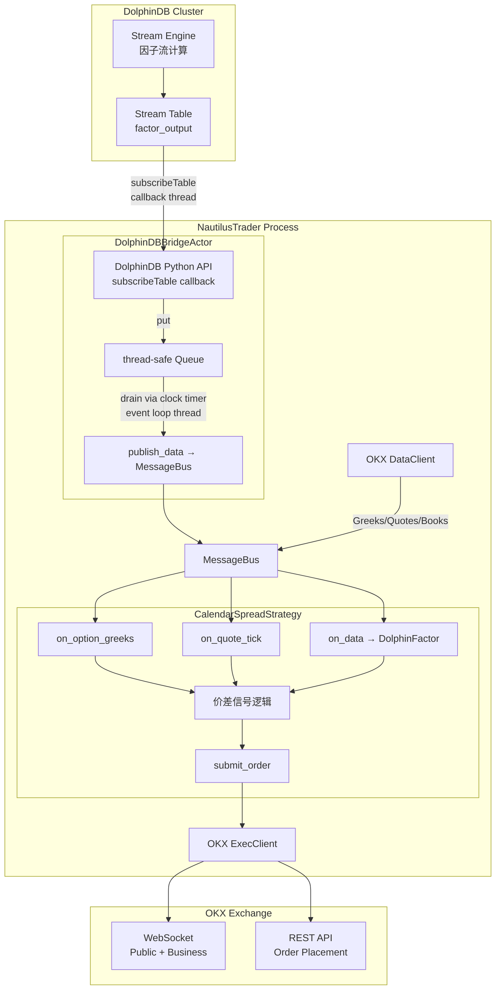
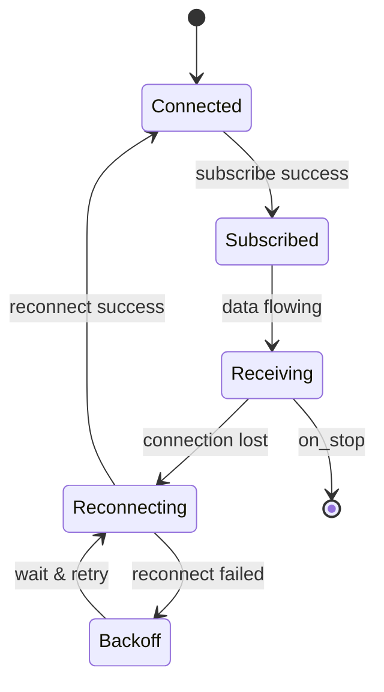

# DolphinDB 流计算因子 × NautilusTrader OKX 期权日历价差 — 深度集成方案

## 1. 架构总览



> [!IMPORTANT]
> **核心设计原则**：DolphinDB 的 `subscribeTable` 回调运行在**独立的 C++ 线程**上，而 NautilusTrader 的所有数据处理都在**单线程事件循环**中。必须通过线程安全队列桥接，**绝不能在回调线程中直接调用 `publish_data`**。

---

## 2. 为什么选方案二（推送触发）而非方案一（轮询）

| 维度 | 方案一：定时轮询 | 方案二：DolphinDB 推送 |
|---|---|---|
| **延迟** | 受限于轮询间隔（典型 100ms-1s） | 因子计算完成即推送，端到端 < 5ms |
| **CPU 开销** | 即使无新数据也持续轮询 | 事件驱动，无新数据零开销 |
| **数据一致性** | 可能错过两次轮询之间的短暂信号 | 每条因子更新都不会遗漏 |
| **复杂度** | 简单但粗糙 | 稍复杂但精确 |
| **适用场景** | 低频策略（> 1s 级别） | 期权做市 / 高频价差策略 |

> [!TIP]
> 对于日历价差这类需要精确时序的策略，方案二的低延迟特性至关重要。近月/远月期权的价差窗口往往转瞬即逝，100ms 的轮询延迟就可能错失最优入场点。

---

## 3. 线程安全：关键设计细节

### 3.1 DolphinDB Python API 回调机制

```
DolphinDB subscribeTable()
   └── C++ 内部 poll 线程
         └── Python callback(table_chunk)   ← 运行在 C++ 线程上
               └── ❌ 不能直接调用 Actor/Strategy 方法
               └── ✅ 只做 queue.put_nowait()
```

### 3.2 安全的桥接模式

```python
# DolphinDB 回调线程（非事件循环线程）
def _dolphin_callback(self, table):
    for row in table.tolist():
        factor = DolphinFactor(...)
        self._queue.put_nowait(factor)   # ← thread-safe, non-blocking

# NautilusTrader 事件循环线程（通过 clock timer 触发）
def _drain_queue(self, event):
    while not self._queue.empty():
        factor = self._queue.get_nowait()
        self.publish_data(DataType(DolphinFactor), factor)  # ← 安全
```

> [!CAUTION]
> `self._queue` 必须使用 `queue.Queue`（线程安全），**不能**使用 `asyncio.Queue`（非线程安全，只能在同一个事件循环中使用）。

### 3.3 定时器间隔选择

`clock.set_timer` 的间隔决定了因子从队列到 MessageBus 的最大延迟：

- **1ms**：极端低延迟，但 timer 回调本身有性能开销
- **5-10ms**（推荐）：对大部分期权策略足够，每秒最多 200 次回调
- **50-100ms**：适合低频策略

---

## 4. 两种数据注入模式的选择

### 4.1 `publish_data` + `subscribe_data` — 结构化因子（推荐）

```python
class DolphinFactor(Data):
    """自定义因子数据，继承 Data 基类"""
    instrument_id: InstrumentId
    factor_name: str
    factor_value: float
    # ts_event 和 ts_init 由 Data 契约提供
```

**优点**：
- 可携带多个字段（instrument_id、因子名、因子值等）
- 类型安全，`on_data` 中通过 `isinstance` 分派
- 可持久化到 Catalog（如使用 `@customdataclass`）

### 4.2 `publish_signal` + `subscribe_signal` — 简单标量信号

```python
self.publish_signal("DolphinMomentum", 0.85)
```

**优点**：
- 极简，不需要定义自定义类
- 适合单个标量信号

**限制**：
- 值只能是 `int / float / str`
- 无法关联 `instrument_id`
- 无法携带多字段

> [!NOTE]
> 对于日历价差策略，因子通常需要关联到具体的期权合约或价差腿，因此**推荐使用 `publish_data` 模式**。

---

## 5. DolphinDB 侧的流计算设计建议

### 5.1 Stream Table 设计

```sql
-- DolphinDB 端：定义因子输出流表
share streamTable(
    1000:0,
    `ts`instrument`factor_name`factor_value,
    [TIMESTAMP, SYMBOL, SYMBOL, DOUBLE]
) as factor_output

-- 创建流计算引擎（示例：波动率价差因子）
createReactiveStateEngine(
    name="vol_spread_engine",
    metrics=[
        <ts>,
        <instrument>,
        <factor_name>,
        <near_iv - far_iv as factor_value>
    ],
    dummyTable=input_table,
    outputTable=factor_output,
    keyColumn="instrument"
)
```

### 5.2 推送到 Python 的订阅

```python
import dolphindb as ddb

s = ddb.session()
s.connect("host", 8848, "admin", "123456")
s.enableStreaming(0)  # 随机分配端口
s.subscribe(
    host="host",
    port=8848,
    handler=bridge_actor._dolphin_callback,  # 回调函数
    tableName="factor_output",
    actionName="nautilus_sub",
    offset=-1,        # 从最新开始
    resub=True,        # 断线自动重连
    msgAsTable=True,   # 以 DataFrame 形式传入
    batchSize=1,       # 逐条推送（低延迟）
    throttle=0.001,    # 最小批量间隔 1ms
)
```

---

## 6. 错误处理与重连策略



关键处理要点：

1. **DolphinDB 连接断开**：`resub=True` 让 API 自动重连，但需在回调中检测数据间隔
2. **回调异常**：在 `_dolphin_callback` 中 try/except，记录日志但不抛出（避免杀死 C++ 线程）
3. **队列溢出**：设置 `maxsize` 并在溢出时丢弃旧数据，记录 warning
4. **策略停止清理**：`on_stop` 中必须 `unsubscribe` DolphinDB 订阅并 drain 队列

---

## 7. 文件结构与代码说明

新增的文件都放在 `examples/live/okx/` 目录下，与现有的 OKX 示例文件并列：

```
examples/live/okx/
├── okx_data_tester.py              # 已有 - 数据测试
├── okx_exec_tester.py              # 已有 - 执行测试
├── okx_option_greeks.py            # 已有 - Greeks 订阅示例
├── okx_spot_swap_quoter.py         # 已有 - Spot+Swap 双腿报价
├── dolphin_factor_types.py         # 新增 - 自定义因子数据类型
├── dolphin_bridge_actor.py         # 新增 - DolphinDB 桥接 Actor
└── okx_option_calendar_spread.py   # 新增 - 日历价差策略 + 启动配置
```

| 文件 | 职责 |
|---|---|
| [dolphin_factor_types.py](file:///Users/zfzt/Documents/nautilus_trader/examples/live/okx/dolphin_factor_types.py) | 定义 `DolphinFactor` 自定义数据类 + `DolphinDBConfig` 连接配置 |
| [dolphin_bridge_actor.py](file:///Users/zfzt/Documents/nautilus_trader/examples/live/okx/dolphin_bridge_actor.py) | `DolphinDBBridgeActor` — 负责连接 DolphinDB、订阅流表、线程安全地将因子注入 MessageBus |
| [okx_option_calendar_spread.py](file:///Users/zfzt/Documents/nautilus_trader/examples/live/okx/okx_option_calendar_spread.py) | `CalendarSpreadStrategy` 策略模板 + `TradingNode` 启动配置，整合期权行情 + DolphinDB 因子 |

---

## 8. 性能基准参考

| 环节 | 典型延迟 |
|---|---|
| DolphinDB 流计算引擎处理 | < 1ms |
| DolphinDB → Python callback（网络 + IPC） | 1-3ms |
| Queue put + drain（timer 5ms 间隔） | 0-5ms |
| MessageBus publish → on_data 回调 | < 0.1ms |
| OKX WebSocket 下单 RTT | 50-200ms |
| **端到端（因子产生 → 下单到达交易所）** | **~60-210ms** |

> [!NOTE]
> 瓶颈在 OKX 的交易所 RTT 而不是因子注入管道。5ms 的 drain 间隔足够满足绝大多数期权策略需求。
