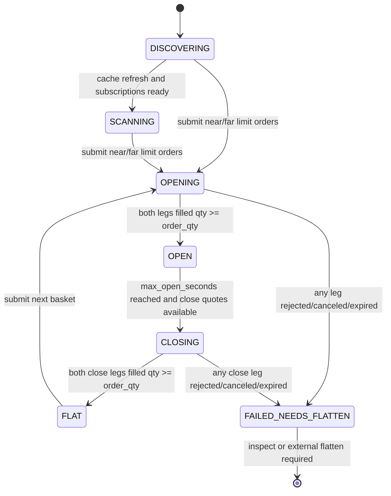
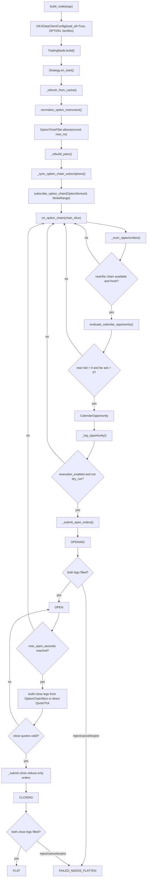

# `okx_option_calendar_spread_dynamic.py` 策略逻辑文档

本文档对应同目录下的 `okx_option_calendar_spread_dynamic.py`。它按当前源码实现描述策略逻辑，不把未来计划或交易所理论能力写成已实现能力。

## 1. 策略定位

这个示例是一个 OKX 期权日历价差动态发现与监控策略。它不是固定两个合约的价差脚本，而是让 OKX instrument provider 先加载期权合约定义，再从 Nautilus cache 和 instrument event stream 中动态发现 BTC/ETH 期权，按到期序列订阅 `OptionChainSlice`，并在行情满足基本可执行条件时输出或提交两腿限价单参数。

默认运行模式是 data-only dry-run：

- 默认只连接 OKX data client，不创建 OKX execution client。
- 默认只打印 `CALENDAR_CANDIDATE` 日志，不提交订单。
- sandbox 下单必须同时满足 `--enable-execution` 和 `--no-dry-run`。
- 只传 `--enable-execution` 会在 `main()` 里直接抛错，避免误以为单独开启执行开关就会提交订单。

当前策略只识别“开多日历价差”候选：

```text
同 underlying + 同 quote_currency + 同 settlement_currency + 同 option_kind + 同 strike
near leg: SELL near expiry option at near bid
far leg:  BUY far expiry option at far ask
open_long_cost = far_ask - near_bid
```

这里的候选只代表行情侧出现了可构造的两腿参数，不等价于组合已经成交、持仓已经建立或交易一定有正收益。

## 2. 核心数据结构

### `OptionInstrumentRecord`

`OptionInstrumentRecord` 位于同目录的 `okx_option_core.py`，是从 Nautilus `Instrument` 归一化出的单个期权合约记录。它是 OKX 期权策略通用的“合约事实记录”，不再包含日历价差特有的配对逻辑：

- `instrument_id`：真实可下单合约 ID。
- `venue`：交易所，默认 OKX。
- `underlying_code`：标的，例如 `BTC`、`ETH`。
- `quote_currency`：报价币种。
- `settlement_currency`：结算币种。
- `expiration_ns`：到期时间，纳秒时间戳。
- `activation_ns`：合约激活时间。
- `strike_price`：行权价。
- `option_kind`：归一化后的 `CALL` 或 `PUT`。
- `instrument`：原始 Nautilus instrument 对象。
- `series_key`：降维后的 option-chain 订阅键。
- `strike_key`：用于策略侧自行分组的行权价字符串。

源码刻意同时保存 `quote_currency` 和 `settlement_currency`。OKX option family 形如 `BTC-USD`、`ETH-USD`，但日历价差配对和 `OptionSeriesId` 不能简单把 family 中的 `USD` 当作真实结算币种。对币本位期权，结算币种可能是 BTC/ETH；策略需要把这个维度保留下来，避免把不同结算口径的合约错配。

`OptionInstrumentRecord` 只暴露 `dte_ns(now_ns)`、`dte_days(now_ns)`、`is_activated(now_ns)`、`is_expired(now_ns)` 这类时间事实。DTE 区间、到期黑窗等策略过滤口径由 `OptionTimeFilter` 承接，避免通用 record 被某一种组合策略的参数污染。

### `OptionSeriesKey`

`OptionSeriesKey` 是 Nautilus option-chain 订阅的最小维度：

```python
OptionSeriesId(
    venue,
    underlying_code,
    settlement_currency,
    expiration_ns,
)
```

它不包含行权价，也不包含 CALL/PUT。一个 series 表示同一标的、同一结算币种、同一到期日下的一整组期权面。策略发现的是单个期权合约，但订阅行情时会降维到 series，让 Nautilus DataEngine 维护该 series 内的 quote、greeks、ATM strike 和 `OptionChainSlice`。

### `CalendarPair`

`CalendarPair` 是日历价差候选的两腿组合：

- `near`：近月合约。
- `far`：远月合约。

两腿必须满足同 underlying、同 quote currency、同 settlement currency、同 CALL/PUT 类型、同行权价，仅到期日不同。

### `OrderLegPlan`

`OrderLegPlan` 是策略输出的“可执行参数”：

- 业务角色，例如 `open_sell_near`、`open_buy_far`、`close_buy_near`、`close_sell_far`。
- 合约 ID。
- 买卖方向。
- 数量。
- 限价。
- TIF。
- `reduce_only`，当前只用于平仓腿，避免退出时反向打开新风险。

dry-run 模式只把这些参数写入日志；sandbox 执行模式才会用它们创建 Nautilus limit order。

### `CalendarOpportunity`

`CalendarOpportunity` 是一次候选机会：

- 包含 `CalendarPair`。
- 保存近月、远月 quote。
- 计算 `open_long_cost = far_ask - near_bid`。
- 生成两条开仓 `OrderLegPlan`，字段名为 `open_legs`：
  - 近月腿：`SELL`，价格为 near bid。
  - 远月腿：`BUY`，价格为 far ask。
- `reason` 固定为 `long_calendar_executable_bid_ask`。

源码仍保留只读属性 `order_legs` 兼容早期测试和文档命名，但新逻辑使用 `open_legs`，因为平仓阶段还会按当前报价生成 `close_legs`。

## 3. 启动与运行生命周期

### 3.1 TradingNode 构建

`build_node(args)` 负责创建 live `TradingNode`：

1. 解析 data client 运行环境：
   - `live` -> `OKXEnvironment.LIVE`
   - `demo` / `sandbox` -> `OKXEnvironment.DEMO`
2. 解析标的列表，默认 `BTC,ETH`。
3. 解析 OKX instrument families，默认 `BTC-USD,ETH-USD`。
4. 始终创建 OKX data client。
5. 只有在 `--enable-execution --no-dry-run` 同时出现时才创建系统内置 sandbox exec client。
6. 创建 `DynamicCalendarSpreadStrategy` 并加入 trader。
7. 注册 OKX data client factory。
8. 如需要执行，再注册 `SandboxLiveExecClientFactory`。
9. `node.build()`。

### 3.2 Data client 配置

数据客户端的关键配置：

- `instrument_provider=InstrumentProviderConfig(load_all=True)`：连接时全量加载合约定义，动态发现依赖这里的 cache。
- `instrument_types=(OKXInstrumentType.OPTION,)`：只加载期权。
- `instrument_families=families`：OKX options 必须明确 family，例如 `BTC-USD`、`ETH-USD`。
- `http_timeout_secs=60`：REST 请求超时；全量 OPTION definitions 在代理下可能较慢。

策略启动后，`on_start()` 会先扫描 cache，再订阅 instrument 更新并设置周期刷新。

### 3.3 dry-run 执行环境

默认 dry-run 路径：

- `exec_clients={}`，不创建执行客户端。
- `LiveExecEngineConfig(reconciliation=False)`，不做开盘对账。
- `LiveRiskEngineConfig()` 使用默认配置，但没有订单提交。

这意味着默认运行可以用于行情链路、动态发现、期权链订阅和候选信号验证，但不会触发交易所下单。

### 3.4 系统 sandbox 执行环境

当 `--enable-execution --no-dry-run` 同时出现时：

- 创建 `SandboxExecutionClientConfig`，不是 OKX demo/sandbox 账户。
- 真实 OKX data client 继续提供 instruments、quotes 和 option-chain slices。
- sandbox exec client 使用同一 venue `OKX` 和同一 instrument provider 口径，在本地 `SimulatedExchange(OKX)` 撮合订单。
- 默认 `starting_balances="10 BTC,100 ETH,1000000 USD"`，其中 BTC/ETH 用于币本位期权结算口径。
- `account_type="MARGIN"`、`oms_type="NETTING"`，用于组合腿的净持仓管理。
- `use_reduce_only=True`，平仓腿的 reduce-only 指令会被 sandbox 执行端尊重。
- `LiveExecEngineConfig(reconciliation=False)`，sandbox 无外部账户，不做交易所开盘对账。
- 不启用连续 open-order / position check。sandbox 撮合器会直接发委托和成交事件；按外部 venue report 口径轮询本地 sandbox 反而会产生 `ORDER_NOT_FOUND` 或 position discrepancy 噪音。
- `graceful_shutdown_on_exception=True`，未捕获异常时走优雅关闭。
- `LiveRiskEngineConfig(bypass=False)`，sandbox 执行仍经过风控。

## 4. 动态发现逻辑

动态发现由 cache 扫描和 instrument event 增量更新共同驱动。

### 4.1 启动扫描

`on_start()` 的第一步是 `_refresh_from_cache()`：

1. 遍历 `self.cache.instruments()`。
2. 对每个 instrument 调用 `_upsert_instrument()`。
3. 重建日历价差 pairs。
4. 同步 option-chain 订阅。
5. 打印 `DISCOVERY` 日志：

```text
DISCOVERY | records=<合约记录数> series=<候选 series 数> pairs=<pair 数> subscribed_series=<已订阅 series 数>
```

### 4.2 增量 instrument 更新

这里的“instrument 更新”不是策略自己直接修改 cache，而是策略订阅了 Nautilus 的 `data.instrument.OKX.*` topic 后，DataEngine 又发布了一份 `Instrument` 定义。DataEngine 处理这类数据时会先 `cache.add_instrument()`，再把该 instrument 发布到对应 topic，所以策略的 `on_instrument(instrument)` 会被调用。

这些事件主要来自三条路径：

1. 启动连接阶段，OKX data client 初始化 instrument provider 后会把当前 provider 持有的 instruments 送入 DataEngine。策略随后 `_refresh_from_cache()` 扫到的是这批已经写入 Nautilus cache 的定义。
2. 策略在 `on_start()` 里主动调用 `request_instruments(..., params={"only_last": True})`。OKX data client 会按当前配置的 option families 重新拉取 instruments，并通过 DataEngine response 路径发布回策略订阅的 venue instrument topic。
3. OKX data client 连接后会按 instrument type 订阅 OKX instruments WebSocket channel。后续如果 OKX 推送合约定义、状态或新增合约变化，adapter 会把 pyo3 instrument 转成 Nautilus `Instrument`，再交给 DataEngine 写 cache 和发布 topic。

因此，启动时当前可加载到的 instruments 已经在 cache 里；但 live 运行期间 cache 仍可能因为主动 request response 或 OKX instruments channel 更新而被覆盖或补充。`on_instrument()` 处理的是这些 DataEngine 发布的 instrument event，不是单独的 cache 轮询结果。

当 `on_instrument(instrument)` 收到事件时：

1. 调用 `_upsert_instrument(instrument)`。
2. 如果记录新增或变化，则 `_rebuild_pairs()`。
3. 再 `_sync_option_chain_subscriptions()` 补充订阅。

当前实现会新增或覆盖仍然满足 `OptionTimeFilter` 的 `_records_by_id` 记录；如果一个已进入 `_records_by_id` 的合约后来进入 expiry blackout、过期或状态变为不可用，`_upsert_instrument()` 会从 `_records_by_id` 删除该记录，并在下一次 `_sync_option_chain_subscriptions()` 中退订不再属于候选集合的 option-chain series。

需要区分三层状态：

1. Nautilus 全局 instrument cache：DataEngine 收到 `Instrument` 后会 `cache.add_instrument()`，按 `instrument.id` 加入或覆盖定义。cache 里的记录表示“系统知道这个合约定义”，不等于该合约当前仍可交易，也不等于策略应该继续把它放进候选池。
2. DataEngine option-chain manager：框架内部会对 option-chain 做一层保护。例如收到 `InstrumentStatus` 的 `CLOSE` / `NOT_AVAILABLE_FOR_TRADING`，或 quote/greeks 的 `ts_event >= expiration_ns` 时，会从 option-chain manager 中移除对应 instrument 并退订该 instrument 的 quote/greeks。这保护的是框架内部 option-chain 聚合器。
3. 当前策略自己的候选池：`_records_by_id`、`_pairs`、`_subscribed_series`、`_latest_chains` 是策略自己维护的状态。DataEngine 清理 option-chain manager 不会自动同步删除这些策略字段；当前文件通过 `OptionTimeFilter` 和订阅同步补上策略侧的基础时间生命周期清理。

因此，`self.cache.instruments()` 里仍看到一个过期合约是正常的；策略是否继续使用它，必须看策略自己的生命周期过滤和清理逻辑。当前文件会清理策略候选池与不再活跃的 option-chain series；对已开仓 sandbox 组合，只实现基于 `max_open_seconds` 的示例平仓，不实现到期前风控退出或 roll。

### 4.3 期权合约过滤

`normalize_option_instrument()` 只接收具备以下属性的 instrument：

- `option_kind`
- `strike_price`
- `expiration_ns`
- `underlying`

不满足这些字段的 instrument 会被跳过，因此 futures、perpetual、spot 等不会进入候选池。

然后策略会检查 `underlying` 是否在配置的 `underlyings` 中。默认只保留 `BTC` 和 `ETH`。

### 4.4 到期与激活过滤

`OptionTimeFilter.allows(record, now_ns)` 负责过滤不可参与策略的合约：

- 如果 `activation_ns > now_ns`，说明合约尚未激活，跳过。
- 剩余到期时间必须大于 `expiry_blackout_minutes`。
- DTE 必须在 `[min_dte_days, max_dte_days]` 区间内。

默认值：

- `min_dte_days=1`
- `max_dte_days=720`
- `expiry_blackout_minutes=60`

这会过滤掉尚未激活、临近到期黑窗内、过短 DTE 或过远 DTE 的合约。

## 5. 日历价差 pair 生成逻辑

`build_calendar_pairs(records, expiry_pair_mode)` 负责从单合约记录生成 near/far pair。

第一步先按日历价差策略自己的 `calendar_pair_key(record)` 分桶：

```text
(
    underlying_code,
    quote_currency,
    settlement_currency,
    option_kind,
    strike_price,
)
```

这个分桶是业务约束：同一个日历价差 pair 内，只允许到期日不同，其余维度必须完全一致。

注意，`calendar_pair_key()` 没有放进 `OptionInstrumentRecord`。这是刻意的边界：跨式、垂直价差、蝶式等策略的分组维度都不同，通用 record 不能内置日历价差的配对语义。

第二步在每个桶内按 `expiration_ns` 从近到远排序。

第三步按 `expiry_pair_mode` 生成组合：

- `all`：同一 strike 的所有 near/far 两两组合。例如 3 个到期日会生成 3 个 pair。
- `adjacent`：只生成相邻到期日组合。例如 3 个到期日只生成 2 个 pair。

默认是 `all`，覆盖所有可发现的近远月组合。

## 6. Option-chain 订阅逻辑

策略不直接为每个合约逐个订阅报价，而是按到期 series 订阅 `OptionChainSlice`。

### 6.1 候选 series 生成

`_candidate_series_keys()` 从当前合约记录中提取唯一的 `OptionSeriesKey`，并按以下顺序稳定排序：

```text
underlying_code -> settlement_currency -> expiration_ns
```

如果 `series_subscription_policy="ranked_active_series"` 且 `max_series_subscriptions > 0`，则只取排序后的前 N 个 series。否则订阅全部发现到的 series。

默认：

- `series_subscription_policy="all_discovered_series"`
- `max_series_subscriptions=0`

### 6.2 行权价范围

`build_strike_range()` 支持四种策略：

| 策略 | 行为 |
|---|---|
| `atm_relative` | 订阅 ATM 上下固定档数，默认上 3 档、下 3 档 |
| `atm_percent` | 订阅 ATM 正负百分比范围内的行权价，默认 10% |
| `fixed` | 订阅固定行权价列表 |
| `all_strikes` | 返回 `None`，让 DataEngine 使用该 series 全部行权价 |

当前 CLI 同时暴露了 `--strike-range-policy fixed` 和 `--fixed-strikes`。默认 `atm_relative` 是不需要手动传 strike 列表的直接使用路径。

### 6.3 订阅调用

`_sync_option_chain_subscriptions()` 对每个候选 series 调用：

```python
self.subscribe_option_chain(
    key.to_series_id(),
    strike_range=strike_range,
    snapshot_interval_ms=self.config.snapshot_interval_ms,
    client_id=ClientId(OKX),
)
```

默认 `snapshot_interval_ms=2000`，即 DataEngine 最低每 2 秒推一次 `OptionChainSlice`。如果配置为 0，则由底层 DataEngine 按更高频率推送。

策略用 `_subscribed_series` 记录已订阅 series，周期 refresh 不会重复发起同一 series 的订阅。

## 7. 行情回调与机会扫描

`on_option_chain(chain_slice)` 是策略的行情入口：

1. 用 `str(chain_slice.series_id)` 作为 key。
2. 把最新 slice 保存到 `_latest_chains`。
3. 调用 `_scan_opportunities()`。

### 7.1 扫描前置条件

`_scan_opportunities()` 遍历当前所有 `_pairs`。每个 pair 必须同时满足：

- near series 已经有最新 `OptionChainSlice`。
- far series 已经有最新 `OptionChainSlice`。

如果任一腿的 chain slice 尚未到达，则该 pair 暂时不能评估。

### 7.2 行情质量过滤

`evaluate_calendar_opportunity()` 对 near/far 两个 chain 做两层时间检查：

1. cross-series skew：

```text
abs(near_chain.ts_event - far_chain.ts_event) <= max_cross_series_skew_ms
```

默认 `max_cross_series_skew_ms=1000`。如果两个到期序列的行情时间差太大，跳过该 pair，避免用不同市场时刻的 bid/ask 计算价差。

2. quote freshness：

```text
now_ns - chain.ts_event <= stale_quote_ms
```

默认 `stale_quote_ms=5000`。如果任一 chain 的行情过期，跳过该 pair。

### 7.3 同 strike quote 取值

策略用 pair 的 `strike_price` 转换成 PyO3 `Price`，再从 near/far chain 中取同一行权价的 quote：

- `CALL`：`get_call_quote(strike)`
- `PUT`：`get_put_quote(strike)`

任一 quote 缺失时跳过。

### 7.4 bid/ask 可执行性

策略读取：

```text
near_bid = near_quote.bid_price
far_ask = far_quote.ask_price
```

只有 `near_bid > 0` 且 `far_ask > 0` 才会生成候选。

然后构造开多日历价差：

```text
near leg = SELL near instrument, qty=order_qty, limit=near_bid, TIF=IOC
far leg  = BUY  far instrument, qty=order_qty, limit=far_ask,  TIF=IOC
open_long_cost = far_ask - near_bid
```

默认 `order_qty=1`，`time_in_force=IOC`。

### 7.5 当前没有实现的机会过滤

当前源码没有实现以下过滤：

- 没有 `open_long_cost` 上限。
- 没有最小收益、最小 edge 或费用后盈利阈值。
- 没有 IV term-structure 因子过滤。
- 没有 Greeks 风险敞口过滤。
- 没有订单簿深度或 L2 VWAP 校验。
- 没有按机会质量排序，扫描顺序就是 `_pairs` 的当前顺序。
- 没有去重冷却时间，同一行情条件下可能重复打印候选日志。

因此 `CALENDAR_CANDIDATE` 应理解为“行情层可组成两腿限价单参数”，不是最终交易信号质量证明。

## 8. 候选输出与 sandbox 执行

### 8.1 dry-run 输出

每个候选通过 `_log_opportunity()` 打印：

```text
CALENDAR_CANDIDATE
| underlying=<BTC/ETH>
| kind=<CALL/PUT>
| strike=<strike>
| near=<near instrument> SELL qty=<qty> limit=<near_bid> tif=<TIF>
| far=<far instrument> BUY qty=<qty> limit=<far_ask> tif=<TIF>
| open_long_cost=<far_ask - near_bid>
| dry_run=<True/False>
```

dry-run 模式下，每次扫描最多输出 `max_opportunities_per_scan` 条，默认 10 条。

### 8.2 sandbox 执行触发

只有满足以下条件时才调用 `_submit_open_orders(opportunity)`：

```text
execution_enabled=True
dry_run=False
```

执行路径每次扫描只提交一个机会，提交后立即 break，避免同一个扫描周期打开多组价差。这里的委托进入 Nautilus 系统内置 sandbox 撮合器，不进入 OKX 真实账户或 OKX demo 账户。

### 8.3 下单流程

`_submit_open_orders()` 的流程：

1. 如果状态不是 `DISCOVERING`、`SCANNING` 或 `FLAT`，直接返回。
2. 调用 `CalendarBasketLifecycle.begin_open(opportunity)`，状态切到 `OPENING`。
3. 对开仓两腿单独订阅 `QuoteTick`，供后续平仓时兜底取价。
4. 对每条腿从 cache 取 instrument。
5. 如果 instrument 不在 cache，记录 error 并把状态切到 `FAILED_NEEDS_FLATTEN`。
6. 使用 `order_factory.limit()` 创建 limit order：
   - `instrument_id`
   - `order_side`
   - `quantity=instrument.make_qty(leg.quantity)`
   - `price=instrument.make_price(leg.limit_price)`
   - `time_in_force=leg.time_in_force`
   - `reduce_only=leg.reduce_only`
   - `tags=[basket_id, leg.role]`
7. 对两条腿分别 `submit_order(order)`。

当前实现先提交 near leg，再提交 far leg。它不是交易所原生组合单，也没有两腿原子成交保证。

## 9. 执行状态机与残腿风险

策略维护一个最小状态机：



### 9.1 成交确认

`on_order_filled(event)` 会按 `instrument_id` 累加 `last_qty`。

只有当前生命周期目标里的两条腿都满足：

```text
filled_qty_by_instrument[leg_id] >= order_qty
```

开仓阶段状态会切到 `OPEN`，并记录 `opened_at_ns`；平仓阶段状态会切到 `FLAT`，并清空 active opportunity 和开仓时间。

单腿成交不算组合成功，因为残腿风险仍然存在。

### 9.2 失败状态

以下事件都会进入 `_handle_residual_risk()`：

- `on_order_rejected`
- `on_order_canceled`
- `on_order_expired`

只要当前状态处于 `OPENING` 或 `CLOSING`，策略就把状态切到 `FAILED_NEEDS_FLATTEN`，并记录 error：

```text
Calendar spread leg did not complete: <instrument_id>.
State moved to FAILED_NEEDS_FLATTEN; inspect/flatten the sandbox account.
```

进入该状态后，策略不会继续提交新价差订单。当前文件没有自动 flatten 残腿重试逻辑，需要人工检查 sandbox 账户或由外部模块处理残腿。

### 9.3 已开仓组合的示例平仓生命周期

两腿都成交后状态切到 `OPEN`。当持仓时间达到 `max_open_seconds` 后，策略会尝试按当前盘口提交平多日历价差的 reduce-only 平仓腿：

```text
near close leg = BUY near at near ask
far close leg  = SELL far at far bid
```

平仓报价优先来自对应 near/far `OptionChainSlice`；如果 active strike 已经离开当前 option-chain strike range，则退回使用开仓时单独订阅的两条实际腿 `QuoteTick`。若仍没有有效 near ask 或 far bid，策略保持 `OPEN`，按 `status_interval_secs` 限频打印缺平仓报价告警，等待后续行情。

当前文件仍没有实现以下生产级持仓生命周期：

- 不会按 DTE 或 expiry blackout 提前强制退出。
- 不会把 near leg roll 到下一到期日。
- 不会自动检查已开仓组合是否仍满足策略约束。
- 不会因为 cache 或 DataEngine option-chain manager 清理了某个 instrument，就自动平掉策略持仓。

所以，当前 `max_open_seconds` 逻辑只是 sandbox 示例退出路径，不等价于生产级到期、风险、止盈止损或 roll 管理。生产化版本至少还需要 near/far DTE 风控、风险限制、平仓/roll 条件、异常 flatten 路径和持久化状态恢复。

## 10. 关闭与自动停止

`on_stop()` 做两件事：

1. 取消 `dynamic_calendar_refresh` 定时器。
2. 对 `_subscribed_series` 中记录的 series 主动 `unsubscribe_option_chain()`。
3. 对 active basket 的单腿 `QuoteTick` 订阅主动 `unsubscribe_quote_ticks()`。

`--run-seconds N` 会通过 `schedule_node_stop()` 启动一个后台 shell，等待 N 秒后向当前进程发送 `SIGINT`。这样 smoke run 可以走 TradingNode 正常 shutdown，而不是强杀进程。

## 11. CLI 参数与默认值

| 参数 | 默认值 | 策略含义 |
|---|---:|---|
| `--data-environment` | `live` | OKX data client 环境；默认使用真实行情 |
| `--underlyings` | `BTC,ETH` | 动态发现时保留的标的 |
| `--instrument-families` | `BTC-USD,ETH-USD` | OKX option families；必须与 provider 加载范围一致 |
| `--expiry-pair-mode` | `all` | `all` 全组合，`adjacent` 仅相邻到期 |
| `--min-dte-days` | `1` | 最短剩余到期天数 |
| `--max-dte-days` | `720` | 最长剩余到期天数 |
| `--expiry-blackout-minutes` | `60` | 到期前黑窗分钟数 |
| `--series-subscription-policy` | `all_discovered_series` | 订阅全部发现 series 或只订阅排序后的前 N 个 |
| `--max-series-subscriptions` | `0` | 0 表示不限制；只在 ranked 模式生效 |
| `--strike-range-policy` | `atm_relative` | 行权价订阅范围策略 |
| `--atm-strikes-above` | `3` | ATM 上方档数 |
| `--atm-strikes-below` | `3` | ATM 下方档数 |
| `--atm-percent` | `0.10` | ATM 百分比范围 |
| `--fixed-strikes` | 空 | `fixed` strike range 模式下的显式行权价列表 |
| `--snapshot-interval-ms` | `2000` | OptionChainSlice 推送间隔 |
| `--refresh-interval-secs` | `60` | cache 重扫、pair 重建、订阅同步间隔 |
| `--stale-quote-ms` | `5000` | 单个 chain slice 最大允许年龄 |
| `--max-cross-series-skew-ms` | `1000` | near/far chain 最大时间差 |
| `--max-opportunities-per-scan` | `10` | dry-run 每轮最多打印候选数 |
| `--status-interval-secs` | `30` | 状态日志最小间隔 |
| `--candidate-log-interval-secs` | `10` | 同一 basket 候选日志最小间隔 |
| `--order-qty` | `1` | 每条腿委托数量 |
| `--max-open-seconds` | `60` | sandbox 持仓最长秒数，超时后提交 reduce-only 平仓腿 |
| `--sandbox-starting-balances` | `10 BTC,100 ETH,1000000 USD` | 系统 sandbox 账户初始余额，BTC/ETH 对应币本位结算 |
| `--sandbox-default-leverage` | `1` | 系统 sandbox 默认杠杆 |
| `--run-seconds` | `0` | 0 表示持续运行；大于 0 时自动 SIGINT 停止 |
| `--trader-id` | `DYN-CALENDAR-001` | Nautilus trader ID |
| `--log-level` | `INFO` | 日志级别 |
| `--proxy-url` | 空 | OKX data client 代理 URL，例如 `http://127.0.0.1:7897` |
| `--data-api-key-env` | `OKX_API_KEY` | data client API key 环境变量名 |
| `--data-api-secret-env` | `OKX_API_SECRET` | data client API secret 环境变量名 |
| `--data-api-passphrase-env` | `OKX_API_PASSPHRASE` | data client passphrase 环境变量名 |
| `--enable-execution` | `False` | 执行总开关 |
| `--dry-run` | `True` | dry-run 开关 |
| `--no-dry-run` | 不启用 | 取消 dry-run；必须与 `--enable-execution` 同时使用才允许下单 |

## 12. 端到端流程图



## 13. 当前实现边界

这份策略文件当前已经实现：

- BTC/ETH 期权动态发现。
- OKX option family 显式加载。
- 基于 cache 和 instrument event 的增量更新。
- 基于 `OptionTimeFilter` 的候选池过期/黑窗清理。
- 不再活跃 option-chain series 的运行期退订。
- 按 same underlying、same settlement、same type、same strike 构造 near/far 日历 pair。
- 按 `OptionSeriesId` 订阅 option-chain。
- 基于 `OptionChainSlice` 的同 strike bid/ask 候选评估。
- dry-run 输出可执行两腿参数。
- 可选 Nautilus sandbox 执行路径。
- sandbox 执行路径下的开仓、持仓计时、reduce-only 平仓状态机。
- active basket 单腿 `QuoteTick` 订阅，用作 option-chain 不含 active strike 时的平仓报价兜底。
- 开仓或平仓腿异常终止后的 `FAILED_NEEDS_FLATTEN` 残腿失败状态。

这份策略文件当前没有实现：

- 机会收益阈值、费用模型、滑点模型。
- L2 深度或 VWAP 可成交量校验。
- 按 IV、Greeks、期限结构进行信号过滤。
- 多机会排序和去重。
- 组合订单或原子化两腿执行。
- 自动撤单后重试。
- 自动 flatten 残腿。
- 已开仓组合的止盈、止损、DTE/到期黑窗强制退出、roll 或生产级持仓生命周期管理。
- 持久化状态恢复。

因此，当前文件更准确的定位是“动态日历价差发现 + dry-run 可执行参数生成 + Nautilus sandbox 开平仓示例”，不是完整生产级期权日历价差交易系统。
