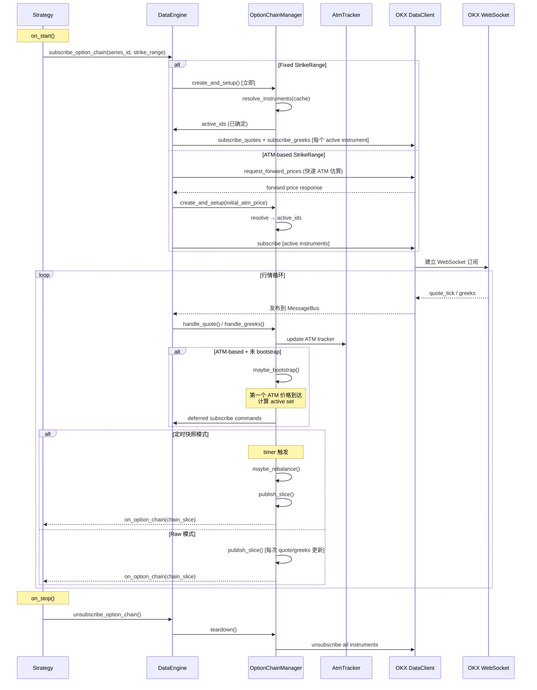
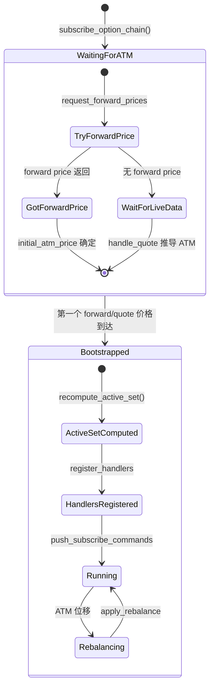

# `subscribe_option_chain` 深度解析

NautilusTrader 内置了一套完整的期权链管理系统，可以自动完成从合约发现、行情订阅、ATM 追踪、动态再平衡到快照发布的全流程。以下是基于源码的逐层剖析。

---

## 1. 四大核心类型

### 1.1 `OptionSeriesId` — 期权系列标识

定义于 [nautilus_pyo3.pyi:1727](file:///Users/zfzt/Documents/nautilus_trader/nautilus_trader/core/nautilus_pyo3.pyi#L1727-L1753)

一个 `OptionSeriesId` 唯一标识一个期权系列（同 underlying、同 expiry、同 settlement currency 的所有行权价 × Call/Put 组合）。

```python
from nautilus_trader.core.nautilus_pyo3 import OptionSeriesId

# 方式一：直接用纳秒时间戳
series = OptionSeriesId(
    venue="OKX",
    underlying="BTC",
    settlement_currency="USD",
    expiration_ns=1735084800_000_000_000,  # 2024-12-25 00:00:00 UTC
)

# 方式二：用日期字符串（推荐）
series = OptionSeriesId.from_expiry(
    venue="OKX",
    underlying="BTC",
    settlement_currency="USD",
    date_str="20241225",   # YYYYMMDD 格式
)
```

> [!NOTE]
> `OptionSeriesId` 不包含行权价和 Call/Put 类型 — 它代表的是**整个到期日的期权面**，包含所有行权价的 Call 和 Put。

### 1.2 `StrikeRange` — 行权价范围过滤器

定义于 [option_chain.rs:39-131](file:///Users/zfzt/Documents/nautilus_trader/crates/model/src/data/option_chain.rs#L39-L131)

三种模式决定订阅哪些行权价：

| 模式 | 构造方法 | 行为 |
|---|---|---|
| **Fixed** | `StrikeRange.fixed([Price("50000"), ...])` | 固定行权价列表，不随 ATM 变动 |
| **ATM Relative** | `StrikeRange.atm_relative(5, 5)` | ATM 上方 5 档 + 下方 5 档，共 11 个行权价 |
| **ATM Percent** | `StrikeRange.atm_percent(0.10)` | ATM ± 10% 范围内的所有行权价 |

**ATM-based 模式的关键特性**：当 ATM 价格未知时（尚未收到第一个标的价格），`resolve()` 返回空列表 → **订阅被延迟**，直到 bootstrap 完成。

```rust
// ATM Relative 的 resolve 逻辑（简化）
fn resolve(&self, atm_price: Option<Price>, all_strikes: &[Price]) -> Vec<Price> {
    // 1. 二分搜索找到最接近 ATM 的行权价 index
    // 2. 向上取 strikes_above 个，向下取 strikes_below 个
    // 3. 返回这个窗口内的行权价列表
}
```

### 1.3 `OptionChainManager` — 核心管理器（Rust）

定义于 [manager.rs](file:///Users/zfzt/Documents/nautilus_trader/crates/data/src/option_chains/manager.rs)

这是整个系统的大脑，每个 `OptionSeriesId` 对应一个 `OptionChainManager` 实例。管理器负责：

- 从 cache 解析属于该系列的所有期权合约
- 维护 ATM 追踪器
- 管理"活跃合约集"（active set）—— 当前在行权价范围内的合约
- 路由 quotes/greeks 到内部聚合器
- 检测 rebalance 需求并执行
- 生成 `OptionChainSlice` 快照

### 1.4 `OptionChainSlice` — 快照数据

定义于 [option_chain.rs:246-362](file:///Users/zfzt/Documents/nautilus_trader/crates/model/src/data/option_chain.rs#L246-L362)

```rust
pub struct OptionChainSlice {
    pub series_id: OptionSeriesId,         // 系列标识
    pub atm_strike: Option<Price>,         // 当前 ATM 行权价
    pub calls: BTreeMap<Price, OptionStrikeData>,  // Call 数据（按行权价排序）
    pub puts: BTreeMap<Price, OptionStrikeData>,   // Put 数据（按行权价排序）
    pub ts_event: UnixNanos,
    pub ts_init: UnixNanos,
}

pub struct OptionStrikeData {
    pub quote: QuoteTick,                  // 最新报价
    pub greeks: Option<OptionGreeks>,      // 最新 Greeks（如果有）
}
```

策略中通过 Python API 访问：
```python
def on_option_chain(self, chain: OptionChainSlice):
    # 获取所有行权价
    strikes = chain.strikes()
    
    # 获取特定行权价的 Call/Put 数据
    call_data = chain.get_call(Price.from_str("50000"))
    put_greeks = chain.get_put_greeks(Price.from_str("50000"))
    call_quote = chain.get_call_quote(Price.from_str("50000"))
    
    # ATM 行权价
    atm = chain.atm_strike
```

---

## 2. 完整生命周期



---

## 3. Rebalance 机制详解

Rebalance 是 `subscribe_option_chain` 最核心的能力。当标的价格大幅波动导致 ATM 行权价移位时，系统需要动态调整订阅范围。

源码位于 [manager.rs:672-734](file:///Users/zfzt/Documents/nautilus_trader/crates/data/src/option_chains/manager.rs#L672-L734)：

```rust
fn maybe_rebalance(&mut self, now_ns: UnixNanos) {
    // 1. aggregator 检查 ATM 是否发生位移
    let Some(action) = self.aggregator.check_rebalance(now_ns) else {
        return;  // ATM 未变化，不需要 rebalance
    };

    // 2. 退订离开活跃范围的合约
    for id in &action.remove {
        msgbus::unsubscribe_quotes(...);
        msgbus::unsubscribe_option_greeks(...);
    }

    // 3. 订阅进入活跃范围的新合约
    for id in &action.add {
        msgbus::subscribe_quotes(...);
        msgbus::subscribe_option_greeks(...);
    }

    // 4. 推送延迟的 wire-level 命令到 DataClient
    for &id in &action.add {
        self.push_subscribe_commands(id);    // → OKX WebSocket 订阅
    }
    for &id in &action.remove {
        self.push_unsubscribe_commands(id);  // → OKX WebSocket 退订
    }
}
```

**具体场景示例**：

假设 BTC 价格从 $100,000 涨到 $110,000，`StrikeRange.atm_relative(5, 5)` 模式：

```
之前 ATM = 100000:
  活跃行权价: [75000, 80000, 85000, 90000, 95000, 100000, 105000, 110000, 115000, 120000, 125000]
                                                    ^^^

ATM 位移到 110000:
  新活跃行权价: [85000, 90000, 95000, 100000, 105000, 110000, 115000, 120000, 125000, 130000, 135000]
                                                        ^^^

  → remove: [75000, 80000] 对应的合约
  → add:    [130000, 135000] 对应的合约
```

> [!IMPORTANT]
> Rebalance 只调整 **MessageBus 订阅和 WebSocket 订阅**。离开活跃范围的合约的 instrument 定义**仍然保留在 cache 中**，随时可以重新进入活跃集。

---

## 4. 两种发布模式

### 4.1 定时快照模式（`snapshot_interval_ms` 指定）

```python
self.subscribe_option_chain(
    series_id=series,
    strike_range=StrikeRange.atm_relative(5, 5),
    snapshot_interval_ms=1000,  # 每秒发布一次快照
)
```

- 通过 `clock.set_timer` 定时触发
- 每次触发时：先 `maybe_rebalance()` 检查 ATM 位移，再 `snapshot()` 生成快照
- 适合中低频策略（1-10 秒级别）

### 4.2 Raw 模式（`snapshot_interval_ms=None`）

```python
self.subscribe_option_chain(
    series_id=series,
    strike_range=StrikeRange.atm_relative(5, 5),
    snapshot_interval_ms=None,   # Raw 模式
)
```

- 每收到一条活跃合约的 quote 或 greeks 更新，立即发布快照
- 最低延迟
- 适合做市或高频策略
- **注意**：快照频率 = 所有活跃合约的行情更新频率之和，可能很高

源码逻辑在 [manager.rs:439-461](file:///Users/zfzt/Documents/nautilus_trader/crates/data/src/option_chains/manager.rs#L439-L461)：
```rust
pub fn handle_quote(&mut self, quote: &QuoteTick) {
    self.aggregator.update_quote(quote);
    self.maybe_bootstrap();

    // Raw 模式：每次 quote 更新都发布快照
    if self.raw_mode && self.bootstrapped
       && self.aggregator.active_ids().contains(&quote.instrument_id)
    {
        self.publish_slice(quote.ts_event);
    }
}
```

---

## 5. Bootstrap 机制

对于 ATM-based 的 `StrikeRange`（`atm_relative` 和 `atm_percent`），系统需要知道 ATM 价格才能确定活跃合约集。Bootstrap 流程：



关键代码 [manager.rs:467-491](file:///Users/zfzt/Documents/nautilus_trader/crates/data/src/option_chains/manager.rs#L467-L491)：
```rust
fn maybe_bootstrap(&mut self) {
    if self.bootstrapped { return; }
    if self.aggregator.atm_tracker().atm_price().is_none() { return; }

    // 第一次收到 ATM 价格 → 计算活跃合约集
    let active_ids = self.aggregator.recompute_active_set();
    // 注册 MessageBus 处理器
    self.register_handlers_for_instruments_bulk(&active_ids);
    // 推送延迟订阅命令到 DataClient
    for &id in &active_ids {
        self.push_subscribe_commands(id);
    }
    self.bootstrapped = true;
}
```

---

## 6. 过期合约处理

系统内置了过期检测和自动清理能力：

1. **数据层拦截**：每条 quote/greeks 到达时，检查 `ts_event >= expiration_ns`，如果过期则丢弃并推送 `DeferredCommand::ExpireInstrument`

2. **定时器检查**：每次 snapshot timer 触发时，检查整个系列是否过期

3. **单合约过期**：[manager.rs:403-433](file:///Users/zfzt/Documents/nautilus_trader/crates/data/src/option_chains/manager.rs#L403-L433) 的 `handle_instrument_expired` 方法：
   - 从 aggregator 移除该合约
   - 取消 MessageBus 处理器
   - 推送 wire-level 退订
   - 如果所有合约都过期了，返回 `true` → DataEngine 整体 teardown 该 manager

---

## 7. 策略使用示例

```python
from nautilus_trader.core.nautilus_pyo3 import OptionSeriesId, StrikeRange
from nautilus_trader.model.types import Price
from nautilus_trader.trading.strategy import Strategy

class VolSurfaceScanner(Strategy):
    def on_start(self):
        # 订阅 BTC 2024-12-25 到期的期权链
        series = OptionSeriesId.from_expiry("OKX", "BTC", "USD", "20241225")
        
        self.subscribe_option_chain(
            series_id=series,
            strike_range=StrikeRange.atm_relative(
                strikes_above=10,  # ATM 上方 10 档
                strikes_below=10,  # ATM 下方 10 档
            ),
            snapshot_interval_ms=2000,  # 每 2 秒一个快照
        )
    
    def on_option_chain(self, chain):
        """每 2 秒收到一次完整的期权链快照"""
        self.log.info(
            f"Chain snapshot: series={chain.series_id} "
            f"ATM={chain.atm_strike} "
            f"calls={chain.call_count()} puts={chain.put_count()}"
        )
        
        # 遍历所有行权价
        for strike in chain.strikes():
            call = chain.get_call(strike)
            put = chain.get_put(strike)
            
            if call and put and call.greeks and put.greeks:
                # 计算 Put-Call Parity 偏差
                call_iv = call.greeks.mark_iv
                put_iv = put.greeks.mark_iv
                if call_iv and put_iv:
                    skew = call_iv - put_iv
                    self.log.info(
                        f"  K={strike}: call_iv={call_iv:.4f} "
                        f"put_iv={put_iv:.4f} skew={skew:.4f}"
                    )
```

---

## 8. 架构总结

| 层级 | 组件 | 语言 | 职责 |
|---|---|---|---|
| **策略层** | `Strategy.on_option_chain()` | Python | 消费快照，执行交易逻辑 |
| **Actor 层** | `Actor.subscribe_option_chain()` | Cython | 发起订阅命令 |
| **Data Engine** | `_handle_subscribe_option_chain()` | Cython/Rust | 创建 Manager，管理生命周期 |
| **Chain Manager** | `OptionChainManager` | Rust | ATM 追踪、rebalance、快照生成 |
| **聚合器** | `OptionChainAggregator` | Rust | 聚合 quotes/greeks，维护期权链状态 |
| **ATM Tracker** | `AtmTracker` | Rust | 追踪 ATM 价格变化 |
| **数据类型** | `OptionChainSlice`/`StrikeRange` | Rust (PyO3) | 跨语言数据结构 |
| **DataClient** | `OKXDataClient` | Rust/Cython | WebSocket 行情订阅/退订 |

> [!TIP]
> 对于你的日历价差策略，可以同时订阅两个不同到期日的 option chain：
> ```python
> # 近月链
> near_series = OptionSeriesId.from_expiry("OKX", "BTC", "USD", "20241225")
> self.subscribe_option_chain(near_series, StrikeRange.atm_relative(5, 5), snapshot_interval_ms=2000)
> 
> # 远月链
> far_series = OptionSeriesId.from_expiry("OKX", "BTC", "USD", "20250326")
> self.subscribe_option_chain(far_series, StrikeRange.atm_relative(5, 5), snapshot_interval_ms=2000)
> ```
> 两条链的快照会分别到达 `on_option_chain`，通过 `chain.series_id` 区分。你可以在回调中对比两个到期日的 IV 曲面，寻找日历价差机会。
